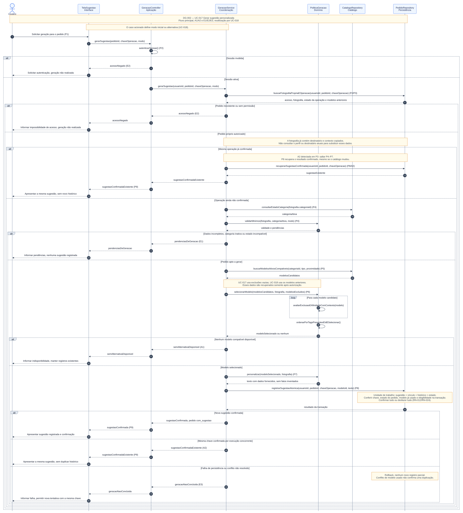

# VazaApp — Análise e Projeto de Software

O VazaApp oferece sugestões de desculpas personalizadas a partir da situação, categoria, destinatário, proximidade e contexto informado. A geração seleciona modelos de um catálogo e adapta apenas os dados fornecidos pelo usuário. O sistema contempla contas, perfil de contexto, destinatários, pedidos, histórico, favoritos, avaliações e administração do catálogo.

**35 casos de uso · 24 regras de negócio · 35 requisitos funcionais · 8 requisitos não funcionais · 2 diagramas Mermaid.**

## Equipe e disciplina

| Integrante | RA |
|---|---|
| Isabella Barela Venancio | 144023 |
| Carolina Yumi Toyota | 143210 |
| Matheus Lara Campos | 126608 |
| Gabriela Borborema Paes Barreto | 144438 |

**Professor:** Prof. Dr. João Choma.  
**Disciplina:** Análise e Projeto de Software.

## Navegação

- [Diagramas](#diagramas)
- [Atores e catálogo dos 35 casos](#atores-e-catálogo)
- [Regras e requisitos](#regras-e-requisitos)
- [Especificações dos casos de uso](#especificações-dos-casos-de-uso)
- [Responsabilidades da sequência central](#responsabilidades-da-sequência-central)
- [Matriz de rastreabilidade](#matriz-de-rastreabilidade)

## Diagramas

### Casos de uso

[Visualizar no Mermaid Live](https://mermaid.live/view#pako:eJy9WM1u5DYSfhVCgw42QHvSpFr9l0UAj8fJZYEN4tjAwsqhWiq1CUuiQlI9njE8yEPkBYI5BMhiT8Gecpt-kzxJwJ-mZbl7pmeASR9EtqrqKxar-InkbZSJHKNFNBjc8prrBblNI32FFabRIo2WoDCNhml0pavyX7DEUqXRooBS4TCNSiGurVpWglI8s5olvBSttq-xvLavilK8yK5Amre3e7CyVq6dz5LXCNIa1iLHswYyXq_SaEFnwzSSUF_fv4qTu6Ef7wVIDssSlXNSiFp_DRUvX1rQY8mhdIMRtT7jr5wvOm5u7NtG8grkyxNRCmklT7AoJkXRFX6PN7qjQKcsScZdhWdC5ig7KiyZxLh008Jr7Egm4-l45iRZ2SqN8tn1yomKWQFF9kBkcZ10PoZ4OUuju7u7wSCVaR0ml3z_zPwnhJDBgBwrJTIOm183_0dF1Ob3kuegiMKKKNRAJDYSFdYaKtKA1DzjjdF-I74k9eaNeKCg8Md281udcXi6dXFxmUZv_wtayLd__HMpv_jqgiuuodaYRj9slc77Sueq3fwiuejoHPd1jvOK11xpCbmZraB4ahUVVxorIHijUdbC25yhXPPNr4LkSPCoAl52DFW7XElorsjZf84u0-gCXsFx05A_f_qZxAnJQAll7FrVHdYDw0zUGi7T6MS0BAlkqB5pm1_OJWaai7qTjO3v_GQ0ov-4TKPzk6PRiNpxn0AOJlLpXKTRD5_vMmPBjLkpajXWmmcgSXs_oztN42AaW9PTOkNpHCpUavNmr9042I2t3XeYtQ0awxD8Trsk2CVuqKW2VjnkZprh3YFOgvXEjfYmK1v-jtkZDMhpKRTh9Zqrzf_WyBURcgU1fwUVEQSVqepdNZ2JqhFSQ4W1Fk93Jou8fv3aTWLoJTvTE8Tj0Jt0FbHO99YV3mjhS8t0CZIcleY1aJtX9RFVNg2zOHVVJmrVlhokaVAWvDTVvnW9LxOzgDFzedQtlPzVB2HMA8a8V-0PQtxjTkdbczrqhfFohnbah8VGaS-Eg9yHRUfZg1p8r_GnrMlpKLD5tkfpzvwF8Sj02CE12WDOc6Eu0-hb1_vwAqSBdKgjnRPJbeEYPFM4OaqsLZt9NEAD-dDxowLejmmnYWAfmjyqWuscKyJBZW19tTfvgYPoQw5yCH9zwmmgHrqLemggHHoQ4ah2hUoLNOk9s327PUBSwFpIrj8q24FuqKObbyzhO1cm4AalErXNQ7435YFvqOObM1HyjJuU12IN92j77APX0HmvZK640pvfJc9s6akQ9R4kFmiHbWmn4d149tkFumGObr52U3qIaaAaxnqD7-Zlp2lYaiz23-lKrLE7_ea7-06YT1m-ga9o4CsWvqss3lkJQRyYix3EXLCGkkPmqvvY_nHb3w-vaRYYiDkGcnAHpDIwEOszEGxHtN84UA97SD3vMf2ECWSBYFgSeoftbUBDKVZmb3O_o7chkFwY6eYXI_6I3AS-YdP-Jho0roTk-1iGBZZhs95CC6Z7V1pgGDbvZfZ9buNAKbGjlOeoQPP1IaaBVeL-iaESOZaHfE7jQC9xn14chjoEJBBNHPfCP3wgYVXF4948HI4RFlic9IKBzpInEjNcmiPv371gAuPFgb7iXTzHAs_FgRDj8c7CC-Jw0IiTPUuw0x0MyL99TJIIc_Tniqxk2whltkFabn5TJBNlW4PZAeQtmO8EvwEV4rLHLutzu-_qCOxpxcjCpiJI_dK30ntWDlcH5OjoyJ-wPvMHKNeG8M-DSuxFiW8nvp36dubbuWvpyLcemnpo6nHo2Lcej3o86vGox6Mej3k85vGYx2Mej3k85vHuufG4HwLzLph3wbyL2LuIvYvYu4i9Xexd3OfcnTQN_GnnFZ2Ro6fE3JHwOivbHN_-kUbk6dFXLr6QHHNX9xwLApkWkhS8LBdPkOGsGA2VluIaF0_G0ySZzIeZua9aPBkVdMrAC49e8FxfLVhz8-UjxApqWKFZGlvYrMiLJMCOkvmkAzsZY7x8iEIuhufD4-GpG1xPZudwaGfQPudDO3v2Se2T2Wdsn2P7TDqDsnDRMKpQVsDzaHHrbg6jhb3njIadm8ntxaS944wW2xvOaOjvN6OFud2M7oYRtFqcvayzaKFli8OobXLQ-JzDSkLlXt79BSqxgdk) · [Editar no Mermaid Live](https://mermaid.live/edit#pako:eJy9WM1u5DYSfhVCgw42QHvSpFr9l0UAj8fJZYEN4tjAwsqhWiq1CUuiQlI9njE8yEPkBYI5BMhiT8Gecpt-kzxJwJ-mZbl7pmeASR9EtqrqKxar-InkbZSJHKNFNBjc8prrBblNI32FFabRIo2WoDCNhml0pavyX7DEUqXRooBS4TCNSiGurVpWglI8s5olvBSttq-xvLavilK8yK5Amre3e7CyVq6dz5LXCNIa1iLHswYyXq_SaEFnwzSSUF_fv4qTu6Ef7wVIDssSlXNSiFp_DRUvX1rQY8mhdIMRtT7jr5wvOm5u7NtG8grkyxNRCmklT7AoJkXRFX6PN7qjQKcsScZdhWdC5ig7KiyZxLh008Jr7Egm4-l45iRZ2SqN8tn1yomKWQFF9kBkcZ10PoZ4OUuju7u7wSCVaR0ml3z_zPwnhJDBgBwrJTIOm183_0dF1Ob3kuegiMKKKNRAJDYSFdYaKtKA1DzjjdF-I74k9eaNeKCg8Md281udcXi6dXFxmUZv_wtayLd__HMpv_jqgiuuodaYRj9slc77Sueq3fwiuejoHPd1jvOK11xpCbmZraB4ahUVVxorIHijUdbC25yhXPPNr4LkSPCoAl52DFW7XElorsjZf84u0-gCXsFx05A_f_qZxAnJQAll7FrVHdYDw0zUGi7T6MS0BAlkqB5pm1_OJWaai7qTjO3v_GQ0ov-4TKPzk6PRiNpxn0AOJlLpXKTRD5_vMmPBjLkpajXWmmcgSXs_oztN42AaW9PTOkNpHCpUavNmr9042I2t3XeYtQ0awxD8Trsk2CVuqKW2VjnkZprh3YFOgvXEjfYmK1v-jtkZDMhpKRTh9Zqrzf_WyBURcgU1fwUVEQSVqepdNZ2JqhFSQ4W1Fk93Jou8fv3aTWLoJTvTE8Tj0Jt0FbHO99YV3mjhS8t0CZIcleY1aJtX9RFVNg2zOHVVJmrVlhokaVAWvDTVvnW9LxOzgDFzedQtlPzVB2HMA8a8V-0PQtxjTkdbczrqhfFohnbah8VGaS-Eg9yHRUfZg1p8r_GnrMlpKLD5tkfpzvwF8Sj02CE12WDOc6Eu0-hb1_vwAqSBdKgjnRPJbeEYPFM4OaqsLZt9NEAD-dDxowLejmmnYWAfmjyqWuscKyJBZW19tTfvgYPoQw5yCH9zwmmgHrqLemggHHoQ4ah2hUoLNOk9s327PUBSwFpIrj8q24FuqKObbyzhO1cm4AalErXNQ7435YFvqOObM1HyjJuU12IN92j77APX0HmvZK640pvfJc9s6akQ9R4kFmiHbWmn4d149tkFumGObr52U3qIaaAaxnqD7-Zlp2lYaiz23-lKrLE7_ea7-06YT1m-ga9o4CsWvqss3lkJQRyYix3EXLCGkkPmqvvY_nHb3w-vaRYYiDkGcnAHpDIwEOszEGxHtN84UA97SD3vMf2ECWSBYFgSeoftbUBDKVZmb3O_o7chkFwY6eYXI_6I3AS-YdP-Jho0roTk-1iGBZZhs95CC6Z7V1pgGDbvZfZ9buNAKbGjlOeoQPP1IaaBVeL-iaESOZaHfE7jQC9xn14chjoEJBBNHPfCP3wgYVXF4948HI4RFlic9IKBzpInEjNcmiPv371gAuPFgb7iXTzHAs_FgRDj8c7CC-Jw0IiTPUuw0x0MyL99TJIIc_Tniqxk2whltkFabn5TJBNlW4PZAeQtmO8EvwEV4rLHLutzu-_qCOxpxcjCpiJI_dK30ntWDlcH5OjoyJ-wPvMHKNeG8M-DSuxFiW8nvp36dubbuWvpyLcemnpo6nHo2Lcej3o86vGox6Mej3k85vGYx2Mej3k85vHuufG4HwLzLph3wbyL2LuIvYvYu4i9Xexd3OfcnTQN_GnnFZ2Ro6fE3JHwOivbHN_-kUbk6dFXLr6QHHNX9xwLApkWkhS8LBdPkOGsGA2VluIaF0_G0ySZzIeZua9aPBkVdMrAC49e8FxfLVhz8-UjxApqWKFZGlvYrMiLJMCOkvmkAzsZY7x8iEIuhufD4-GpG1xPZudwaGfQPudDO3v2Se2T2Wdsn2P7TDqDsnDRMKpQVsDzaHHrbg6jhb3njIadm8ntxaS944wW2xvOaOjvN6OFud2M7oYRtFqcvayzaKFli8OobXLQ-JzDSkLlXt79BSqxgdk)

O diagrama representa os 35 objetivos e suas associações com os atores. A relação `<<include>>` de UC-018 para UC-017 indica reutilização obrigatória da geração de sugestão. Autenticação é precondição das operações protegidas. A notação utiliza elipses, limite do sistema e atores externos em um `flowchart` Mermaid.

### Sequência de geração de sugestão personalizada

[Visualizar no Mermaid Live](https://mermaid.live/view#pako:eJyNGdtu28rxVwYsAig4dGzJcuwQhQFFVg6CNI5g2b0AAooROZS3IXfZ3aXqJDBw_qH9geA8FC2Qp6BfoD85X1LsLi-rCxX7IbFndu6XneV8CWKRUBAFz559YZzpCL7MA31POc2DaB4sUNE8COdBJsRHC4kzVIrFFmjP_RElw0VGah5EX-ZBKrh-gznLPtnjI8kws4cNYsY-O779YfFgoRhrIV9_XFro7yhNX6aphxAyIelwg7OXp7Rocbf0oMciExW6fz44Oxu26D8wTh761RBPFxcWrdiSY-bhTk-H_bMzD7fF-iTtnw_QuQEXlL0WD68_Lr0DNKCL9GTzgNXcO_NyeD68WLRnDsgQoujGcqFpU3qapovKMRa5LTl5dX5-8rLBb7H2jMdYsxVqJvimgGRBmNL2kW0xXnwU_b0kHtN1mS82zqT2Zx48eodc2vxDYjEPohQzRXUI36NcMj4PotOzcB7kpBQuqQEOhuE8SBguJeYO-GcDPdmG_qWG5kxKIUeGs_JElYre48OfWKLvtxV406Zsf9iqsA02Xt2APT4-Pns257WFV06duZxzAAAsteDWMw3ECIM7QAV3qlx_lUzUqAKlZjErkGu4NQduKcNZuSSlUfx-IY8v33JNMsWY9pGMDcnPJDFGMRZcS5FlJC3dqMhYjOt_r3_dK2zmUc5IrlhMlmwsTOB5N-HUEE5FxjSLsWJgKa9Evv7G95v2zhCNUWMmluKGCqGYFvKTk4h6_dXA9xHeWGmUsGSbbEpSMaXX_-UxQ0Nak18LTSBWJOEuvIng6uejk5MB_PbLv-BufHTSP7dWS1DWyetfBRQkleCYsc-YoOX9JisfBBSScaNGFsKofzwaAMGkfzwZHE9OQ5BUamZIrKOgMAE27C921bgNZxF8gBiVAIyZ4JgISChlnCAXiQDGWcwwA1ECZpokR1OF0HMMn7-oWd4dXV7eRjATGYuZRglLkrV8lAjGFOMp6E37z2ui26PLy3Fkj8o6sXru3NskhPgeV_ShcHEMrT4N6diRYqmJm2jLmSkQ0XsOvemgOYWZBoMwajC-Wn_NWII10rFxemNMSolrWhr7e5OWg1Pz6PLyzjeuEWstDD1juflHUhWxmgtlihpFrAc3lbi8nG27oVQlSmb98DSPmJ_Z0eXlTQSLUsUo3wgtlhJThlMpCslwUlM-gbn14_H0dIP9zZHT1HkrhLSREILR2uQOgigab9gkokwoQNMqmJCkfIYmPq6CgHF6YMq4lUyyKcpN8ufM-syncXZW4T8Utq74bp-pw_uWp0LmKIHlhVCKLZjJloQgocbiHwW6CXZlVSHX3wvJhO280hzdEd8W48z0hJHnVfjb-ivEguv1f3JISGnGTUMy_MjC6UELiEXBMBHqhe0P10avWHBVZiZTbQtJmS3gTQ6oS2TKVacqF0ozXTIJpBQpSCzDbVVNuN6TyjdiXOmYMplvOaLLwgEkpCnWmCBQDtPTCBRabafD33755_TcWTK9AElxaSSBcbW1KBGtMFMBpHIBikBAXPdqyMtElDvKe_VRs22qbdzo_8TSuDge7SabXyKq4jypk3q_Oi6N1Y4aB8nqpD5ABr3pq7361ck-KiQp4raZWS9ie-uEtvq4WAm4N9fYd8ninbS1Wf6hTQNkPEFXFYezwcTgXdSm6MQ2jjFqWgrJsNem_4u4Br5NjNOHey16V3m8OTza7q--5GkEKzR1Ld8zznKhen4T2-RRNdhOydNKsmOYEBAUxBN37at9FKaArkxpAeOxyIuMtFCeWGDV_SrKuqG6g6jX31aU7ePpJ5IRT1b6FVXzD_Qm_b3a-5m0h66LZKdbeiaHwInfl34ugaQlU1p2JIPfK7HQAtBdg92G2uRxF9x7d7eYWAk1tl5iK2Kq5-VNCJoVIoRCigeW2zCZgJ51uqROp-riGiNPWIJa7I0nbHW3aVQPcqVCoIc4K9X6f6RghZ-tf9zYZLFC7bkcXeebtD0YlHOia1gWIHJb4Visv6vmXrFFuLfnQZv5ijKyQ17lut6OkZt3eoWeGDtYIpTx3MtOz5nHI0zNdRKbzu6IIa55d5GBrSSrH5pKQmnlKRSTUcq4DdlY5OPquqt07tSCeNKFqqS4R4ScCnmLSzV1fZDU5G0ymTUO6nUKmG4kSEORCFO0Lv-7SE35X9sTjXfa2oaEqULwg3UO_qVB-aidyK8sMTN8eqPuggf_-uhgcIh2d1biTu1mWgoht-lcF75Q0Ax2nTVk24DLyTZJd0elTTfYYHoPJNnbCYmfziZ5zw86po5sPVblVQmmQnKKTQG4mzE1lWLeE-b-TLo7A_gTh-uCzcQx0iJn8VPGjboMbS8zmtn546AhbUu6ieCON1OslrjA7F5EXn_-CVbrbzwuM_Nre93DT9UF9KJ6evOUJJNOtXbar591tZJ2GiyVwRFQRst2iuZo5HNVtaqGLbN5pEtXQAmpFD9TBejdXB-d9AfH5r_B8HlnfwNv8moHxWRD4iFaW5hi5d9bh4eYzRB3TXF1TE0u_bVG_4hd93TXOdT5P3sGvH2XsXtAWMY_9I6rTjsj2vB7vrEfF-iB4tJNgbHgsZCya3J9mtu8KbZjyn6av348Df_AcR2TcVLa71fywHS84743mN2jqcHC_zZkMt44M2O6eVEqka3Y4d4H2zV-I7JsgfHHegBzw3vdgc0bz3zEaWvOykvq13lVsBuzO5gprjL08GyxHc-la1vXNhJ2cEDoTU6fHMc99E8NXXMrpcbbofuAoJk07kAwqeCma9Pa69jajD4Yvu6BogO1B7wF8v6sfg3CICeZI0uC6IvbbgSR3YEEod2ABFG9_wjCre2HoWh3H0HkNh9B2Ow9gshuPYKw2XkEUb3xaID2o7qBu6_pNbz5Zm9QbtNRo5o9h0G5LUcQ-jsOA3cf-Rv4Bju3WzAGbu02rHp2s-Ej28_-Bu-2GjW-g6-_z9jA-LsMg3CbjBqxKcltMSrcBrvGuN39hSW024tN9Cbrxtd79haVWmmaBo_tARNss7Go9wX-vsKuKza3FXZZsbWrsEuJrU2Fg_l7ikaAt6XYFPqmSa_-MNzeUDigv59w64kwME-W2SceB5GWpeFfJKjrTYUDPv4fEbDnkg) · [Editar no Mermaid Live](https://mermaid.live/edit#pako:eJyNGdtu28rxVwYsAig4dGzJcuwQhQFFVg6CNI5g2b0AAooROZS3IXfZ3aXqJDBw_qH9geA8FC2Qp6BfoD85X1LsLi-rCxX7IbFndu6XneV8CWKRUBAFz559YZzpCL7MA31POc2DaB4sUNE8COdBJsRHC4kzVIrFFmjP_RElw0VGah5EX-ZBKrh-gznLPtnjI8kws4cNYsY-O779YfFgoRhrIV9_XFro7yhNX6aphxAyIelwg7OXp7Rocbf0oMciExW6fz44Oxu26D8wTh761RBPFxcWrdiSY-bhTk-H_bMzD7fF-iTtnw_QuQEXlL0WD68_Lr0DNKCL9GTzgNXcO_NyeD68WLRnDsgQoujGcqFpU3qapovKMRa5LTl5dX5-8rLBb7H2jMdYsxVqJvimgGRBmNL2kW0xXnwU_b0kHtN1mS82zqT2Zx48eodc2vxDYjEPohQzRXUI36NcMj4PotOzcB7kpBQuqQEOhuE8SBguJeYO-GcDPdmG_qWG5kxKIUeGs_JElYre48OfWKLvtxV406Zsf9iqsA02Xt2APT4-Pns257WFV06duZxzAAAsteDWMw3ECIM7QAV3qlx_lUzUqAKlZjErkGu4NQduKcNZuSSlUfx-IY8v33JNMsWY9pGMDcnPJDFGMRZcS5FlJC3dqMhYjOt_r3_dK2zmUc5IrlhMlmwsTOB5N-HUEE5FxjSLsWJgKa9Evv7G95v2zhCNUWMmluKGCqGYFvKTk4h6_dXA9xHeWGmUsGSbbEpSMaXX_-UxQ0Nak18LTSBWJOEuvIng6uejk5MB_PbLv-BufHTSP7dWS1DWyetfBRQkleCYsc-YoOX9JisfBBSScaNGFsKofzwaAMGkfzwZHE9OQ5BUamZIrKOgMAE27C921bgNZxF8gBiVAIyZ4JgISChlnCAXiQDGWcwwA1ECZpokR1OF0HMMn7-oWd4dXV7eRjATGYuZRglLkrV8lAjGFOMp6E37z2ui26PLy3Fkj8o6sXru3NskhPgeV_ShcHEMrT4N6diRYqmJm2jLmSkQ0XsOvemgOYWZBoMwajC-Wn_NWII10rFxemNMSolrWhr7e5OWg1Pz6PLyzjeuEWstDD1juflHUhWxmgtlihpFrAc3lbi8nG27oVQlSmb98DSPmJ_Z0eXlTQSLUsUo3wgtlhJThlMpCslwUlM-gbn14_H0dIP9zZHT1HkrhLSREILR2uQOgigab9gkokwoQNMqmJCkfIYmPq6CgHF6YMq4lUyyKcpN8ufM-syncXZW4T8Utq74bp-pw_uWp0LmKIHlhVCKLZjJloQgocbiHwW6CXZlVSHX3wvJhO280hzdEd8W48z0hJHnVfjb-ivEguv1f3JISGnGTUMy_MjC6UELiEXBMBHqhe0P10avWHBVZiZTbQtJmS3gTQ6oS2TKVacqF0ozXTIJpBQpSCzDbVVNuN6TyjdiXOmYMplvOaLLwgEkpCnWmCBQDtPTCBRabafD33755_TcWTK9AElxaSSBcbW1KBGtMFMBpHIBikBAXPdqyMtElDvKe_VRs22qbdzo_8TSuDge7SabXyKq4jypk3q_Oi6N1Y4aB8nqpD5ABr3pq7361ck-KiQp4raZWS9ie-uEtvq4WAm4N9fYd8ninbS1Wf6hTQNkPEFXFYezwcTgXdSm6MQ2jjFqWgrJsNem_4u4Br5NjNOHey16V3m8OTza7q--5GkEKzR1Ld8zznKhen4T2-RRNdhOydNKsmOYEBAUxBN37at9FKaArkxpAeOxyIuMtFCeWGDV_SrKuqG6g6jX31aU7ePpJ5IRT1b6FVXzD_Qm_b3a-5m0h66LZKdbeiaHwInfl34ugaQlU1p2JIPfK7HQAtBdg92G2uRxF9x7d7eYWAk1tl5iK2Kq5-VNCJoVIoRCigeW2zCZgJ51uqROp-riGiNPWIJa7I0nbHW3aVQPcqVCoIc4K9X6f6RghZ-tf9zYZLFC7bkcXeebtD0YlHOia1gWIHJb4Visv6vmXrFFuLfnQZv5ijKyQ17lut6OkZt3eoWeGDtYIpTx3MtOz5nHI0zNdRKbzu6IIa55d5GBrSSrH5pKQmnlKRSTUcq4DdlY5OPquqt07tSCeNKFqqS4R4ScCnmLSzV1fZDU5G0ymTUO6nUKmG4kSEORCFO0Lv-7SE35X9sTjXfa2oaEqULwg3UO_qVB-aidyK8sMTN8eqPuggf_-uhgcIh2d1biTu1mWgoht-lcF75Q0Ax2nTVk24DLyTZJd0elTTfYYHoPJNnbCYmfziZ5zw86po5sPVblVQmmQnKKTQG4mzE1lWLeE-b-TLo7A_gTh-uCzcQx0iJn8VPGjboMbS8zmtn546AhbUu6ieCON1OslrjA7F5EXn_-CVbrbzwuM_Nre93DT9UF9KJ6evOUJJNOtXbar591tZJ2GiyVwRFQRst2iuZo5HNVtaqGLbN5pEtXQAmpFD9TBejdXB-d9AfH5r_B8HlnfwNv8moHxWRD4iFaW5hi5d9bh4eYzRB3TXF1TE0u_bVG_4hd93TXOdT5P3sGvH2XsXtAWMY_9I6rTjsj2vB7vrEfF-iB4tJNgbHgsZCya3J9mtu8KbZjyn6av348Df_AcR2TcVLa71fywHS84743mN2jqcHC_zZkMt44M2O6eVEqka3Y4d4H2zV-I7JsgfHHegBzw3vdgc0bz3zEaWvOykvq13lVsBuzO5gprjL08GyxHc-la1vXNhJ2cEDoTU6fHMc99E8NXXMrpcbbofuAoJk07kAwqeCma9Pa69jajD4Yvu6BogO1B7wF8v6sfg3CICeZI0uC6IvbbgSR3YEEod2ABFG9_wjCre2HoWh3H0HkNh9B2Ow9gshuPYKw2XkEUb3xaID2o7qBu6_pNbz5Zm9QbtNRo5o9h0G5LUcQ-jsOA3cf-Rv4Bju3WzAGbu02rHp2s-Ej28_-Bu-2GjW-g6-_z9jA-LsMg3CbjBqxKcltMSrcBrvGuN39hSW024tN9Cbrxtd79haVWmmaBo_tARNss7Go9wX-vsKuKza3FXZZsbWrsEuJrU2Fg_l7ikaAt6XYFPqmSa_-MNzeUDigv59w64kwME-W2SceB5GWpeFfJKjrTYUDPv4fEbDnkg)

A sequência realiza [UC-017](#uc-017), reutilizado por [UC-018](#uc-018), com sete participantes, alternativas `alt` e avaliação de candidatos em `loop`. P1–P9 correspondem aos passos do caso de uso. A mesma chave de operação devolve o resultado confirmado; uma nova sugestão só é apresentada após confirmação da transação. O contexto e o destinatário vêm da fotografia preservada no pedido.

Os links de edição abrem o código Mermaid dos diagramas. Após editar, exporte o SVG correspondente para atualizar a imagem do repositório.

## Atores e catálogo

| Ator | Papel e limite |
|---|---|
| Visitante | Pessoa sem sessão ativa, inclusive quem já possui conta e deseja entrar ou recuperar acesso. |
| Usuário | Pessoa autenticada que mantém seus dados e solicita sugestões. |
| Administrador | Papel autenticado autorizado a manter o catálogo e consultar avaliações minimizadas. Uma pessoa pode ter ambos os papéis, sem implicar acesso aos pedidos de terceiros. |
| Serviço de e-mail | Sistema externo secundário usado para entregar o token de recuperação de acesso. |

Conta, perfil, banco de dados, categorias e modelos são elementos internos. Os repositórios de persistência aparecem como participantes da sequência, sem assumir o papel de atores.

| Caso de uso | Objetivo | Ator principal |
|---|---|---|
| [UC-001](#uc-001) | Cadastrar conta | Visitante |
| [UC-002](#uc-002) | Autenticar usuário | Visitante |
| [UC-003](#uc-003) | Encerrar sessão | Usuário / Administrador |
| [UC-004](#uc-004) | Recuperar acesso | Visitante |
| [UC-005](#uc-005) | Alterar dados da conta | Usuário |
| [UC-006](#uc-006) | Excluir conta | Usuário |
| [UC-007](#uc-007) | Consultar perfil de contexto | Usuário |
| [UC-008](#uc-008) | Atualizar perfil de contexto | Usuário |
| [UC-009](#uc-009) | Cadastrar destinatário | Usuário |
| [UC-010](#uc-010) | Consultar destinatários | Usuário |
| [UC-011](#uc-011) | Atualizar destinatário | Usuário |
| [UC-012](#uc-012) | Excluir destinatário | Usuário |
| [UC-013](#uc-013) | Criar pedido de desculpa | Usuário |
| [UC-014](#uc-014) | Consultar pedidos | Usuário |
| [UC-015](#uc-015) | Atualizar pedido em rascunho | Usuário |
| [UC-016](#uc-016) | Excluir pedido | Usuário |
| [UC-017](#uc-017) | Gerar sugestão personalizada | Usuário |
| [UC-018](#uc-018) | Solicitar nova sugestão | Usuário |
| [UC-019](#uc-019) | Consultar histórico de sugestões | Usuário |
| [UC-020](#uc-020) | Copiar sugestão | Usuário |
| [UC-021](#uc-021) | Favoritar sugestão | Usuário |
| [UC-022](#uc-022) | Consultar favoritos | Usuário |
| [UC-023](#uc-023) | Remover sugestão dos favoritos | Usuário |
| [UC-024](#uc-024) | Avaliar sugestão | Usuário |
| [UC-025](#uc-025) | Atualizar avaliação | Usuário |
| [UC-026](#uc-026) | Excluir avaliação | Usuário |
| [UC-027](#uc-027) | Cadastrar categoria | Administrador |
| [UC-028](#uc-028) | Consultar categorias | Administrador |
| [UC-029](#uc-029) | Atualizar categoria | Administrador |
| [UC-030](#uc-030) | Desativar categoria | Administrador |
| [UC-031](#uc-031) | Cadastrar modelo de desculpa | Administrador |
| [UC-032](#uc-032) | Consultar modelos de desculpa | Administrador |
| [UC-033](#uc-033) | Atualizar modelo de desculpa | Administrador |
| [UC-034](#uc-034) | Desativar modelo de desculpa | Administrador |
| [UC-035](#uc-035) | Consultar avaliações recebidas | Administrador |

## Regras e requisitos

`RN` identifica uma regra de negócio; `RF`, um comportamento funcional; `RNF`, uma qualidade ou restrição técnica; `UC`, um objetivo do ator. Os critérios CA e cenários CT definem a verificação de cada caso. As prioridades e o status Proposto orientam o planejamento da implementação.

### Regras de negócio

| ID | Regra |
|---|---|
| RN-001 | Cada conta possui nome, e-mail único e senha; telefone e foto são opcionais. E-mail é normalizado antes da comparação. |
| RN-002 | Somente contas ativas com credenciais válidas iniciam sessão. Encerrar sessão invalida a sessão corrente. Operações administrativas exigem o papel Administrador. |
| RN-003 | Dados de conta, perfil, destinatários, pedidos, sugestões, favoritos e avaliações pertencem ao usuário; nenhum usuário pode consultar ou alterar os dados de outro. |
| RN-004 | Recuperação de acesso usa token de uso único com validade de 15 minutos enviado ao e-mail cadastrado; a resposta pública não revela se uma conta existe. A redefinição por token não exige senha anterior e invalida todas as sessões da conta. |
| RN-005 | Excluir conta exige confirmação e senha atual; elimina os dados pessoais e seus registros dependentes e invalida suas sessões, sem excluir categorias ou modelos compartilhados. |
| RN-006 | O perfil de contexto é opcional e pode conter profissão, trabalho, moradia e contexto social/acadêmico; apenas informações fornecidas são usadas na personalização. |
| RN-007 | Destinatário exige nome, tipo (familiar, amigo, colega, superior ou outro) e proximidade (baixa, média ou alta). |
| RN-008 | Um pedido em rascunho exige título. Para gerar, exige situação descrita, categoria ativa e destinatário com tipo e proximidade válidos; contexto complementar é opcional. Uma operação nova de UC-017 direto realiza a primeira geração em rascunho; pedidos com_sugestao solicitam alternativas pelo UC-018. Repetir uma chave já confirmada segue RN-024. |
| RN-009 | Somente pedidos em rascunho podem ser editados. Pedido com sugestão preserva seus dados como fotografia do contexto. Excluir qualquer pedido exige confirmação e remove suas sugestões, favoritos e avaliações dependentes. |
| RN-010 | Geração utiliza somente modelos ativos de categoria ativa, compatíveis com o tipo de destinatário e a proximidade do pedido. Candidatos com mais tags presentes no contexto informado têm prioridade; comparação sem distinção entre maiúsculas/minúsculas e desempate por identificador crescente. Sem contexto ou tags compatíveis, usa o desempate estável. |
| RN-011 | Personalização substitui apenas parâmetros permitidos (nome_destinatario, situacao, contexto, nome_usuario) com dados fornecidos; contexto ausente é omitido sem inventar fatos. |
| RN-012 | Sugestão, vínculo ao pedido e histórico são persistidos em uma única transação. Só após confirmação da transação a sugestão é apresentada como concluída e o pedido passa a com_sugestao. |
| RN-013 | Nova sugestão reutiliza a fotografia do pedido e exclui modelos já utilizados nesse pedido. Se não há alternativa, informa indisponibilidade e mantém as sugestões existentes. |
| RN-014 | Um usuário pode favoritar uma sugestão própria uma única vez. Remover dos favoritos não exclui a sugestão nem o histórico. |
| RN-015 | Copiar transfere o texto da sugestão própria para a área de transferência mediante ação do usuário; não envia mensagens ao destinatário. |
| RN-016 | Cada sugestão admite uma avaliação do proprietário, com nota inteira de 1 a 5 e comentário opcional de até 500 caracteres. Avaliar é opcional; atualização substitui a avaliação existente. |
| RN-017 | Categoria possui nome único e descrição. Desativar categoria impede novas gerações e cadastro/ativação de modelos nela, preservando pedidos e sugestões históricos. |
| RN-018 | Modelo exige texto, categoria ativa e pelo menos um tipo de destinatário e uma proximidade permitidos. Tags de contexto são opcionais, mantidas como termos não vazios e sem duplicatas após normalização. Parâmetros fora da lista permitida são rejeitados. |
| RN-019 | Desativar modelo o remove das próximas seleções sem modificar sugestões já geradas. Atualizar um modelo também preserva o texto histórico das sugestões. |
| RN-020 | Consulta administrativa de avaliações apresenta categoria, modelo, nota, comentário e data, sem campos estruturados de nome, e-mail, destinatário ou contexto pessoal; não concede acesso aos pedidos dos usuários. Comentário livre pode conter informações fornecidas pelo autor, portanto a interface não promete anonimização integral. |
| RN-021 | Na alteração autenticada dos dados da conta (UC-005), alterar e-mail ou senha exige senha atual. O novo e-mail deve permanecer único. Alterar senha nesse caso invalida as demais sessões da conta; recuperação por token segue RN-004. |
| RN-022 | Excluir destinatário exige confirmação e preserva a fotografia do destinatário nos pedidos já criados; esses pedidos continuam consultáveis e aptos a gerar com os dados preservados. |
| RN-023 | Consultas sem registros ou sem correspondência ao filtro retornam uma lista vazia com orientação; ausência de resultado não é falha de persistência. |
| RN-024 | Geração usa uma chave de operação: repetir a mesma solicitação já confirmada devolve a mesma sugestão antes de revalidar o catálogo. A exclusão de modelos anteriores e o estado apropriado do pedido são conferidos no registro para impedir duplicação concorrente no mesmo pedido. |

### Requisitos funcionais

| ID | Requisito | UC principal |
|---|---|---|
| RF-001 | O sistema deve permitir criar uma conta com dados válidos e e-mail único. | [UC-001 — Cadastrar conta](#uc-001) |
| RF-002 | O sistema deve permitir iniciar uma sessão de usuário ou administrador com credenciais válidas. | [UC-002 — Autenticar usuário](#uc-002) |
| RF-003 | O sistema deve permitir encerrar a sessão corrente e impedir sua reutilização. | [UC-003 — Encerrar sessão](#uc-003) |
| RF-004 | O sistema deve permitir redefinir a senha por um token enviado ao e-mail da conta. | [UC-004 — Recuperar acesso](#uc-004) |
| RF-005 | O sistema deve permitir atualizar nome, contato, foto, e-mail ou senha da própria conta. | [UC-005 — Alterar dados da conta](#uc-005) |
| RF-006 | O sistema deve permitir eliminar a própria conta e seus dados dependentes após confirmação. | [UC-006 — Excluir conta](#uc-006) |
| RF-007 | O sistema deve permitir conhecer as informações de contexto atualmente armazenadas. | [UC-007 — Consultar perfil de contexto](#uc-007) |
| RF-008 | O sistema deve permitir cadastrar, corrigir ou limpar informações opcionais de contexto. | [UC-008 — Atualizar perfil de contexto](#uc-008) |
| RF-009 | O sistema deve permitir salvar um destinatário reutilizável em pedidos futuros. | [UC-009 — Cadastrar destinatário](#uc-009) |
| RF-010 | O sistema deve permitir localizar e consultar os próprios destinatários. | [UC-010 — Consultar destinatários](#uc-010) |
| RF-011 | O sistema deve permitir corrigir nome, tipo ou proximidade de um destinatário para pedidos futuros. | [UC-011 — Atualizar destinatário](#uc-011) |
| RF-012 | O sistema deve permitir remover um destinatário preservando os dados dos pedidos anteriores. | [UC-012 — Excluir destinatário](#uc-012) |
| RF-013 | O sistema deve permitir salvar um rascunho com situação e destinatário quando disponíveis. | [UC-013 — Criar pedido de desculpa](#uc-013) |
| RF-014 | O sistema deve permitir localizar os próprios pedidos e consultar seus detalhes e sugestões. | [UC-014 — Consultar pedidos](#uc-014) |
| RF-015 | O sistema deve permitir completar ou corrigir dados de um pedido antes da primeira geração. | [UC-015 — Atualizar pedido em rascunho](#uc-015) |
| RF-016 | O sistema deve permitir remover um pedido e os seus registros dependentes após confirmação. | [UC-016 — Excluir pedido](#uc-016) |
| RF-017 | O sistema deve permitir obter uma sugestão personalizada e registrada para um pedido válido. | [UC-017 — Gerar sugestão personalizada](#uc-017) |
| RF-018 | O sistema deve permitir obter outra alternativa para o mesmo pedido sem repetir os dados. | [UC-018 — Solicitar nova sugestão](#uc-018) |
| RF-019 | O sistema deve permitir localizar sugestões próprias já geradas e seu contexto preservado. | [UC-019 — Consultar histórico de sugestões](#uc-019) |
| RF-020 | O sistema deve permitir disponibilizar o texto de uma sugestão própria para uso em outro aplicativo. | [UC-020 — Copiar sugestão](#uc-020) |
| RF-021 | O sistema deve permitir guardar uma sugestão própria na coleção de favoritos. | [UC-021 — Favoritar sugestão](#uc-021) |
| RF-022 | O sistema deve permitir localizar sugestões marcadas como favoritas. | [UC-022 — Consultar favoritos](#uc-022) |
| RF-023 | O sistema deve permitir retirar uma sugestão da coleção de favoritos mantendo o histórico. | [UC-023 — Remover sugestão dos favoritos](#uc-023) |
| RF-024 | O sistema deve permitir registrar uma avaliação opcional de sugestão própria, com nota obrigatória de 1 a 5 e comentário opcional. | [UC-024 — Avaliar sugestão](#uc-024) |
| RF-025 | O sistema deve permitir corrigir uma avaliação anteriormente registrada. | [UC-025 — Atualizar avaliação](#uc-025) |
| RF-026 | O sistema deve permitir remover uma avaliação própria mantendo a sugestão. | [UC-026 — Excluir avaliação](#uc-026) |
| RF-027 | O sistema deve permitir disponibilizar uma nova categoria para classificar pedidos e modelos. | [UC-027 — Cadastrar categoria](#uc-027) |
| RF-028 | O sistema deve permitir localizar categorias ativas ou inativas e consultar seus dados. | [UC-028 — Consultar categorias](#uc-028) |
| RF-029 | O sistema deve permitir corrigir nome e descrição ou reativar uma categoria. | [UC-029 — Atualizar categoria](#uc-029) |
| RF-030 | O sistema deve permitir impedir novas gerações na categoria preservando os registros históricos. | [UC-030 — Desativar categoria](#uc-030) |
| RF-031 | O sistema deve permitir adicionar um modelo elegível para personalização. | [UC-031 — Cadastrar modelo de desculpa](#uc-031) |
| RF-032 | O sistema deve permitir localizar e consultar modelos do catálogo. | [UC-032 — Consultar modelos de desculpa](#uc-032) |
| RF-033 | O sistema deve permitir corrigir texto e compatibilidades ou reativar um modelo. | [UC-033 — Atualizar modelo de desculpa](#uc-033) |
| RF-034 | O sistema deve permitir retirar um modelo das próximas gerações mantendo o histórico. | [UC-034 — Desativar modelo de desculpa](#uc-034) |
| RF-035 | O sistema deve permitir consultar avaliações do catálogo sem expor dados pessoais dos pedidos. | [UC-035 — Consultar avaliações recebidas](#uc-035) |

RF-018 reutiliza obrigatoriamente RF-017, excluindo os modelos já utilizados no pedido conforme RN-013. Essa relação é representada pelo `include` entre UC-018 e UC-017.

### Requisitos não funcionais

As metas de desempenho são propostas para a implementação e deverão ser medidas no ambiente de referência descrito no requisito.

| ID | Categoria | Requisito e forma de verificação | Aplicação |
|---|---|---|---|
| RNF-001 | Segurança | As operações devem verificar sessão, papel e propriedade no servidor. Senhas são armazenadas por hash resistente e não reversível; transporte usa TLS. Tokens de recuperação são protegidos, expiram e não aparecem em logs. | UC-001 a UC-035, conforme sessão/papel exigidos |
| RNF-002 | Privacidade | Consultas de usuário isolam seus dados. Consultas administrativas de avaliações omitem campos estruturados de identidade, destinatário e contexto. O formulário de comentário informa que o texto será lido pela administração e orienta não inserir dados pessoais. | UC-006 a UC-026; UC-035 |
| RNF-003 | Usabilidade | Mensagens em português explicam sucesso, pendências, vazio e falhas sem códigos internos. A interface deve oferecer rótulos claros e navegação por teclado, inclusive nas confirmações de exclusão. | Todos os UCs com interação humana |
| RNF-004 | Desempenho | Meta preliminar de projeto: percentil 95 de geração em até 5 s e de consultas em até 2 s, com 20 usuários simultâneos e catálogo de 1.000 modelos em ambiente de referência a documentar na implementação. | UC-007, UC-010, UC-014, UC-017 a UC-019, UC-022, UC-028, UC-032, UC-035 |
| RNF-005 | Compatibilidade | A interface web deve funcionar em navegadores modernos de desktop e dispositivos móveis, sem plugin. Se a API de área de transferência estiver indisponível, oferecer cópia manual. | Todos os UCs; alternativa específica em UC-020 |
| RNF-006 | Integridade | Persistência deve respeitar transações, integridade referencial e recuperação após falhas. Geração confirma sugestão, vínculo, histórico e estado juntos; exclusões eliminam dependências atomicamente; repetição da mesma chave não duplica uma geração. | UCs de escrita, especialmente UC-006, UC-016, UC-017, UC-018 |
| RNF-007 | Observabilidade | Falhas e gerações devem ter identificador de correlação, instante e resultado técnico, sem registrar senhas, tokens, texto pessoal do pedido ou conteúdo do contexto. Logs não substituem o histórico consultável. | UC-004, UC-017, UC-018 e exceções técnicas de persistência |
| RNF-008 | Manutenibilidade | Separar interface, coordenação da aplicação, regras do domínio e persistência. Categorias e modelos são mantidos pelo administrador sem alteração de código, respeitando a validação dos parâmetros. | UC-017, UC-018, UC-027 a UC-034; DG-002 |

### Dados e decisões do domínio

| Elemento | Informação e responsabilidade |
|---|---|
| Conta | Nome, e-mail normalizado, credencial protegida, contatos opcionais, papel e sessões. Administradores são provisionados pela operação; autoconcessão de papel não faz parte do cadastro público. |
| PerfilContexto | Informações opcionais do proprietário. Editar/limpar o perfil não altera pedidos já fotografados. |
| Destinatário | Nome, tipo e proximidade reutilizáveis. Pedido aceita destinatário cadastrado ou dados informados diretamente. |
| Pedido | Título, situação, categoria, fotografia do destinatário e contexto, proprietário e estado (`rascunho` ou `com_sugestao`). Durante o rascunho, a fotografia pode ser atualizada. |
| Categoria | Nome único, descrição, estado ativo/inativo. A escolha explícita da categoria comunica a natureza da situação; o texto livre a detalha. |
| ModeloDesculpa | Categoria, texto com parâmetros permitidos, tipos e proximidades compatíveis, contexto/tags de classificação e estado. A ordenação usa compatibilidade com o contexto informado e desempate estável por identificador. |
| Sugestão | Texto final preservado, pedido, modelo/versão utilizada e instante da geração. Favorito e avaliação referenciam a sugestão. |
| OperaçãoGeracao | Chave de operação, pedido, proprietário e resultado confirmado. Reexecutar a mesma chave consulta o resultado antes de revalidar a elegibilidade atual do catálogo. |
| Histórico | Visão das sugestões confirmadas; não exige uma segunda cópia do texto. A escrita é atômica com a sugestão. |
| Avaliação | Nota de 1 a 5 e comentário opcional até 500 caracteres; uma por sugestão. O comentário pode conter dados inseridos pelo autor, portanto a interface orienta não compartilhar dados pessoais. A administração recebe campos estruturados minimizados; isso não é uma garantia de anonimização do texto livre. |

### Limites do escopo

Geração por serviço externo de IA, envio automático de mensagens, integração com redes sociais, pagamentos e gestão pública de administradores. O mecanismo de geração permanece baseado em catálogo.

## Especificações dos casos de uso

### UC-001 — Cadastrar conta

- **Objetivo:** criar uma conta com dados válidos e e-mail único.
- **Ator principal:** Visitante.
- **Atores secundários:** nenhum.
- **Gatilho:** o visitante solicita criar uma conta.
- **Precondições:** o visitante ainda não iniciou uma sessão para a operação.
- **Entradas:** nome, e-mail e senha; telefone e foto opcionais.
- **Prioridade / status:** Alta / Proposto.

#### Fluxo principal

1. O visitante solicita o cadastro de uma conta.
2. O sistema informa os dados obrigatórios e opcionais para o cadastro.
3. O visitante fornece nome, e-mail e senha, podendo informar telefone e foto, e confirma o cadastro.
4. O sistema valida os dados obrigatórios, normaliza o e-mail e verifica sua unicidade.
5. O sistema registra a conta como ativa, com os dados fornecidos e papel de Usuário.
6. O sistema confirma o cadastro concluído e disponibiliza a autenticação.

#### Fluxos alternativos

- **A1 — Corrigir dados (origem: passo 4):** se falta um dado obrigatório ou o e-mail é inválido, o sistema identifica o problema e mantém os dados para correção. O visitante corrige os dados e retorna ao passo 3.
- **A2 — E-mail já utilizado (origem: passo 4):** o sistema rejeita o cadastro duplicado e orienta o visitante a usar outro e-mail ou recuperar o acesso. Se ele escolhe outro e-mail, retorna ao passo 3; se escolhe recuperar acesso, este caso termina sem cadastro e UC-004 pode ser iniciado.
- **A3 — Cancelar (origem: passo 3):** o visitante desiste antes de confirmar; o sistema encerra o caso sem criar conta.

#### Exceções

- **E1 — Falha ao registrar (origem: passo 5):** o sistema informa que não concluiu o cadastro, não confirma uma conta inexistente e encerra a tentativa. Uma nova tentativa repete a verificação de unicidade.

#### Pós-condições

- **Sucesso:** conta ativa criada, identificada por e-mail normalizado e único; a senha não é apresentada nas consultas de conta.
- **Falha/cancelamento:** nenhuma nova conta é confirmada; contas existentes permanecem preservadas.

#### Rastreabilidade e verificação

- **RF-001:** permitir ao visitante cadastrar uma conta com nome, e-mail único e senha, com telefone e foto opcionais.
- **Regras:** RN-001.
- **CA-001.1:** o cadastro aceita os três dados obrigatórios sem exigir telefone ou foto.
- **CT-001.1:** informar nome `Ana Lima`, e-mail `ana.lima@example.com` ainda não usado e uma senha válida; omitir telefone e foto. Esperado: uma conta ativa e confirmação de sucesso.
- **CA-001.2:** a comparação de e-mails usa a normalização, impedindo contas duplicadas.
- **CT-001.2:** com `ana.lima@example.com` já cadastrado, tentar ` ANA.LIMA@example.com `. Esperado: rejeição por duplicidade e manutenção de uma única conta.
- **CA-001.3:** dados obrigatórios ausentes não geram conta.
- **CT-001.3:** confirmar o cadastro sem nome. Esperado: orientação para corrigir o nome, sem conta criada.

### UC-002 — Autenticar usuário

- **Objetivo:** iniciar uma sessão de usuário ou administrador com credenciais válidas.
- **Ator principal:** Visitante.
- **Atores secundários:** nenhum.
- **Gatilho:** o visitante solicita acesso autenticado.
- **Precondições:** existe uma conta ativa para o fluxo de sucesso; o papel dessa conta já foi definido.
- **Entradas:** e-mail e senha.
- **Prioridade / status:** Alta / Proposto.

#### Fluxo principal

1. O visitante solicita iniciar uma sessão.
2. O sistema solicita e-mail e senha.
3. O visitante informa as credenciais e solicita autenticação.
4. O sistema verifica as credenciais e a condição ativa da conta.
5. O sistema inicia uma sessão associada à conta e ao seu papel.
6. O sistema disponibiliza as operações permitidas ao Usuário ou ao Administrador autenticado.

#### Fluxos alternativos

- **A1 — Credenciais recusadas (origem: passo 4):** diante de credenciais inválidas ou conta inativa, o sistema não inicia sessão e informa que o acesso não foi autorizado. O visitante pode corrigir os dados, retornando ao passo 3, ou encerrar a tentativa.
- **A2 — Recuperar acesso (origem: passo 3):** o visitante escolhe recuperar a senha; este caso termina sem iniciar sessão e UC-004 pode ser iniciado.
- **A3 — Acesso administrativo (origem: passo 6):** se a conta tem papel Administrador, o sistema disponibiliza as operações administrativas previstas. O caso termina com sessão administrativa ativa; o visitante não escolhe nem promove seu próprio papel durante a autenticação.

#### Exceções

- **E1 — Serviço de autenticação indisponível (origem: passos 4 ou 5):** o sistema informa a impossibilidade de concluir o acesso e encerra a tentativa sem sessão utilizável.

#### Pós-condições

- **Sucesso:** sessão ativa vinculada à conta autenticada e ao papel autorizado.
- **Falha/cancelamento:** nenhuma sessão válida é iniciada pela tentativa recusada.

#### Rastreabilidade e verificação

- **RF-002:** permitir autenticação de contas ativas, aplicando as permissões de seu papel.
- **Regras:** RN-002.
- **CA-002.1:** credenciais corretas de conta ativa iniciam sessão com seu papel.
- **CT-002.1:** autenticar uma conta ativa de Usuário com sua senha correta. Esperado: acesso às operações de Usuário e ausência de autorização administrativa.
- **CA-002.2:** conta inativa ou senha incorreta não inicia sessão.
- **CT-002.2:** autenticar uma conta inativa com senha correta. Esperado: acesso recusado e nenhuma sessão ativa criada.
- **CA-002.3:** operações administrativas dependem do papel cadastrado.
- **CT-002.3:** autenticar uma conta ativa com papel Administrador. Esperado: acesso às operações administrativas sem alteração do papel durante o login.

### UC-003 — Encerrar sessão

- **Objetivo:** encerrar a sessão corrente e impedir sua reutilização.
- **Ator principal:** Usuário / Administrador.
- **Atores secundários:** nenhum.
- **Gatilho:** o ator solicita encerrar a sessão em uso.
- **Precondições:** o ator possui uma sessão corrente.
- **Entradas:** solicitação de encerramento e identificação da sessão corrente.
- **Prioridade / status:** Alta / Proposto.

#### Fluxo principal

1. O ator solicita encerrar sua sessão corrente.
2. O sistema identifica a sessão associada à solicitação.
3. O sistema invalida essa sessão.
4. O sistema confirma o encerramento e passa a tratar as próximas ações como ações de visitante.

#### Fluxos alternativos

- **A1 — Sessão já encerrada ou expirada (origem: passo 2):** o sistema constata que a sessão já não é válida, informa que não há sessão ativa e encerra o caso com o mesmo resultado de acesso encerrado.

#### Exceções

- **E1 — Falha na invalidação (origem: passo 3):** o sistema informa que não pôde confirmar o encerramento e encerra a tentativa. O ator pode repetir a operação; a confirmação de saída somente é emitida após constatar a invalidação.

#### Pós-condições

- **Sucesso:** a sessão corrente não autoriza novas operações protegidas; outras sessões da conta não são encerradas por este caso.
- **Falha:** o encerramento não é apresentado como concluído sem a confirmação da invalidação.

#### Rastreabilidade e verificação

- **RF-003:** permitir que Usuário e Administrador encerrem a sessão corrente.
- **Regras:** RN-002.
- **CA-003.1:** a sessão encerrada não pode ser reutilizada.
- **CT-003.1:** encerrar a sessão de um Usuário e tentar consultar seus pedidos usando a mesma sessão. Esperado: solicitação de autenticação, sem exposição dos pedidos.
- **CA-003.2:** encerrar uma sessão não encerra outra sessão da mesma conta.
- **CT-003.2:** manter duas sessões da mesma conta, encerrar a primeira e consultar o perfil pela segunda. Esperado: primeira inválida e segunda ainda autorizada.

### UC-004 — Recuperar acesso

- **Objetivo:** redefinir a senha por um token enviado ao e-mail da conta.
- **Ator principal:** Visitante.
- **Ator secundário:** Serviço de e-mail.
- **Gatilho:** o visitante solicita recuperação por não conseguir usar a senha atual.
- **Precondições:** não é necessário possuir sessão; existe uma conta com o e-mail informado para que a redefinição seja concluída.
- **Entradas:** e-mail da conta; posteriormente, token recebido e nova senha.
- **Prioridade / status:** Alta / Proposto.

#### Fluxo principal

1. O visitante solicita recuperar o acesso e informa o e-mail da conta.
2. O sistema recebe a solicitação e consulta a existência de uma conta correspondente sem revelar o resultado ao visitante.
3. Para a conta encontrada, o sistema cria um token de uso único válido por 15 minutos e solicita ao Serviço de e-mail o envio das instruções de recuperação.
4. O Serviço de e-mail aceita o envio; o sistema apresenta a resposta neutra: “Se houver uma conta para o e-mail informado, você receberá instruções para recuperar o acesso”.
5. O visitante acessa as instruções recebidas e apresenta o token ao sistema.
6. O sistema verifica se o token corresponde à conta, está dentro da validade e ainda não foi utilizado.
7. O visitante informa e confirma uma nova senha.
8. O sistema valida a nova senha, registra a redefinição, inutiliza o token utilizado e invalida todas as sessões existentes da conta.
9. O sistema confirma a redefinição e disponibiliza a autenticação com a nova senha.

#### Fluxos alternativos

- **A1 — E-mail sem conta correspondente (origem: passo 2):** o sistema não cria token nem solicita envio, apresenta a mesma resposta neutra do passo 4 e encerra a solicitação sem redefinição.
- **A2 — Token inválido, expirado ou utilizado (origem: passo 6):** o sistema rejeita a redefinição e informa que é necessário solicitar nova recuperação. O visitante pode retornar ao passo 1; o token recusado não altera a senha.
- **A3 — Nova senha incompleta ou confirmação divergente (origem: passo 8):** o sistema indica o problema e retorna ao passo 7. Ao receber a correção, verifica novamente a validade e o uso do token antes de gravar.
- **A4 — Visitante não conclui a recuperação (origem: passos 5 ou 7):** o visitante abandona o processo; a senha permanece inalterada e o token perde a validade ao completar 15 minutos.

#### Exceções

- **E1 — Falha de envio (origem: passos 3 ou 4):** o sistema registra que as instruções não foram encaminhadas e conserva a resposta pública neutra, sem expor a existência da conta. A solicitação termina sem redefinir a senha; o visitante pode repetir a recuperação.
- **E2 — Falha na redefinição (origem: passo 8):** o sistema não confirma a troca nem consome o token sem a gravação correspondente. Informa que a operação não foi concluída e encerra a tentativa; uma nova tentativa exige token ainda válido e não utilizado.

#### Pós-condições

- **Sucesso:** senha redefinida e token utilizado invalidado; o visitante deve autenticar-se para iniciar sessão.
- **Solicitação recebida sem resgate:** resposta neutra apresentada; a senha permanece inalterada.
- **Falha/cancelamento:** nenhuma redefinição é confirmada com token inválido ou sem gravação bem-sucedida.

#### Rastreabilidade e verificação

- **RF-004:** permitir recuperar acesso sem sessão por token de uso único enviado ao e-mail cadastrado, válido por 15 minutos e com resposta pública neutra.
- **Regras:** RN-004.
- **CA-004.1:** o token válido permite uma redefinição e não pode ser reutilizado.
- **CT-004.1:** solicitar recuperação, usar o token após 5 minutos e tentar usá-lo novamente. Esperado: primeira redefinição concluída e segunda recusada, mantendo a senha definida na primeira.
- **CA-004.2:** token fora da validade não permite trocar a senha.
- **CT-004.2:** apresentar o token após 16 minutos. Esperado: rejeição e senha anterior preservada.
- **CA-004.3:** a resposta pública não identifica se há conta para o e-mail.
- **CT-004.3:** solicitar recuperação para um e-mail cadastrado e para `sem.conta@example.com`, não cadastrado. Esperado: mesma mensagem neutra nas duas solicitações; envio somente para a conta existente.

### UC-005 — Alterar dados da conta

- **Objetivo:** atualizar nome, contato, foto, e-mail ou senha da própria conta.
- **Ator principal:** Usuário.
- **Atores secundários:** nenhum.
- **Gatilho:** o usuário solicita alterar seus dados cadastrais.
- **Precondições:** sessão válida de Usuário; a conta consultada pertence ao usuário autenticado.
- **Entradas:** nome, e-mail, telefone e foto desejados; nova senha quando houver troca; senha atual para alterar e-mail ou senha.
- **Prioridade / status:** Alta / Proposto.

#### Fluxo principal

1. O usuário solicita alterar os dados da própria conta.
2. O sistema apresenta os dados atuais editáveis, sem apresentar a senha.
3. O usuário informa as alterações e, para troca de e-mail ou senha, fornece também a senha atual.
4. O sistema valida os campos, verifica a senha atual quando exigida e verifica a unicidade do novo e-mail após normalização.
5. O sistema grava as alterações na própria conta.
6. Quando há troca de senha, o sistema invalida as demais sessões da conta.
7. O sistema confirma a atualização e apresenta os dados atualizados, sem revelar senhas.

#### Fluxos alternativos

- **A1 — Atualizar somente dados não sensíveis (origem: passo 3):** o usuário altera nome, telefone ou foto sem trocar e-mail ou senha. O sistema prossegue ao passo 4 sem exigir senha atual para essas alterações.
- **A2 — Limpar dado opcional (origem: passo 3):** o usuário remove telefone ou foto. O sistema aceita a ausência desses dados e prossegue ao passo 4.
- **A3 — Corrigir dados (origem: passo 4):** e-mail já utilizado, nome obrigatório ausente, e-mail inválido ou senha atual incorreta impedem a gravação. O sistema informa o problema, preserva os dados anteriores e retorna ao passo 3.
- **A4 — Cancelar (origem: passo 3):** o usuário desiste das alterações; o caso termina mantendo os dados anteriormente registrados.

#### Exceções

- **E1 — Sessão inválida ou conta não autorizada (origem: passos 1 a 5):** o sistema recusa a operação e encerra a tentativa sem consultar ou alterar dados de outra conta.
- **E2 — Falha ao salvar (origem: passo 5):** o sistema informa que não concluiu a atualização e encerra a tentativa sem confirmar os novos dados.

#### Pós-condições

- **Sucesso:** dados próprios atualizados; e-mail permanece único; troca de senha invalida as demais sessões.
- **Falha/cancelamento:** dados anteriores preservados, sem alteração em contas de terceiros.

#### Rastreabilidade e verificação

- **RF-005:** permitir editar a própria conta, exigindo senha atual para trocar e-mail ou senha e mantendo a unicidade do e-mail.
- **Regras:** RN-001, RN-003, RN-021.
- **CA-005.1:** a alteração de contato opcional não depende de trocar credenciais.
- **CT-005.1:** remover telefone e foto da própria conta, mantendo nome e e-mail. Esperado: atualização concluída e dados opcionais vazios.
- **CA-005.2:** a troca de e-mail exige senha atual correta e e-mail disponível.
- **CT-005.2:** informar um e-mail já pertencente a outra conta, mesmo com senha atual correta. Esperado: rejeição, preservando o e-mail anterior.
- **CA-005.3:** a troca de senha encerra as demais sessões.
- **CT-005.3:** com duas sessões da conta, alterar a senha pela primeira, informando a senha atual correta. Esperado: nova senha registrada e segunda sessão recusada na próxima operação protegida.

### UC-006 — Excluir conta

- **Objetivo:** eliminar a própria conta e seus dados dependentes após confirmação.
- **Ator principal:** Usuário.
- **Atores secundários:** nenhum.
- **Gatilho:** o usuário solicita excluir sua conta.
- **Precondições:** sessão válida de Usuário e conta própria existente.
- **Entradas:** confirmação explícita de exclusão e senha atual.
- **Prioridade / status:** Alta / Proposto.

#### Fluxo principal

1. O usuário solicita excluir a própria conta.
2. O sistema informa que serão eliminados seus dados de conta, perfil, destinatários, pedidos, sugestões, favoritos e avaliações, e solicita confirmação e senha atual.
3. O usuário confirma a exclusão e fornece a senha atual.
4. O sistema verifica a confirmação, a senha e a titularidade da conta.
5. O sistema elimina a conta e todos os seus registros dependentes, preservando categorias e modelos compartilhados.
6. O sistema invalida as sessões da conta excluída.
7. O sistema confirma a exclusão e encerra o acesso autenticado.

#### Fluxos alternativos

- **A1 — Cancelar exclusão (origem: passo 3):** o usuário não confirma ou cancela; o sistema termina o caso mantendo a conta e seus registros.
- **A2 — Senha incorreta (origem: passo 4):** o sistema recusa a exclusão e permite nova informação da senha, retornando ao passo 3, ou cancelamento sem alterações.

#### Exceções

- **E1 — Sessão inválida ou conta não autorizada (origem: passos 1 a 4):** o sistema recusa a operação e encerra a tentativa sem eliminar dados.
- **E2 — Falha na exclusão (origem: passo 5):** o sistema não confirma conclusão parcial e preserva a consistência da conta e de seus registros dependentes. Informa a falha e encerra a tentativa sem apresentar a conta como excluída.

#### Pós-condições

- **Sucesso:** conta, dados pessoais e dependências eliminados; nenhuma sessão dessa conta permanece válida; catálogo compartilhado preservado.
- **Falha/cancelamento:** a conta não é apresentada como excluída e nenhum dado de terceiros ou do catálogo é removido.

#### Rastreabilidade e verificação

- **RF-006:** permitir excluir a própria conta após confirmação e senha atual, eliminando dependências e invalidando suas sessões.
- **Regras:** RN-003, RN-005.
- **CA-006.1:** a exclusão abrange os dados dependentes da conta sem remover o catálogo compartilhado.
- **CT-006.1:** excluir uma conta com destinatário, pedido, sugestão, favorito e avaliação, após confirmação e senha correta. Esperado: todos esses registros eliminados; categorias e modelos continuam disponíveis para outras contas.
- **CA-006.2:** senha incorreta ou ausência de confirmação não exclui a conta.
- **CT-006.2:** confirmar a exclusão com senha incorreta. Esperado: conta e dados preservados, sem confirmação de exclusão.
- **CA-006.3:** nenhuma sessão da conta excluída autoriza acesso.
- **CT-006.3:** excluir a conta enquanto ela possui duas sessões e tentar consultar dados pela outra sessão. Esperado: acesso recusado.

### UC-007 — Consultar perfil de contexto

- **Objetivo:** conhecer as informações de contexto atualmente armazenadas.
- **Ator principal:** Usuário.
- **Atores secundários:** nenhum.
- **Gatilho:** o usuário solicita consultar seu perfil de contexto.
- **Precondições:** sessão válida de Usuário.
- **Entradas:** identificação da conta autenticada.
- **Prioridade / status:** Média / Proposto.

#### Fluxo principal

1. O usuário solicita consultar o próprio perfil de contexto.
2. O sistema identifica o proprietário pela sessão e recupera as informações de contexto desse usuário.
3. O sistema apresenta profissão, trabalho, moradia e contextos social e acadêmico que foram fornecidos.
4. O usuário consulta o perfil apresentado.

#### Fluxos alternativos

- **A1 — Perfil ainda não preenchido (origem: passo 2):** o sistema apresenta ausência de informações de contexto e orienta que o preenchimento é opcional. O caso termina com consulta concluída; o usuário pode iniciar UC-008.
- **A2 — Perfil parcialmente preenchido (origem: passo 3):** o sistema apresenta somente os valores registrados e identifica os demais campos como não informados. Prossegue ao passo 4, sem completar informações por suposição.

#### Exceções

- **E1 — Sessão inválida ou perfil não autorizado (origem: passos 1 ou 2):** o sistema recusa a consulta e encerra a tentativa sem apresentar perfil de terceiros.
- **E2 — Falha na recuperação (origem: passo 2):** o sistema informa que não pôde consultar os dados e encerra a tentativa. Não apresenta a falha como perfil vazio.

#### Pós-condições

- **Sucesso:** informações próprias consultadas, ou ausência de perfil informada; nenhum dado é modificado.
- **Falha:** consulta não concluída e dados preservados.

#### Rastreabilidade e verificação

- **RF-007:** permitir consultar o próprio perfil de contexto, incluindo a situação de perfil não preenchido.
- **Regras:** RN-003, RN-006, RN-023.
- **CA-007.1:** a consulta apresenta apenas as informações efetivamente registradas.
- **CT-007.1:** consultar perfil com profissão `Estudante` e demais campos vazios. Esperado: profissão apresentada e ausência dos demais valores, sem fatos inventados.
- **CA-007.2:** ausência de perfil é um resultado válido da consulta.
- **CT-007.2:** consultar o perfil de uma conta recém-criada. Esperado: indicação de perfil não preenchido e orientação de preenchimento opcional.
- **CA-007.3:** a consulta não revela contexto de outra conta.
- **CT-007.3:** usando a sessão de Ana, solicitar identificação de perfil de Bruno. Esperado: acesso recusado e nenhum contexto de Bruno apresentado.

### UC-008 — Atualizar perfil de contexto

- **Objetivo:** cadastrar, corrigir ou limpar informações opcionais de contexto.
- **Ator principal:** Usuário.
- **Atores secundários:** nenhum.
- **Gatilho:** o usuário solicita preencher ou alterar seu contexto.
- **Precondições:** sessão válida de Usuário.
- **Entradas:** profissão, trabalho, moradia e contexto social/acadêmico, todos opcionais; indicação de campos que devem ser limpos.
- **Prioridade / status:** Média / Proposto.

#### Fluxo principal

1. O usuário solicita atualizar o próprio perfil de contexto.
2. O sistema apresenta os valores existentes, ou campos não preenchidos quando não há perfil.
3. O usuário informa, corrige ou limpa os campos desejados e confirma a atualização.
4. O sistema verifica a titularidade e a validade dos dados informados, sem exigir preenchimento integral do perfil.
5. O sistema registra as informações fornecidas e remove dos campos limpos os valores anteriores.
6. O sistema confirma a atualização e apresenta o contexto registrado.

#### Fluxos alternativos

- **A1 — Limpar todo o contexto (origem: passo 3):** o usuário solicita deixar todos os campos vazios. O sistema aceita o perfil vazio e prossegue ao passo 4.
- **A2 — Corrigir entrada inválida (origem: passo 4):** o sistema informa o problema nos dados fornecidos e retorna ao passo 3 sem alterar os valores registrados.
- **A3 — Cancelar (origem: passo 3):** o usuário desiste antes da confirmação; o caso termina mantendo o contexto anterior.

#### Exceções

- **E1 — Sessão inválida ou perfil não autorizado (origem: passos 1 a 5):** o sistema recusa a operação e encerra a tentativa sem alterar contexto próprio ou de terceiros.
- **E2 — Falha ao salvar (origem: passo 5):** o sistema informa que não concluiu a atualização e encerra a tentativa sem confirmar novos valores.

#### Pós-condições

- **Sucesso:** perfil próprio atualizado, inclusive com valores vazios quando solicitado; pedidos com fotografia já preservada não são reescritos por esta alteração.
- **Falha/cancelamento:** perfil anterior preservado.

#### Rastreabilidade e verificação

- **RF-008:** permitir preencher, corrigir ou limpar o próprio perfil opcional de contexto.
- **Regras:** RN-003, RN-006.
- **CA-008.1:** um perfil pode ser registrado parcialmente.
- **CT-008.1:** informar somente profissão `Professor`, mantendo os demais campos vazios. Esperado: profissão salva sem exigência dos campos opcionais.
- **CA-008.2:** limpar campos remove valores anteriores sem excluir a conta.
- **CT-008.2:** limpar todos os campos de um perfil preenchido. Esperado: contexto vazio e conta preservada.
- **CA-008.3:** alterações canceladas não substituem o perfil.
- **CT-008.3:** modificar o campo trabalho e cancelar antes de confirmar. Esperado: trabalho anterior mantido.

### UC-009 — Cadastrar destinatário

- **Objetivo:** salvar um destinatário reutilizável em pedidos futuros.
- **Ator principal:** Usuário.
- **Atores secundários:** nenhum.
- **Gatilho:** o usuário solicita registrar uma pessoa como destinatário.
- **Precondições:** sessão válida de Usuário.
- **Entradas:** nome; tipo familiar, amigo, colega, superior ou outro; proximidade baixa, média ou alta.
- **Prioridade / status:** Média / Proposto.

#### Fluxo principal

1. O usuário solicita cadastrar um destinatário.
2. O sistema informa os dados obrigatórios e as opções de tipo e proximidade.
3. O usuário informa nome, tipo e proximidade e confirma o cadastro.
4. O sistema valida o nome e as opções informadas, atribuindo a propriedade do registro à conta autenticada.
5. O sistema registra o destinatário na coleção desse usuário.
6. O sistema confirma o cadastro e disponibiliza o destinatário para escolha em pedidos futuros.

#### Fluxos alternativos

- **A1 — Dados incompletos ou opção inválida (origem: passo 4):** o sistema indica os campos que precisam de correção e retorna ao passo 3, sem cadastrar o destinatário.
- **A2 — Cancelar (origem: passo 3):** o usuário abandona o cadastro antes da confirmação; o caso termina sem registro.

#### Exceções

- **E1 — Sessão inválida (origem: passos 1 a 5):** o sistema recusa o cadastro e encerra a tentativa sem criar registro para outra conta.
- **E2 — Falha ao registrar (origem: passo 5):** o sistema informa a falha e encerra a tentativa sem confirmar o destinatário como salvo.

#### Pós-condições

- **Sucesso:** destinatário com nome, tipo e proximidade válidos registrado como pertencente ao usuário.
- **Falha/cancelamento:** nenhum destinatário novo é confirmado; registros anteriores preservados.

#### Rastreabilidade e verificação

- **RF-009:** permitir cadastrar destinatários próprios reutilizáveis, com nome, tipo e proximidade obrigatórios.
- **Regras:** RN-003, RN-007.
- **CA-009.1:** os três campos válidos permitem cadastrar destinatário próprio.
- **CT-009.1:** cadastrar `Rita`, tipo `familiar`, proximidade `alta`. Esperado: destinatário salvo e disponível somente para o usuário proprietário.
- **CA-009.2:** ausência de tipo ou proximidade impede o cadastro.
- **CT-009.2:** informar nome e tipo `amigo`, deixando proximidade vazia. Esperado: orientação para escolher a proximidade e nenhum registro salvo.

### UC-010 — Consultar destinatários

- **Objetivo:** localizar e consultar os próprios destinatários.
- **Ator principal:** Usuário.
- **Atores secundários:** nenhum.
- **Gatilho:** o usuário solicita consultar seus destinatários cadastrados.
- **Precondições:** sessão válida de Usuário.
- **Entradas:** filtros opcionais por nome, tipo e proximidade; identificação de um destinatário próprio quando desejar seus detalhes.
- **Prioridade / status:** Média / Proposto.

#### Fluxo principal

1. O usuário solicita a consulta de seus destinatários, podendo informar filtros.
2. O sistema consulta somente os destinatários pertencentes à conta autenticada e aplica os filtros fornecidos.
3. O sistema apresenta os destinatários encontrados, com nome, tipo e proximidade.
4. O usuário escolhe um destinatário para consultar seus detalhes.
5. O sistema verifica novamente a titularidade e apresenta os dados do destinatário escolhido.

#### Fluxos alternativos

- **A1 — Nenhum destinatário encontrado (origem: passo 2):** o sistema apresenta lista vazia e orienta o usuário a cadastrar um destinatário ou rever os filtros. O caso termina com consulta concluída; o usuário pode iniciar UC-009 ou repetir o passo 1.
- **A2 — Consultar somente a lista (origem: passo 4):** o usuário não escolhe um registro; o caso termina com a lista consultada.
- **A3 — Alterar filtros (origem: passo 3):** o usuário modifica ou remove os filtros e retorna ao passo 1.

#### Exceções

- **E1 — Sessão inválida ou destinatário não autorizado (origem: passos 1, 2 ou 5):** o sistema recusa a consulta e encerra a tentativa sem revelar destinatários de terceiros.
- **E2 — Registro removido durante a consulta (origem: passo 5):** o sistema informa que o destinatário não está mais disponível e retorna ao passo 2 para atualizar a lista.
- **E3 — Falha de consulta (origem: passos 2 ou 5):** o sistema informa que não pôde recuperar os dados e encerra a tentativa, sem apresentar a falha como ausência de destinatários.

#### Pós-condições

- **Sucesso:** lista ou detalhes de destinatários próprios consultados, inclusive lista vazia quando aplicável.
- **Falha:** nenhum destinatário é modificado ou exposto indevidamente.

#### Rastreabilidade e verificação

- **RF-010:** permitir listar, filtrar e consultar detalhes dos destinatários próprios.
- **Regras:** RN-003, RN-007, RN-023.
- **CA-010.1:** filtros retornam somente destinatários próprios correspondentes.
- **CT-010.1:** Ana tem Rita/familiar/alta e Paulo/colega/baixa; filtrar por `familiar`. Esperado: somente Rita na lista, sem destinatários de outras contas.
- **CA-010.2:** ausência de resultado é tratada como consulta concluída.
- **CT-010.2:** consultar uma conta sem destinatários. Esperado: lista vazia e orientação para cadastro, sem mensagem de falha de armazenamento.
- **CA-010.3:** detalhes de destinatário de terceiros não podem ser consultados.
- **CT-010.3:** usando a sessão de Ana, solicitar detalhes de um destinatário de Bruno. Esperado: acesso recusado e nenhum dado apresentado.

### UC-011 — Atualizar destinatário

- **Objetivo:** corrigir nome, tipo ou proximidade de um destinatário para pedidos futuros.
- **Ator principal:** Usuário.
- **Atores secundários:** nenhum.
- **Gatilho:** o usuário solicita alterar um destinatário próprio.
- **Precondições:** sessão válida de Usuário; destinatário próprio cadastrado.
- **Entradas:** identificação do destinatário; novo nome, tipo e/ou proximidade.
- **Prioridade / status:** Média / Proposto.

#### Fluxo principal

1. O usuário identifica um destinatário próprio e solicita atualizá-lo.
2. O sistema verifica a titularidade e apresenta os dados atuais.
3. O usuário corrige os dados desejados e confirma a atualização.
4. O sistema valida nome, tipo e proximidade obrigatórios.
5. O sistema atualiza o destinatário cadastrado, preservando as fotografias já armazenadas em pedidos.
6. O sistema confirma a alteração e apresenta os novos dados para uso em pedidos futuros.

#### Fluxos alternativos

- **A1 — Dados incompletos ou inválidos (origem: passo 4):** o sistema aponta os problemas e retorna ao passo 3, mantendo o cadastro anterior.
- **A2 — Cancelar (origem: passo 3):** o usuário desiste; o caso termina sem atualizar o destinatário.

#### Exceções

- **E1 — Sessão inválida, registro inexistente ou não autorizado (origem: passos 1, 2 ou 5):** o sistema recusa a operação e encerra a tentativa sem alterar registros próprios ou de terceiros.
- **E2 — Falha ao atualizar (origem: passo 5):** o sistema informa que não concluiu a atualização e encerra a tentativa sem confirmar novos valores.

#### Pós-condições

- **Sucesso:** destinatário próprio atualizado; pedidos anteriores conservam a fotografia que já registraram.
- **Falha/cancelamento:** dados do destinatário e dos pedidos preservados.

#### Rastreabilidade e verificação

- **RF-011:** permitir corrigir nome, tipo e proximidade de destinatário próprio sem reescrever fotografias de pedidos anteriores.
- **Regras:** RN-003, RN-007.
- **CA-011.1:** alterações válidas passam a ser usadas em novas escolhas do destinatário.
- **CT-011.1:** alterar Rita de tipo `colega` e proximidade `baixa` para `amigo` e `alta`, depois escolhê-la em um novo pedido. Esperado: novo pedido recebe os valores atualizados.
- **CA-011.2:** os dados armazenados em pedidos anteriores são preservados.
- **CT-011.2:** após a alteração do teste anterior, consultar um pedido criado quando Rita era colega/baixa. Esperado: fotografia desse pedido ainda registra colega/baixa.
- **CA-011.3:** os campos obrigatórios não podem ser removidos do cadastro.
- **CT-011.3:** tentar salvar o destinatário com nome vazio. Esperado: rejeição e nome anterior mantido.

### UC-012 — Excluir destinatário

- **Objetivo:** remover um destinatário preservando os dados dos pedidos anteriores.
- **Ator principal:** Usuário.
- **Atores secundários:** nenhum.
- **Gatilho:** o usuário solicita excluir um destinatário próprio.
- **Precondições:** sessão válida de Usuário; destinatário próprio existente.
- **Entradas:** identificação do destinatário e confirmação explícita de exclusão.
- **Prioridade / status:** Média / Proposto.

#### Fluxo principal

1. O usuário identifica um destinatário e solicita excluí-lo.
2. O sistema verifica a titularidade, apresenta o registro e informa que os dados já preservados em pedidos serão mantidos.
3. O usuário confirma a exclusão.
4. O sistema remove o destinatário da coleção do usuário, preservando as fotografias dos pedidos existentes.
5. O sistema confirma a exclusão e deixa de disponibilizar esse cadastro para novas escolhas.

#### Fluxos alternativos

- **A1 — Cancelar (origem: passo 3):** o usuário não confirma a exclusão; o caso termina mantendo o destinatário.

#### Exceções

- **E1 — Sessão inválida ou destinatário não autorizado (origem: passos 1, 2 ou 4):** o sistema recusa a operação e encerra a tentativa sem remover dados de terceiros.
- **E2 — Destinatário já removido (origem: passos 2 ou 4):** o sistema informa que o registro não está mais disponível e encerra o caso sem modificar os pedidos existentes.
- **E3 — Falha ao excluir (origem: passo 4):** o sistema informa que não concluiu a exclusão e encerra a tentativa sem confirmação de remoção.

#### Pós-condições

- **Sucesso:** destinatário excluído da coleção; pedidos anteriores permanecem consultáveis e podem gerar sugestões usando os dados preservados, se atenderem aos demais requisitos de geração.
- **Falha/cancelamento:** nenhuma fotografia de pedido é eliminada; a remoção não é apresentada como concluída sem confirmação.

#### Rastreabilidade e verificação

- **RF-012:** permitir excluir destinatário próprio após confirmação, preservando sua fotografia nos pedidos anteriores.
- **Regras:** RN-003, RN-022.
- **CA-012.1:** o destinatário excluído deixa de aparecer na coleção.
- **CT-012.1:** excluir Rita com confirmação e consultar destinatários. Esperado: Rita ausente da coleção.
- **CA-012.2:** a exclusão não elimina os dados necessários de um pedido anterior.
- **CT-012.2:** criar pedido válido com Rita, excluir o destinatário e consultar o pedido. Esperado: nome, tipo e proximidade preservados; a exclusão do cadastro não impede por si só a geração.
- **CA-012.3:** cancelamento mantém o destinatário.
- **CT-012.3:** solicitar exclusão de Paulo e cancelar a confirmação. Esperado: Paulo permanece cadastrado.

### UC-013 — Criar pedido de desculpa

- **Objetivo:** salvar um rascunho com situação e destinatário quando disponíveis.
- **Ator principal:** Usuário.
- **Atores secundários:** nenhum.
- **Gatilho:** o usuário solicita iniciar um novo pedido de desculpa.
- **Precondições:** sessão válida de Usuário; nenhum pedido anterior ou destinatário cadastrado é exigido.
- **Entradas:** título obrigatório; situação, categoria, destinatário e contexto complementar opcionais nesta etapa. O destinatário pode ser escolhido da coleção própria ou informado diretamente com nome, tipo e proximidade.
- **Prioridade / status:** Alta / Proposto.

#### Fluxo principal

1. O usuário solicita criar um pedido de desculpa.
2. O sistema informa que o título é obrigatório para salvar o rascunho e apresenta os dados opcionais do pedido.
3. O usuário informa o título, acrescenta os dados disponíveis e confirma o salvamento.
4. O sistema valida o título e os dados fornecidos; se há destinatário, verifica nome, tipo e proximidade, e, se escolhido de um cadastro, sua titularidade.
5. O sistema registra o pedido como `rascunho`, pertencente ao usuário, e guarda uma fotografia dos dados informados, incluindo os dados do destinatário escolhido ou informado diretamente.
6. O sistema confirma o rascunho salvo e informa quais dados ainda são necessários para gerar uma sugestão.

#### Fluxos alternativos

- **A1 — Salvar somente com título (origem: passo 3):** o usuário ainda não informa situação, categoria ou destinatário. O sistema prossegue ao passo 4 e salva o rascunho, sem apresentar geração como disponível até que seus dados obrigatórios estejam completos.
- **A2 — Escolher destinatário cadastrado (origem: passo 3):** o usuário escolhe um destinatário próprio. O sistema utiliza seu nome, tipo e proximidade para a fotografia do pedido e retorna à continuação do passo 3; a escolha não cria um novo cadastro.
- **A3 — Informar destinatário diretamente (origem: passo 3):** o usuário informa nome, tipo e proximidade sem cadastrar um destinatário reutilizável. O sistema usa esses dados no pedido e retorna à continuação do passo 3; não cria registro na coleção de destinatários.
- **A4 — Usar contexto de perfil (origem: passo 3):** quando disponível, o usuário pode aproveitar informações do próprio perfil como contexto complementar do pedido. O sistema guarda os valores efetivamente escolhidos na fotografia e retorna à continuação do passo 3. Sem perfil, o pedido pode ser salvo normalmente.
- **A5 — Corrigir dados (origem: passo 4):** título vazio ou dados fornecidos inválidos impedem o salvamento. O sistema informa o problema e retorna ao passo 3.
- **A6 — Cancelar (origem: passo 3):** o usuário desiste antes de confirmar; o caso termina sem criar pedido.

#### Exceções

- **E1 — Sessão inválida ou destinatário não autorizado (origem: passos 1, 4 ou 5):** o sistema recusa a operação e encerra a tentativa sem criar pedido com dados de outra conta.
- **E2 — Falha ao salvar (origem: passo 5):** o sistema informa que não concluiu a criação e encerra a tentativa sem confirmar o pedido como registrado.

#### Pós-condições

- **Sucesso:** pedido próprio registrado como rascunho, com título e fotografia dos dados disponíveis; nenhuma sugestão é gerada por este caso.
- **Falha/cancelamento:** nenhum pedido novo é confirmado.

#### Rastreabilidade e verificação

- **RF-013:** permitir criar rascunho de pedido com título obrigatório e demais dados disponíveis, aceitando destinatário cadastrado ou informado diretamente.
- **Regras:** RN-003, RN-007, RN-008.
- **CA-013.1:** título suficiente permite salvar rascunho, sem liberar geração incompleta.
- **CT-013.1:** salvar título `Atraso na reunião`, omitindo situação, categoria e destinatário. Esperado: rascunho criado e indicação dos dados faltantes para gerar.
- **CA-013.2:** destinatário direto permite criar pedido sem cadastro reutilizável.
- **CT-013.2:** informar título, situação, categoria ativa e destinatário direto `Rita`/`superior`/`baixa`. Esperado: rascunho salvo com esses dados e nenhum novo destinatário na coleção.
- **CA-013.3:** escolha de destinatário guarda fotografia dos dados do momento.
- **CT-013.3:** criar rascunho escolhendo Rita/`colega`/`média`; alterar depois o cadastro para `amigo`/`alta`. Esperado: pedido mantém colega/média até eventual edição explícita do rascunho.

### UC-014 — Consultar pedidos

- **Objetivo:** localizar os próprios pedidos e consultar seus detalhes e sugestões.
- **Ator principal:** Usuário.
- **Atores secundários:** nenhum.
- **Gatilho:** o usuário solicita consultar seus pedidos.
- **Precondições:** sessão válida de Usuário.
- **Entradas:** filtros opcionais por título, estado e categoria; identificação do pedido próprio escolhido.
- **Prioridade / status:** Alta / Proposto.

#### Fluxo principal

1. O usuário solicita consultar seus pedidos, podendo informar filtros.
2. O sistema consulta os pedidos da conta autenticada e aplica os filtros informados.
3. O sistema apresenta os resultados com identificação, título, estado e categoria quando informada.
4. O usuário escolhe um pedido para consultar seus detalhes.
5. O sistema verifica a titularidade e recupera a fotografia do pedido e as sugestões associadas.
6. O sistema apresenta título, estado, situação, categoria, dados preservados do destinatário, contexto complementar e sugestões existentes.

#### Fluxos alternativos

- **A1 — Nenhum pedido encontrado (origem: passo 2):** o sistema apresenta lista vazia e orienta a rever os filtros ou criar um pedido. O caso termina com consulta concluída; o usuário pode retornar ao passo 1 ou iniciar UC-013.
- **A2 — Consultar somente a lista (origem: passo 4):** o usuário não escolhe um pedido; o caso termina com a lista consultada.
- **A3 — Pedido em rascunho (origem: passo 6):** o sistema identifica os campos ainda não preenchidos e a inexistência de sugestões, sem inventar informações. O caso termina com os detalhes do rascunho consultados.
- **A4 — Rever filtros (origem: passo 3):** o usuário modifica os filtros e retorna ao passo 1.

#### Exceções

- **E1 — Sessão inválida ou pedido não autorizado (origem: passos 1, 2 ou 5):** o sistema recusa a consulta e encerra a tentativa sem revelar pedidos de terceiros.
- **E2 — Pedido removido durante a consulta (origem: passo 5):** o sistema informa que o registro não está mais disponível e retorna ao passo 2 para atualizar a lista.
- **E3 — Falha de consulta (origem: passos 2 ou 5):** o sistema informa que não pôde recuperar os dados e encerra a tentativa, sem confundir a falha com resultado vazio.

#### Pós-condições

- **Sucesso:** lista ou detalhes de pedidos próprios consultados, inclusive lista vazia; fotografias e sugestões permanecem inalteradas.
- **Falha:** nenhum pedido é modificado e nenhum dado de terceiros é apresentado.

#### Rastreabilidade e verificação

- **RF-014:** permitir listar, filtrar e consultar detalhes e sugestões dos pedidos próprios.
- **Regras:** RN-003, RN-009, RN-023.
- **CA-014.1:** a consulta de detalhes usa os dados preservados no pedido.
- **CT-014.1:** consultar pedido com sugestão cuja fotografia registra Rita como `colega`, após alterar seu cadastro para `amigo`. Esperado: detalhes ainda mostram `colega` e a sugestão originalmente gerada.
- **CA-014.2:** filtros podem produzir uma lista vazia sem erro.
- **CT-014.2:** filtrar por estado `com_sugestao` em conta que possui somente rascunhos. Esperado: lista vazia e orientação para rever filtros.
- **CA-014.3:** pedidos de terceiros permanecem inacessíveis.
- **CT-014.3:** solicitar um pedido de Bruno usando a sessão de Ana. Esperado: recusa sem apresentação de situação, destinatário ou sugestão desse pedido.

### UC-015 — Atualizar pedido em rascunho

- **Objetivo:** completar ou corrigir dados de um pedido antes da primeira geração.
- **Ator principal:** Usuário.
- **Atores secundários:** nenhum.
- **Gatilho:** o usuário solicita alterar um pedido próprio em rascunho.
- **Precondições:** sessão válida de Usuário; pedido próprio existente no estado `rascunho` e sem sugestão gerada.
- **Entradas:** identificação do pedido; título, situação, categoria, destinatário e contexto complementar desejados. O destinatário pode ser escolhido do cadastro próprio ou informado diretamente.
- **Prioridade / status:** Alta / Proposto.

#### Fluxo principal

1. O usuário identifica um pedido próprio e solicita sua atualização.
2. O sistema verifica a titularidade e o estado `rascunho` e apresenta os dados registrados no pedido.
3. O usuário completa, corrige ou remove campos opcionais, mantendo um título, e confirma as alterações.
4. O sistema valida o título e os dados informados, inclusive o tipo e a proximidade do destinatário quando fornecido.
5. O sistema verifica novamente se o pedido continua em rascunho e grava a fotografia atualizada dos dados, preservando a propriedade do pedido.
6. O sistema confirma a atualização e informa se o pedido atende aos dados obrigatórios para gerar uma sugestão.

#### Fluxos alternativos

- **A1 — Trocar a forma de informar destinatário (origem: passo 3):** o usuário escolhe outro destinatário cadastrado ou informa seus dados diretamente. O sistema utiliza os novos valores na fotografia do rascunho e retorna à continuação do passo 3; não exige cadastro reutilizável.
- **A2 — Limpar dados opcionais do rascunho (origem: passo 3):** o usuário remove situação, categoria, destinatário ou contexto complementar ainda não definitivos. O sistema permite salvar o rascunho com título e prossegue ao passo 4, indicando no passo 6 os dados que faltam para gerar.
- **A3 — Corrigir dados inválidos (origem: passo 4):** título vazio ou dados informados inválidos impedem a gravação. O sistema informa o problema e retorna ao passo 3, mantendo a fotografia anterior.
- **A4 — Cancelar (origem: passo 3):** o usuário abandona as alterações; o caso termina com o rascunho anterior preservado.

#### Exceções

- **E1 — Sessão inválida, pedido inexistente ou não autorizado (origem: passos 1, 2 ou 5):** o sistema recusa a operação e encerra a tentativa sem alterar pedidos de terceiros.
- **E2 — Pedido já possui sugestão (origem: passos 2 ou 5):** o sistema recusa a edição, inclusive se a primeira geração foi concluída durante a tentativa. Encerra o caso preservando a fotografia utilizada na sugestão.
- **E3 — Falha ao atualizar (origem: passo 5):** o sistema informa que não concluiu a atualização e encerra a tentativa sem confirmar os novos dados.

#### Pós-condições

- **Sucesso:** dados e fotografia do pedido em rascunho atualizados; estado permanece `rascunho`, sem geração automática de sugestão.
- **Falha/cancelamento:** fotografia anterior preservada; pedido com sugestão não é editado.

#### Rastreabilidade e verificação

- **RF-015:** permitir completar ou corrigir pedido próprio somente enquanto estiver em rascunho, mantendo título obrigatório.
- **Regras:** RN-003, RN-007, RN-008, RN-009.
- **CA-015.1:** é possível completar um rascunho para torná-lo apto à geração.
- **CT-015.1:** em rascunho com título `Atraso`, acrescentar situação, categoria ativa e destinatário direto válido. Esperado: dados salvos e indicação de prontidão para geração, sem sugestão gerada por essa edição.
- **CA-015.2:** primeira sugestão concluída impede a edição da fotografia.
- **CT-015.2:** tentar alterar situação de pedido no estado `com_sugestao`. Esperado: recusa e fotografia da sugestão preservada.
- **CA-015.3:** o rascunho pode voltar a ter campos opcionais vazios, mantendo o título.
- **CT-015.3:** remover destinatário de rascunho anteriormente completo. Esperado: rascunho salvo sem destinatário e indicação de impedimento à geração até completar esse dado.

### UC-016 — Excluir pedido

- **Objetivo:** remover um pedido e os seus registros dependentes após confirmação.
- **Ator principal:** Usuário.
- **Atores secundários:** nenhum.
- **Gatilho:** o usuário solicita excluir um pedido próprio.
- **Precondições:** sessão válida de Usuário; pedido próprio existente, em `rascunho` ou `com_sugestao`.
- **Entradas:** identificação do pedido e confirmação explícita de exclusão.
- **Prioridade / status:** Alta / Proposto.

#### Fluxo principal

1. O usuário identifica um pedido e solicita sua exclusão.
2. O sistema verifica a titularidade e informa que o pedido, suas sugestões, favoritos e avaliações dependentes serão removidos.
3. O usuário confirma a exclusão.
4. O sistema remove o pedido e os registros dependentes, preservando conta, perfil, destinatários cadastrados e catálogo compartilhado.
5. O sistema confirma a exclusão e atualiza os resultados das consultas afetadas.

#### Fluxos alternativos

- **A1 — Cancelar (origem: passo 3):** o usuário não confirma a exclusão; o caso termina mantendo pedido, sugestões, favoritos e avaliações.
- **A2 — Excluir rascunho sem sugestões (origem: passo 4):** o sistema remove somente o pedido, pois não existem sugestões, favoritos ou avaliações dependentes, e prossegue ao passo 5.

#### Exceções

- **E1 — Sessão inválida ou pedido não autorizado (origem: passos 1, 2 ou 4):** o sistema recusa a operação e encerra a tentativa sem remover pedido de outra conta.
- **E2 — Pedido já excluído (origem: passos 2 ou 4):** o sistema informa que o registro não está mais disponível e encerra o caso sem remover outros registros.
- **E3 — Falha na exclusão (origem: passo 4):** o sistema não confirma remoção parcial e preserva a consistência entre pedido e dependências. Informa que a exclusão não foi concluída e encerra a tentativa.

#### Pós-condições

- **Sucesso:** pedido próprio e suas sugestões, favoritos e avaliações dependentes eliminados; nenhum registro dependente continua disponível no histórico ou nos favoritos.
- **Falha/cancelamento:** remoção não confirmada; dados alheios ao pedido não são eliminados.

#### Rastreabilidade e verificação

- **RF-016:** permitir excluir qualquer pedido próprio após confirmação, removendo suas sugestões, favoritos e avaliações dependentes.
- **Regras:** RN-003, RN-009.
- **CA-016.1:** pedido com sugestão pode ser excluído com todas as dependências.
- **CT-016.1:** excluir pedido com duas sugestões, um favorito e uma avaliação. Esperado: pedido e todos esses registros ausentes das consultas; destinatário cadastrado e modelos do catálogo preservados.
- **CA-016.2:** pedido em rascunho também pode ser excluído.
- **CT-016.2:** confirmar a exclusão de rascunho que contém apenas título. Esperado: pedido removido sem afetar outro rascunho da mesma conta.
- **CA-016.3:** cancelamento preserva pedido e dependências.
- **CT-016.3:** iniciar exclusão de pedido com sugestão e cancelar a confirmação. Esperado: pedido, sugestão, favorito e avaliação ainda consultáveis.

### UC-017 — Gerar sugestão personalizada

**Status:** Proposto. **Prioridade:** Alta.

**Objetivo:** Obter uma sugestão personalizada e registrada para um pedido válido.

**Ator principal:** Usuário. **Atores secundários:** Nenhum.

**Gatilho:** O usuário solicita a geração em um pedido próprio; também pode ser invocado obrigatoriamente pelo UC-018.

**Pré-condições:** Conta ativa; pedido existente. A sessão e a propriedade do pedido são conferidas no fluxo, antes do acesso aos dados. A fotografia do pedido reúne situação, categoria, destinatário e contexto copiado do perfil quando o pedido foi criado ou alterado.

**Entradas:** Identificador do pedido e chave da operação; no UC-018, conjunto de modelos já usados a excluir. Os dados para personalização vêm da fotografia do pedido.

#### Fluxo principal

1. **Usuário:** solicita a geração para um pedido.
2. **Sistema:** autentica a sessão e autoriza a propriedade do pedido.
3. **Sistema:** recupera a fotografia do pedido e seu contexto, incluindo o perfil copiado quando o pedido foi criado ou alterado; verifica também se a chave já possui comprovante de operação confirmada e recupera os modelos anteriormente usados, aplicando sua exclusão quando invocado pelo UC-018.
4. **Sistema:** valida situação, categoria ativa, destinatário com tipo e proximidade válidos e estado do pedido. Na invocação direta com chave nova, exige rascunho; quando incluído por UC-018, exige `com_sugestao`.
5. **Sistema:** consulta modelos ativos da categoria, compatíveis com o tipo e a proximidade do destinatário.
6. **Sistema:** ordena os candidatos pelo contexto informado e seleciona um modelo; quando chamado pelo UC-018, exclui os modelos já usados nesse pedido.
7. **Sistema:** personaliza os parâmetros permitidos com os dados fornecidos, omitindo contexto ausente e sem inventar fatos.
8. **Sistema:** persiste sugestão, vínculo, histórico e estado `com_sugestao` do pedido em uma transação atômica. Confere a chave da operação e os modelos já usados para controlar repetição e concorrência.
9. **Sistema:** apresenta a sugestão somente após a confirmação da transação.

#### Fluxos alternativos

- **A1 — Sem modelo compatível. Origem: passo 6.** O sistema informa a indisponibilidade. **Retorno:** não retorna; termina sem persistir sugestão e sem alterar o pedido.
- **A2 — Operação já confirmada. Origem: passo 3.** A chave identifica uma geração já concluída. O sistema salta os passos 4 a 7 e, no passo 8, recupera a sugestão vinculada ao comprovante, sem nova gravação. **Retorno:** passo 9, apresentando o mesmo resultado mesmo que a categoria tenha sido desativada posteriormente. Se a confirmação concorrente só for detectada no passo 8, aplica o mesmo retorno.

#### Exceções

- **E1 — Dados incompletos, categoria inativa ou estado incompatível. Origem: passo 4.** O sistema apresenta as pendências. Se uma nova solicitação direta encontrar pedido já gerado, orienta UC-018. **Fim:** encerra sem gerar; o usuário pode corrigir um rascunho pelo UC-015. Se o pedido já tem sugestão e a categoria está inativa, deve aguardar sua reativação ou criar outro pedido válido pelo UC-013.
- **E2 — Sessão inválida ou pedido de outro usuário. Origem: passo 2.** O sistema nega acesso sem revelar o conteúdo do pedido. **Fim:** encerra sem leitura ou alteração dos dados protegidos.
- **E3 — Falha de persistência ou conflito concorrente de estado/modelo. Origem: passo 8.** O sistema desfaz a transação e registra o erro sem dados pessoais; inclui o conflito em que outra operação confirmou o mesmo modelo antes desta tentativa. **Fim:** encerra sem sugestão parcial ou mudança de estado desta operação; nova tentativa conserva a mesma chave enquanto a operação não foi confirmada.

**Pós-condição de sucesso:** Sugestão, histórico e pedido são consistentes; o usuário recebe o resultado confirmado. Na repetição idempotente, recebe a sugestão existente.

**Pós-condição de falha:** Nenhum resultado parcial é apresentado como concluído; os registros anteriores permanecem íntegros.

**Rastreabilidade:** RF-017; RN-002, RN-003, RN-008, RN-009, RN-010, RN-011, RN-012, RN-024; RNF-001, RNF-002, RNF-003, RNF-004, RNF-006, RNF-007, RNF-008.

#### Critérios de aceite

- **CA-017.1:** Com pedido válido, somente modelo ativo e compatível é personalizado; campos ausentes não produzem fatos inventados.
- **CA-017.2:** A sugestão só é apresentada como concluída quando sugestão, histórico e estado do pedido foram confirmados juntos.
- **CA-017.3:** Repetir a mesma chave devolve a mesma sugestão; um usuário não consegue gerar para pedido alheio.

#### Casos de teste propostos

- **CT-017.1 → CA-017.1:** Primeiro gerar para pedido em rascunho com destinatário amigo/alta e contexto vazio; catálogo com modelo compatível e outro para superior. Depois, em outro pedido válido com contexto “prova acadêmica”, oferecer dois modelos compatíveis, um com tag `acadêmica` e outro sem tags. Esperado: no primeiro caso, somente o compatível e contexto omitido; no segundo, preferência pelo modelo com tag presente, sem inventar fatos. Nova chave direta em pedido já gerado é orientada para UC-018.
- **CT-017.2 → CA-017.2:** Induzir falha ao gravar o histórico no passo 8. Esperado: rollback da sugestão e do estado do pedido; nenhuma mensagem de geração concluída.
- **CT-017.3 → CA-017.3:** Confirmar a chave `geracao-017-1`, desativar a categoria e reenviar a mesma chave; depois solicitar o pedido com outra conta. Esperado: a mesma sugestão existente e um único registro de histórico na repetição, sem nova geração; acesso negado para a outra conta.

### UC-018 — Solicitar nova sugestão

**Status:** Proposto. **Prioridade:** Alta.

**Objetivo:** Obter outra alternativa para o mesmo pedido sem repetir os dados.

**Ator principal:** Usuário. **Atores secundários:** Nenhum.

**Gatilho:** O usuário solicita outra sugestão em um pedido que já possui resultado.

**Pré-condições:** Conta ativa; pedido próprio com pelo menos uma sugestão confirmada e fotografia preservada. A validade da sessão é conferida no UC-017.

**Entradas:** Identificador do pedido e nova chave da operação. O sistema recupera os modelos já usados e o contexto preservado.

#### Fluxo principal

1. **Usuário:** solicita uma nova sugestão para o pedido.
2. **Sistema:** recebe somente a referência do pedido e a chave da operação e indica o modo alternativa, que exige excluir os modelos já usados; ainda não lê dados protegidos do pedido.
3. **Sistema:** inclui obrigatoriamente o UC-017, executando seus passos 2 a 9. Após autenticar e autorizar no passo 2 do caso incluído, recupera a fotografia, confirma que há resultado anterior e obtém os modelos já usados no passo 3; usa-os como exclusões na seleção do passo 6. A situação não é solicitada novamente.
4. **Usuário:** consulta a alternativa apresentada pelo UC-017; as sugestões anteriores continuam disponíveis no histórico.

#### Fluxos alternativos

- **A1 — Sem alternativa disponível. Origem: passo 3, seleção do UC-017.** Após excluir os modelos anteriores, não resta candidato compatível. O sistema informa a indisponibilidade. **Retorno:** não retorna; encerra preservando as sugestões anteriores.
- **A2 — Repetição da mesma solicitação. Origem: passo 3, recuperação do comprovante ou persistência do UC-017.** A chave já foi confirmada. **Retorno:** passo 4, com a mesma alternativa existente, conforme A2 do UC-017.

#### Exceções

- **E1 — Pedido sem sugestão anterior. Origem: passo 3, recuperação do pedido no passo 3 do UC-017.** O sistema orienta iniciar pelo UC-017. **Fim:** encerra sem geração alternativa.
- **E2 — Acesso, validação ou persistência rejeitados. Origem: passo 3.** Aplicam-se E1, E2 ou E3 do UC-017, incluindo conflito concorrente na gravação. **Fim:** encerra sem alterar os resultados anteriores; nenhuma alternativa parcial é apresentada.

**Pós-condição de sucesso:** Nova sugestão é registrada pelo UC-017 a partir da mesma fotografia, usando um modelo ainda não utilizado no pedido.

**Pós-condição de falha:** Sugestões anteriores permanecem acessíveis; não há novo registro incompleto.

**Rastreabilidade:** RF-017 e RF-018; RN-003, RN-010, RN-012, RN-013, RN-024; RNF-001, RNF-002, RNF-003, RNF-004, RNF-006, RNF-007. **Relacionamento:** UC-018 `<<include>>` UC-017.

#### Critérios de aceite

- **CA-018.1:** A alternativa usa a fotografia preservada e exclui os modelos já usados no pedido.
- **CA-018.2:** A execução inclui a geração e a persistência do UC-017; a falta de candidatos mantém os resultados existentes.
- **CA-018.3:** Repetição da mesma chave não duplica a alternativa; duas operações concorrentes não confirmam o mesmo modelo como alternativas distintas para o pedido.

#### Casos de teste propostos

- **CT-018.1 → CA-018.1:** Pedido com modelo M1 já usado; M2 compatível ainda disponível; perfil do usuário alterado após o pedido. Solicitar alternativa. Esperado: M2 com o contexto preservado do pedido, sem usar o perfil novo.
- **CT-018.2 → CA-018.2:** Catálogo contém somente M1, já usado. Solicitar alternativa. Esperado: mensagem de indisponibilidade, mesmo histórico e nenhuma nova sugestão.
- **CT-018.3 → CA-018.3:** Executar duas requisições com chaves diferentes, ambas selecionando M2 antes de qualquer confirmação, quando apenas M2 resta; repetir a chave vencedora. Esperado: uma operação confirma M2; a outra detecta conflito no passo 8 e executa E3 do UC-017 com rollback; a repetição retorna o resultado existente. Se a segunda seleção ocorrer após a primeira confirmação, aplica-se A1, pois já não há alternativa.

### UC-019 — Consultar histórico de sugestões

**Status:** Proposto. **Prioridade:** Média.

**Objetivo:** Localizar sugestões próprias já geradas e seu contexto preservado.

**Ator principal:** Usuário. **Atores secundários:** Nenhum.

**Gatilho:** O usuário abre o histórico de sugestões.

**Pré-condições:** Conta ativa com sessão válida. Ter sugestões anteriores não é obrigatório.

**Entradas:** Filtros opcionais de período, categoria ou pedido; identificador da sugestão para consultar detalhes.

#### Fluxo principal

1. **Usuário:** solicita o histórico e, opcionalmente, informa filtros.
2. **Sistema:** valida a sessão e restringe a consulta ao proprietário.
3. **Sistema:** recupera as sugestões confirmadas que correspondem aos filtros e apresenta data, pedido e texto, da mais recente para a mais antiga.
4. **Usuário:** seleciona uma sugestão da lista.
5. **Sistema:** verifica novamente a propriedade e apresenta o texto e a fotografia do pedido associada à geração.

#### Fluxos alternativos

- **A1 — Lista vazia. Origem: passo 3.** O sistema informa que não há sugestões ou correspondências ao filtro. **Retorno:** passo 1, se o usuário alterar o filtro; caso contrário, encerra normalmente.
- **A2 — Apenas listar. Origem: passo 4.** O usuário encerra sem abrir detalhes. **Retorno:** não retorna; termina com a lista consultada.

#### Exceções

- **E1 — Filtro inválido. Origem: passo 3.** Período final anterior ao inicial é rejeitado com orientação. **Fim:** não executa a consulta inválida; o usuário pode reiniciar no passo 1.
- **E2 — Sessão inválida ou sugestão alheia. Origem: passos 2 ou 5.** O sistema nega acesso aos dados protegidos. **Fim:** encerra sem exibir esses registros.
- **E3 — Consulta indisponível. Origem: passos 3 ou 5.** O sistema informa falha de acesso aos registros, distinguindo-a de uma lista vazia. **Fim:** encerra sem modificar dados.

**Pós-condição de sucesso:** Lista ou detalhe próprio consultado, inclusive lista vazia válida.

**Pós-condição de falha:** Histórico permanece inalterado e nenhum registro alheio é exposto.

**Rastreabilidade:** RF-019; RN-003, RN-012, RN-023; RNF-001, RNF-002, RNF-003, RNF-004.

#### Critérios de aceite

- **CA-019.1:** A lista mostra somente sugestões confirmadas do usuário e respeita período, categoria e pedido selecionados.
- **CA-019.2:** Os detalhes preservam o texto e o contexto da geração, mesmo após mudanças posteriores no perfil ou no catálogo.
- **CA-019.3:** Lista vazia é informada como resultado válido; falha de consulta possui mensagem própria.

#### Casos de teste propostos

- **CT-019.1 → CA-019.1:** Conta A tem sugestões em setembro e outubro; conta B tem sugestão em outubro. Consultar outubro na conta A. Esperado: somente os registros de outubro de A.
- **CT-019.2 → CA-019.2:** Gerar sugestão, alterar o perfil e o texto do modelo e reabrir seu detalhe. Esperado: texto e fotografia originais.
- **CT-019.3 → CA-019.3:** Consultar período sem registros e depois simular indisponibilidade do armazenamento. Esperado: lista vazia orientativa no primeiro caso e erro de consulta no segundo.

### UC-020 — Copiar sugestão

**Status:** Proposto. **Prioridade:** Média.

**Objetivo:** Disponibilizar o texto de uma sugestão própria para uso em outro aplicativo.

**Ator principal:** Usuário. **Atores secundários:** Nenhum.

**Gatilho:** O usuário aciona “Copiar” em uma sugestão.

**Pré-condições:** Conta ativa com sessão válida; sugestão própria existente e exibida.

**Entradas:** Identificador da sugestão e ação explícita de cópia.

#### Fluxo principal

1. **Usuário:** solicita a cópia da sugestão exibida.
2. **Sistema:** valida a sessão, a propriedade e a existência da sugestão.
3. **Sistema:** transfere o texto da sugestão para a área de transferência com a permissão do navegador.
4. **Sistema:** confirma que o texto foi copiado.

#### Fluxos alternativos

- **A1 — Permissão solicitada pelo navegador. Origem: passo 3.** O usuário concede a permissão de escrita na área de transferência. **Retorno:** passo 3.

#### Exceções

- **E1 — Área de transferência indisponível ou permissão negada. Origem: passo 3.** O sistema informa que a cópia automática não ocorreu e mantém o texto selecionável para cópia manual. **Fim:** encerra sem confirmação de cópia automática.
- **E2 — Sessão inválida, sugestão inexistente ou alheia. Origem: passo 2.** O sistema nega a operação sem apresentar texto protegido. **Fim:** encerra sem escrever na área de transferência.

**Pós-condição de sucesso:** Texto próprio está na área de transferência; nenhum pedido ou sugestão é alterado e nenhuma mensagem é enviada ao destinatário.

**Pós-condição de falha:** Registros permanecem inalterados e o sistema não afirma que a cópia foi concluída.

**Rastreabilidade:** RF-020; RN-003, RN-015; RNF-001, RNF-002, RNF-003, RNF-005.

#### Critérios de aceite

- **CA-020.1:** A cópia contém exatamente o texto apresentado da sugestão própria.
- **CA-020.2:** A ação escreve somente na área de transferência, sem enviar e-mail ou mensagem ao destinatário.
- **CA-020.3:** Permissão negada apresenta orientação e não produz confirmação falsa.

#### Casos de teste propostos

- **CT-020.1 → CA-020.1:** Copiar uma sugestão com acentos e duas linhas e colar em um editor. Esperado: conteúdo idêntico, incluindo acentos e quebras.
- **CT-020.2 → CA-020.2:** Copiar sugestão vinculada a destinatário cadastrado. Esperado: nenhuma chamada de envio de mensagem e nenhum registro de envio; texto disponível para colar.
- **CT-020.3 → CA-020.3:** Negar a permissão da área de transferência. Esperado: aviso de falha e texto selecionável, sem mensagem “Copiado”.

### UC-021 — Favoritar sugestão

**Status:** Proposto. **Prioridade:** Média.

**Objetivo:** Guardar uma sugestão própria na coleção de favoritos.

**Ator principal:** Usuário. **Atores secundários:** Nenhum.

**Gatilho:** O usuário marca uma sugestão como favorita.

**Pré-condições:** Conta ativa com sessão válida; sugestão própria existente.

**Entradas:** Identificador da sugestão.

#### Fluxo principal

1. **Usuário:** solicita favoritar a sugestão.
2. **Sistema:** valida a sessão e a propriedade da sugestão.
3. **Sistema:** verifica a existência do vínculo de favorito e registra um único vínculo entre usuário e sugestão.
4. **Sistema:** apresenta a sugestão como favorita.

#### Fluxos alternativos

- **A1 — Já favorita. Origem: passo 3.** O vínculo já existe, inclusive após repetição da ação ou requisições simultâneas. **Retorno:** passo 4, sem duplicar registros.

#### Exceções

- **E1 — Acesso inválido ou sugestão inexistente. Origem: passo 2.** O sistema nega a operação. **Fim:** encerra sem criar favorito.
- **E2 — Falha de gravação. Origem: passo 3.** O sistema informa que a marcação não foi concluída. **Fim:** preserva o estado anterior e não apresenta confirmação de favorito novo.

**Pós-condição de sucesso:** Existe exatamente um vínculo de favorito para a sugestão e o usuário.

**Pós-condição de falha:** Coleção anterior preservada; sugestão e histórico não são alterados.

**Rastreabilidade:** RF-021; RN-003, RN-014; RNF-001, RNF-002, RNF-003, RNF-006.

#### Critérios de aceite

- **CA-021.1:** Somente o proprietário pode favoritar a sugestão.
- **CA-021.2:** Repetir a ação mantém um único vínculo, inclusive sob concorrência.
- **CA-021.3:** Falha de persistência mantém o estado anterior e não confirma a marcação.

#### Casos de teste propostos

- **CT-021.1 → CA-021.1:** Conta A tenta favoritar uma sugestão da conta B por identificador. Esperado: acesso negado e nenhum vínculo criado.
- **CT-021.2 → CA-021.2:** Enviar duas solicitações simultâneas para favoritar a mesma sugestão própria. Esperado: um vínculo e estado final favorito.
- **CT-021.3 → CA-021.3:** Simular falha ao criar o vínculo. Esperado: aviso de falha, coleção inalterada e ausência de confirmação positiva.

### UC-022 — Consultar favoritos

**Status:** Proposto. **Prioridade:** Média.

**Objetivo:** Localizar sugestões marcadas como favoritas.

**Ator principal:** Usuário. **Atores secundários:** Nenhum.

**Gatilho:** O usuário abre a coleção de favoritos.

**Pré-condições:** Conta ativa com sessão válida. A coleção pode estar vazia.

**Entradas:** Filtro opcional de categoria; identificador do favorito selecionado.

#### Fluxo principal

1. **Usuário:** solicita a coleção de favoritos, com filtro opcional.
2. **Sistema:** valida a sessão e restringe a consulta aos vínculos do usuário.
3. **Sistema:** apresenta as sugestões favoritas que correspondem ao filtro, com texto, pedido e categoria preservados.
4. **Usuário:** seleciona uma sugestão favorita.
5. **Sistema:** verifica a propriedade e apresenta o detalhe da sugestão.

#### Fluxos alternativos

- **A1 — Coleção vazia. Origem: passo 3.** O sistema informa a ausência de favoritos ou de resultados para o filtro. **Retorno:** passo 1, se o usuário mudar o filtro; caso contrário, termina normalmente.
- **A2 — Consulta apenas da lista. Origem: passo 4.** O usuário fecha a coleção. **Retorno:** não retorna; encerra sem abrir detalhe.

#### Exceções

- **E1 — Sessão inválida ou favorito alheio. Origem: passos 2 ou 5.** O sistema nega acesso. **Fim:** encerra sem expor dados protegidos.
- **E2 — Consulta indisponível. Origem: passos 3 ou 5.** O sistema informa falha de consulta. **Fim:** encerra sem modificar a coleção.

**Pós-condição de sucesso:** Favoritos próprios consultados ou coleção vazia corretamente informada.

**Pós-condição de falha:** Favoritos, sugestões e histórico permanecem inalterados.

**Rastreabilidade:** RF-022; RN-003, RN-014, RN-023; RNF-001, RNF-002, RNF-003, RNF-004.

#### Critérios de aceite

- **CA-022.1:** A coleção apresenta somente os favoritos do usuário autenticado.
- **CA-022.2:** A consulta por categoria respeita o filtro e permite abrir a sugestão própria.
- **CA-022.3:** A coleção vazia é um resultado válido, diferente de erro de consulta.

#### Casos de teste propostos

- **CT-022.1 → CA-022.1:** A e B favoritam sugestões diferentes. Consultar como A. Esperado: somente os vínculos de A.
- **CT-022.2 → CA-022.2:** Marcar sugestões de duas categorias e filtrar uma delas. Esperado: apenas a categoria escolhida; detalhe com o texto armazenado.
- **CT-022.3 → CA-022.3:** Abrir coleção sem vínculos e depois repetir com falha de armazenamento. Esperado: orientação de coleção vazia e mensagem de erro distintas.

### UC-023 — Remover sugestão dos favoritos

**Status:** Proposto. **Prioridade:** Média.

**Objetivo:** Retirar uma sugestão da coleção de favoritos mantendo o histórico.

**Ator principal:** Usuário. **Atores secundários:** Nenhum.

**Gatilho:** O usuário desmarca uma sugestão favorita.

**Pré-condições:** Conta ativa com sessão válida; sugestão própria existente. A ausência do vínculo de favorito é tratada de modo idempotente.

**Entradas:** Identificador da sugestão.

#### Fluxo principal

1. **Usuário:** solicita remover a sugestão dos favoritos.
2. **Sistema:** valida a sessão e a propriedade da sugestão.
3. **Sistema:** remove somente o vínculo de favorito do usuário com a sugestão.
4. **Sistema:** apresenta a sugestão como não favorita e atualiza a coleção.

#### Fluxos alternativos

- **A1 — Vínculo já ausente. Origem: passo 3.** A remoção já ocorreu ou a sugestão não estava favorita. **Retorno:** passo 4, confirmando o estado final sem erro nem alteração da sugestão.

#### Exceções

- **E1 — Acesso inválido ou sugestão inexistente. Origem: passo 2.** O sistema nega a operação. **Fim:** encerra sem remoção de vínculos alheios.
- **E2 — Falha de gravação. Origem: passo 3.** O sistema informa que a remoção não foi concluída. **Fim:** preserva o vínculo anterior e não confirma a retirada.

**Pós-condição de sucesso:** O vínculo de favorito está ausente; sugestão e histórico continuam disponíveis.

**Pós-condição de falha:** Coleção anterior preservada, sem alteração dos dados da sugestão.

**Rastreabilidade:** RF-023; RN-003, RN-014; RNF-001, RNF-002, RNF-003, RNF-006.

#### Critérios de aceite

- **CA-023.1:** A operação remove apenas o vínculo do proprietário.
- **CA-023.2:** Sugestão e histórico permanecem consultáveis após a retirada.
- **CA-023.3:** Repetir a remoção mantém o estado não favorito sem erro de duplicidade ou exclusão adicional.

#### Casos de teste propostos

- **CT-023.1 → CA-023.1:** A tenta remover dos favoritos uma sugestão de B. Esperado: acesso negado; vínculo de B preservado.
- **CT-023.2 → CA-023.2:** Remover sugestão própria e consultar seu histórico. Esperado: sugestão com o mesmo texto ainda acessível e ausente da coleção de favoritos.
- **CT-023.3 → CA-023.3:** Solicitar a remoção duas vezes. Esperado: estado não favorito nas duas respostas; nenhuma exclusão da sugestão.

### UC-024 — Avaliar sugestão

**Status:** Proposto. **Prioridade:** Média.

**Objetivo:** Registrar uma avaliação opcional de sugestão própria, com nota obrigatória de 1 a 5 e comentário opcional.

**Ator principal:** Usuário. **Atores secundários:** Nenhum.

**Gatilho:** O usuário decide avaliar uma sugestão. A avaliação é opcional e não condiciona geração, cópia ou consulta.

**Pré-condições:** Conta ativa com sessão válida; sugestão própria existente, sem avaliação anterior.

**Entradas:** Identificador da sugestão; nota inteira de 1 a 5; comentário opcional de até 500 caracteres.

#### Fluxo principal

1. **Usuário:** solicita avaliar a sugestão.
2. **Sistema:** valida a sessão, a propriedade e a ausência de avaliação anterior.
3. **Sistema:** apresenta campos para nota e comentário opcional.
4. **Usuário:** informa a nota, opcionalmente um comentário, e confirma.
5. **Sistema:** valida a nota e o tamanho do comentário.
6. **Sistema:** registra uma única avaliação vinculada à sugestão e ao proprietário.
7. **Sistema:** apresenta a avaliação registrada.

#### Fluxos alternativos

- **A1 — Avaliação já existente. Origem: passo 2.** O sistema apresenta a avaliação atual e orienta sua edição pelo UC-025. **Retorno:** não retorna; encerra sem duplicar avaliação.
- **A2 — Cancelamento. Origem: passo 4.** O usuário cancela o formulário. **Retorno:** não retorna; encerra sem gravar.

#### Exceções

- **E1 — Nota ou comentário inválido. Origem: passo 5.** O sistema informa a exigência de nota inteira entre 1 e 5 ou limite de 500 caracteres. **Fim:** não grava; permite nova tentativa no passo 4.
- **E2 — Acesso inválido ou sugestão inexistente. Origem: passo 2.** O sistema nega a avaliação. **Fim:** encerra sem expor ou alterar a sugestão.
- **E3 — Falha de persistência ou criação concorrente. Origem: passo 6.** O sistema não confirma novo registro parcial; em disputa, informa que uma avaliação já existe. **Fim:** preserva o estado confirmado e orienta consultar ou atualizar pelo UC-025.

**Pós-condição de sucesso:** Uma avaliação válida é vinculada à sugestão; texto e histórico da sugestão permanecem iguais.

**Pós-condição de falha:** Nenhuma avaliação inválida ou duplicada é criada; sugestões anteriores permanecem íntegras.

**Rastreabilidade:** RF-024; RN-003, RN-016; RNF-001, RNF-002, RNF-003, RNF-006.

#### Critérios de aceite

- **CA-024.1:** A nota é obrigatória quando o caso é invocado, inteira de 1 a 5; comentário é opcional e limitado a 500 caracteres.
- **CA-024.2:** Existe no máximo uma avaliação por sugestão e apenas seu proprietário pode registrá-la.
- **CA-024.3:** O usuário pode cancelar ou não avaliar, mantendo acesso à sugestão e às demais operações.

#### Casos de teste propostos

- **CT-024.1 → CA-024.1:** Registrar nota 5 sem comentário e tentar nota 0, nota 2,5 e comentário de 501 caracteres em outras sugestões. Esperado: primeira aceita; entradas inválidas rejeitadas sem gravação.
- **CT-024.2 → CA-024.2:** Avaliar uma sugestão duas vezes e tentar avaliar a sugestão de outra conta. Esperado: um registro; orientação de atualização na repetição; acesso negado à conta alheia.
- **CT-024.3 → CA-024.3:** Abrir o formulário, cancelar e copiar a sugestão. Esperado: nenhuma avaliação e cópia disponível.

### UC-025 — Atualizar avaliação

**Status:** Proposto. **Prioridade:** Média.

**Objetivo:** Corrigir uma avaliação anteriormente registrada.

**Ator principal:** Usuário. **Atores secundários:** Nenhum.

**Gatilho:** O usuário solicita editar uma avaliação própria.

**Pré-condições:** Conta ativa com sessão válida; sugestão própria e avaliação existente.

**Entradas:** Identificador da avaliação; nova nota inteira de 1 a 5 e comentário opcional de até 500 caracteres.

#### Fluxo principal

1. **Usuário:** solicita editar a avaliação.
2. **Sistema:** valida a sessão, a propriedade da sugestão e a existência da avaliação.
3. **Sistema:** apresenta os valores atuais.
4. **Usuário:** altera nota ou comentário e confirma a atualização.
5. **Sistema:** valida os novos valores segundo os limites da avaliação.
6. **Sistema:** substitui os valores da avaliação existente sem criar outro vínculo.
7. **Sistema:** apresenta os valores confirmados.

#### Fluxos alternativos

- **A1 — Cancelamento. Origem: passo 4.** O usuário cancela a edição. **Retorno:** não retorna; encerra mantendo os valores anteriores.
- **A2 — Comentário removido. Origem: passo 4.** O usuário limpa o comentário e conserva nota válida. **Retorno:** passo 5, tratando o comentário como ausente.

#### Exceções

- **E1 — Valores inválidos. Origem: passo 5.** O sistema identifica nota fora de 1 a 5, não inteira, ou comentário acima de 500 caracteres. **Fim:** mantém a avaliação anterior e permite nova tentativa no passo 4.
- **E2 — Sessão inválida, avaliação alheia ou ausente. Origem: passo 2.** O sistema nega acesso ou informa que não há avaliação a editar; neste último caso, orienta UC-024. **Fim:** encerra sem criar avaliação implicitamente.
- **E3 — Falha de gravação. Origem: passo 6.** O sistema informa que a atualização não foi concluída. **Fim:** mantém os valores confirmados anteriormente.

**Pós-condição de sucesso:** A mesma avaliação contém os novos valores válidos; sugestão permanece inalterada.

**Pós-condição de falha:** Avaliação anterior preservada; nenhum vínculo adicional é criado.

**Rastreabilidade:** RF-025; RN-003, RN-016; RNF-001, RNF-002, RNF-003, RNF-006.

#### Critérios de aceite

- **CA-025.1:** Atualizar substitui os valores da avaliação própria e mantém um único registro por sugestão.
- **CA-025.2:** É possível remover o comentário mantendo uma nota válida.
- **CA-025.3:** Dados inválidos ou falha de gravação preservam os valores anteriores.

#### Casos de teste propostos

- **CT-025.1 → CA-025.1:** Alterar nota 2 para 4 em avaliação própria. Esperado: mesmo identificador, nota 4 e um registro; tentar com outra conta deve ser negado.
- **CT-025.2 → CA-025.2:** Limpar um comentário de 30 caracteres e manter nota 3. Esperado: comentário ausente e nota 3.
- **CT-025.3 → CA-025.3:** Tentar comentário de 501 caracteres; depois induzir falha ao salvar nota 5 válida. Esperado: nota e comentário originais preservados nos dois cenários.

### UC-026 — Excluir avaliação

**Status:** Proposto. **Prioridade:** Média.

**Objetivo:** Remover uma avaliação própria mantendo a sugestão.

**Ator principal:** Usuário. **Atores secundários:** Nenhum.

**Gatilho:** O usuário solicita excluir sua avaliação.

**Pré-condições:** Conta ativa com sessão válida; sugestão própria com avaliação existente.

**Entradas:** Identificador da avaliação e confirmação de exclusão.

#### Fluxo principal

1. **Usuário:** solicita excluir a avaliação.
2. **Sistema:** valida a sessão, a propriedade da sugestão e a existência da avaliação.
3. **Sistema:** apresenta nota e comentário da avaliação e solicita confirmação.
4. **Usuário:** confirma a exclusão.
5. **Sistema:** remove somente a avaliação.
6. **Sistema:** confirma a exclusão e mantém a sugestão disponível.

#### Fluxos alternativos

- **A1 — Cancelamento. Origem: passo 4.** O usuário cancela a exclusão. **Retorno:** não retorna; encerra mantendo a avaliação.

#### Exceções

- **E1 — Acesso inválido ou avaliação ausente. Origem: passo 2.** O sistema nega acesso ou informa que não há avaliação a excluir. **Fim:** encerra sem modificar registros.
- **E2 — Falha de gravação. Origem: passo 5.** O sistema informa que a exclusão não foi concluída. **Fim:** mantém a avaliação anterior e não confirma remoção.

**Pós-condição de sucesso:** Avaliação removida; sugestão, favoritos e histórico preservados. Uma nova avaliação pode ser criada pelo UC-024.

**Pós-condição de falha:** Avaliação e demais registros permanecem inalterados.

**Rastreabilidade:** RF-026; RN-003, RN-016; RNF-001, RNF-002, RNF-003, RNF-006.

#### Critérios de aceite

- **CA-026.1:** Somente o proprietário pode confirmar a exclusão de sua avaliação.
- **CA-026.2:** A exclusão não remove a sugestão, seu histórico ou seus favoritos.
- **CA-026.3:** Cancelamento e falha de gravação mantêm a avaliação anterior.

#### Casos de teste propostos

- **CT-026.1 → CA-026.1:** Tentar excluir a avaliação de outra conta e depois excluir avaliação própria com confirmação. Esperado: primeira negada; segunda removida.
- **CT-026.2 → CA-026.2:** Excluir avaliação de sugestão favorita e consultar o histórico e favoritos. Esperado: sugestão ainda disponível em ambos e sem avaliação.
- **CT-026.3 → CA-026.3:** Cancelar uma exclusão e simular falha de armazenamento em outra tentativa. Esperado: avaliação preservada nas duas tentativas.

### UC-027 — Cadastrar categoria

**Status:** Proposto. **Prioridade:** Alta.

**Objetivo:** Disponibilizar uma nova categoria para classificar pedidos e modelos.

**Ator principal:** Administrador. **Atores secundários:** Nenhum.

**Gatilho:** O administrador solicita cadastrar uma categoria.

**Pré-condições:** Conta ativa com sessão válida e papel Administrador.

**Entradas:** Nome único e descrição da categoria.

#### Fluxo principal

1. **Administrador:** solicita cadastrar uma categoria.
2. **Sistema:** valida a sessão e o papel administrativo e apresenta o formulário.
3. **Administrador:** informa nome e descrição e confirma.
4. **Sistema:** valida os dados e verifica a unicidade do nome.
5. **Sistema:** registra a categoria com estado ativo.
6. **Sistema:** apresenta os dados da categoria criada.

#### Fluxos alternativos

- **A1 — Cancelamento. Origem: passo 3.** O administrador cancela o formulário. **Retorno:** não retorna; encerra sem cadastrar.

#### Exceções

- **E1 — Nome vazio, duplicado ou descrição ausente. Origem: passo 4.** O sistema identifica os campos a corrigir. **Fim:** não grava; permite nova tentativa no passo 3.
- **E2 — Sessão inválida ou papel insuficiente. Origem: passo 2.** O sistema nega a operação administrativa. **Fim:** encerra sem cadastro.
- **E3 — Falha de gravação ou disputa pelo mesmo nome. Origem: passo 5.** O sistema informa a falha ou a duplicidade, mantendo a unicidade. **Fim:** não confirma categoria adicional.

**Pós-condição de sucesso:** Categoria ativa, com nome único, disponível para novos pedidos e modelos.

**Pós-condição de falha:** Catálogo permanece sem registro inválido ou duplicado.

**Rastreabilidade:** RF-027; RN-002, RN-017; RNF-001, RNF-003, RNF-006, RNF-008.

#### Critérios de aceite

- **CA-027.1:** O cadastro exige papel Administrador e dados válidos.
- **CA-027.2:** O catálogo não admite duas categorias com o mesmo nome.
- **CA-027.3:** A categoria criada é ativa e fica disponível para novos pedidos e modelos.

#### Casos de teste propostos

- **CT-027.1 → CA-027.1:** Uma conta comum tenta criar categoria; administrador tenta nome vazio. Esperado: acesso negado no primeiro caso e validação sem gravação no segundo.
- **CT-027.2 → CA-027.2:** Cadastrar “Compromisso social” duas vezes, incluindo solicitações concorrentes. Esperado: uma categoria e aviso de duplicidade.
- **CT-027.3 → CA-027.3:** Cadastrar “Compromisso acadêmico” com descrição válida. Esperado: estado ativo e categoria selecionável em novo pedido e novo modelo.

### UC-028 — Consultar categorias

**Status:** Proposto. **Prioridade:** Média.

**Objetivo:** Localizar categorias ativas ou inativas e consultar seus dados.

**Ator principal:** Administrador. **Atores secundários:** Nenhum.

**Gatilho:** O administrador abre o catálogo de categorias.

**Pré-condições:** Conta ativa com sessão válida e papel Administrador.

**Entradas:** Filtros opcionais de nome e estado; identificador para consulta de detalhes.

#### Fluxo principal

1. **Administrador:** solicita a lista de categorias e informa filtros opcionais.
2. **Sistema:** valida a sessão e o papel administrativo.
3. **Sistema:** recupera as categorias que correspondem aos filtros e apresenta nome e estado.
4. **Administrador:** seleciona uma categoria.
5. **Sistema:** apresenta nome, descrição e estado da categoria.

#### Fluxos alternativos

- **A1 — Nenhum resultado. Origem: passo 3.** O sistema apresenta lista vazia e orientação para alterar filtros ou cadastrar categoria. **Retorno:** passo 1, se os filtros forem alterados; caso contrário, encerra normalmente.
- **A2 — Consulta apenas da lista. Origem: passo 4.** O administrador encerra sem abrir detalhes. **Retorno:** não retorna; encerra normalmente.

#### Exceções

- **E1 — Sessão inválida ou papel insuficiente. Origem: passo 2.** O sistema nega acesso à consulta administrativa. **Fim:** encerra sem apresentar a lista administrativa.
- **E2 — Consulta indisponível ou categoria inexistente. Origem: passos 3 ou 5.** O sistema informa erro de consulta ou ausência do registro. **Fim:** encerra sem alterar catálogo.

**Pós-condição de sucesso:** Lista ou detalhe consultado, incluindo categorias inativas e lista vazia válida.

**Pós-condição de falha:** Catálogo permanece inalterado.

**Rastreabilidade:** RF-028; RN-002, RN-017, RN-023; RNF-001, RNF-003, RNF-004, RNF-008.

#### Critérios de aceite

- **CA-028.1:** A consulta administrativa exige o papel Administrador.
- **CA-028.2:** Filtro por estado diferencia categorias ativas e inativas e permite consultar seus dados.
- **CA-028.3:** Nenhum resultado é apresentado como lista vazia orientativa, sem erro de persistência.

#### Casos de teste propostos

- **CT-028.1 → CA-028.1:** Abrir a lista administrativa com conta comum. Esperado: acesso negado.
- **CT-028.2 → CA-028.2:** Cadastrar duas categorias e desativar uma; filtrar estado inativo e abrir detalhe. Esperado: somente a inativa, com nome e descrição preservados.
- **CT-028.3 → CA-028.3:** Buscar nome inexistente. Esperado: lista vazia com orientação para alterar o filtro.

### UC-029 — Atualizar categoria

**Status:** Proposto. **Prioridade:** Alta.

**Objetivo:** Corrigir nome e descrição ou reativar uma categoria.

**Ator principal:** Administrador. **Atores secundários:** Nenhum.

**Gatilho:** O administrador solicita editar uma categoria existente.

**Pré-condições:** Conta ativa com sessão válida e papel Administrador; categoria existente.

**Entradas:** Identificador da categoria; novo nome, descrição e, quando aplicável, solicitação de reativação. Desativação é realizada pelo UC-030.

#### Fluxo principal

1. **Administrador:** solicita editar a categoria.
2. **Sistema:** valida a sessão e o papel administrativo e recupera os dados atuais.
3. **Administrador:** altera nome ou descrição e confirma.
4. **Sistema:** valida os dados e verifica a unicidade do nome entre as demais categorias.
5. **Sistema:** grava as alterações preservando o identificador e os vínculos existentes.
6. **Sistema:** apresenta os dados confirmados.

#### Fluxos alternativos

- **A1 — Reativação. Origem: passo 3.** A categoria está inativa e o administrador solicita ativá-la. O sistema inclui o estado ativo na atualização. **Retorno:** passo 4; a ativação de modelos é uma decisão separada do UC-033.
- **A2 — Cancelamento. Origem: passo 3.** O administrador cancela a edição. **Retorno:** não retorna; encerra sem alterar a categoria.

#### Exceções

- **E1 — Dados inválidos ou nome duplicado. Origem: passo 4.** O sistema aponta os campos a corrigir. **Fim:** mantém os dados anteriores e permite nova tentativa no passo 3.
- **E2 — Acesso insuficiente ou categoria inexistente. Origem: passo 2.** O sistema nega acesso ou informa indisponibilidade do registro. **Fim:** encerra sem alteração.
- **E3 — Falha de gravação. Origem: passo 5.** O sistema informa que a atualização não foi concluída. **Fim:** mantém os valores anteriores.

**Pós-condição de sucesso:** Categoria atualizada; em reativação, fica novamente elegível para novos pedidos e modelos. Sugestões históricas conservam seu texto e fotografia.

**Pós-condição de falha:** Categoria e vínculos anteriores permanecem íntegros.

**Rastreabilidade:** RF-029; RN-002, RN-017; RNF-001, RNF-003, RNF-006, RNF-008.

#### Critérios de aceite

- **CA-029.1:** Nome continua único e o identificador da categoria é preservado.
- **CA-029.2:** Reativar a categoria não altera sugestões históricas nem reativa implicitamente modelos desativados.
- **CA-029.3:** Dados inválidos, cancelamento ou falha de gravação preservam a categoria anterior.

#### Casos de teste propostos

- **CT-029.1 → CA-029.1:** Renomear uma categoria para nome livre e depois para nome de outra categoria. Esperado: primeira atualização conserva o identificador; segunda é rejeitada.
- **CT-029.2 → CA-029.2:** Reativar categoria com modelo desativado e sugestão histórica. Esperado: categoria ativa; modelo ainda desativado; texto histórico igual.
- **CT-029.3 → CA-029.3:** Alterar a descrição e cancelar; depois simular falha na gravação da mesma alteração. Esperado: descrição anterior preservada nos dois casos.

### UC-030 — Desativar categoria

**Status:** Proposto. **Prioridade:** Alta.

**Objetivo:** Impedir novas gerações na categoria preservando os registros históricos.

**Ator principal:** Administrador. **Atores secundários:** Nenhum.

**Gatilho:** O administrador solicita desativar uma categoria.

**Pré-condições:** Conta ativa com sessão válida e papel Administrador; categoria existente.

**Entradas:** Identificador da categoria e confirmação da desativação.

#### Fluxo principal

1. **Administrador:** solicita desativar a categoria.
2. **Sistema:** valida a sessão e o papel administrativo e recupera a categoria.
3. **Sistema:** informa que a categoria deixará de permitir novas gerações e cadastro ou ativação de modelos, preservando os históricos, e solicita confirmação.
4. **Administrador:** confirma a desativação.
5. **Sistema:** registra o estado inativo sem excluir fisicamente a categoria ou seus vínculos.
6. **Sistema:** confirma o estado inativo.

#### Fluxos alternativos

- **A1 — Categoria já inativa. Origem: passo 2.** O sistema informa o estado atual. **Retorno:** passo 6, sem nova alteração.
- **A2 — Cancelamento. Origem: passo 4.** O administrador cancela. **Retorno:** não retorna; encerra mantendo o estado anterior.

#### Exceções

- **E1 — Acesso insuficiente ou categoria inexistente. Origem: passo 2.** O sistema nega acesso ou informa ausência do registro. **Fim:** encerra sem alteração.
- **E2 — Falha de gravação. Origem: passo 5.** O sistema informa que a desativação não foi concluída. **Fim:** preserva o estado anterior e não confirma a mudança.

**Pós-condição de sucesso:** Categoria inativa impede novas gerações e cadastro ou ativação de modelos; pedidos e sugestões históricos permanecem consultáveis. Modelos nela deixam de ser elegíveis enquanto a categoria está inativa.

**Pós-condição de falha:** Estado anterior mantido; nenhum histórico é excluído.

**Rastreabilidade:** RF-030; RN-002, RN-017; RNF-001, RNF-003, RNF-006, RNF-008.

#### Critérios de aceite

- **CA-030.1:** A mudança exige Administrador e confirmação explícita.
- **CA-030.2:** Categoria inativa bloqueia novas gerações e cadastro ou ativação de modelos nela.
- **CA-030.3:** Desativar não remove pedidos, sugestões, avaliações ou textos históricos.

#### Casos de teste propostos

- **CT-030.1 → CA-030.1:** Conta comum tenta desativar; administrador cancela a confirmação. Esperado: nenhum dos casos altera o estado.
- **CT-030.2 → CA-030.2:** Desativar categoria e tentar gerar para ela, cadastrar modelo e ativar modelo existente nela. Esperado: três operações rejeitadas com orientação.
- **CT-030.3 → CA-030.3:** Desativar categoria com sugestão avaliada e favorita. Esperado: sugestão, avaliação, favorito e fotografia continuam consultáveis pelo proprietário.

### UC-031 — Cadastrar modelo de desculpa

**Status:** Proposto. **Prioridade:** Alta.

**Objetivo:** Adicionar um modelo elegível para personalização.

**Ator principal:** Administrador. **Atores secundários:** Nenhum.

**Gatilho:** O administrador solicita cadastrar um modelo de desculpa.

**Pré-condições:** Conta ativa com sessão válida e papel Administrador; pelo menos uma categoria ativa disponível.

**Entradas:** Texto do modelo, categoria ativa, pelo menos um tipo de destinatário e uma proximidade permitidos; tags de contexto opcionais. Parâmetros opcionais limitados a `nome_destinatario`, `situacao`, `contexto` e `nome_usuario`.

#### Fluxo principal

1. **Administrador:** solicita cadastrar um modelo.
2. **Sistema:** valida a sessão e o papel administrativo e apresenta categorias ativas e campos do modelo.
3. **Administrador:** informa texto, categoria, tipos de destinatário, proximidades e tags opcionais de contexto e confirma.
4. **Sistema:** valida texto, categoria ainda ativa, compatibilidades e parâmetros permitidos; normaliza tags, removendo termos vazios e duplicatas.
5. **Sistema:** registra o modelo com estado ativo, suas compatibilidades e tags de contexto.
6. **Sistema:** apresenta o modelo confirmado e disponível para seleção compatível.

#### Fluxos alternativos

- **A1 — Texto sem parâmetros. Origem: passo 4.** O texto é válido sem substituições. **Retorno:** passo 5, cadastrando-o normalmente.
- **A2 — Cancelamento. Origem: passo 3.** O administrador cancela o formulário. **Retorno:** não retorna; encerra sem cadastrar.

#### Exceções

- **E1 — Dados ou parâmetros inválidos. Origem: passo 4.** O sistema rejeita texto vazio, categoria inativa, ausência de tipo ou proximidade, valores fora do domínio ou parâmetro não permitido. **Fim:** não grava; permite corrigir no passo 3.
- **E2 — Acesso insuficiente. Origem: passo 2.** O sistema nega o cadastro. **Fim:** encerra sem criar modelo.
- **E3 — Falha de gravação ou categoria desativada antes da confirmação. Origem: passo 5.** O sistema não confirma o cadastro ativo. **Fim:** encerra sem modelo parcialmente persistido ou elegível em categoria inativa.

**Pós-condição de sucesso:** Modelo ativo, com categoria ativa e compatibilidades válidas, disponível para geração.

**Pós-condição de falha:** Nenhum modelo incompleto ou inválido fica disponível no catálogo.

**Rastreabilidade:** RF-031; RN-002, RN-011, RN-017, RN-018; RNF-001, RNF-003, RNF-006, RNF-008.

#### Critérios de aceite

- **CA-031.1:** O modelo exige categoria ativa, texto e ao menos um tipo e uma proximidade válidos; tags são opcionais e persistidas sem termos vazios ou duplicados.
- **CA-031.2:** Somente os quatro parâmetros permitidos são aceitos; texto sem parâmetros também é válido.
- **CA-031.3:** Somente Administrador cadastra; categoria desativada não permite cadastro ativo.

#### Casos de teste propostos

- **CT-031.1 → CA-031.1:** Cadastrar modelo para amigo/alta e categoria ativa, com tags `Acadêmica`, `acadêmica` e termo vazio; tentar outro sem proximidade. Esperado: primeiro disponível com uma tag normalizada `acadêmica`; segundo rejeitado sem registro.
- **CT-031.2 → CA-031.2:** Cadastrar texto com `{situacao}`; tentar `{telefone_destinatario}`; cadastrar texto sem parâmetros. Esperado: primeiro e terceiro aceitos; segundo rejeitado.
- **CT-031.3 → CA-031.3:** Tentar cadastro com conta comum; depois desativar a categoria entre preenchimento e confirmação administrativa. Esperado: nenhum modelo ativo criado nas duas tentativas.

### UC-032 — Consultar modelos de desculpa

**Status:** Proposto. **Prioridade:** Média.

**Objetivo:** Localizar e consultar modelos do catálogo.

**Ator principal:** Administrador. **Atores secundários:** Nenhum.

**Gatilho:** O administrador abre o catálogo de modelos.

**Pré-condições:** Conta ativa com sessão válida e papel Administrador.

**Entradas:** Filtros opcionais de categoria, estado, tipo de destinatário e proximidade; identificador de modelo para detalhe.

#### Fluxo principal

1. **Administrador:** solicita a lista de modelos e informa filtros opcionais.
2. **Sistema:** valida a sessão e o papel administrativo.
3. **Sistema:** recupera os modelos correspondentes e apresenta texto, categoria e estado.
4. **Administrador:** seleciona um modelo.
5. **Sistema:** apresenta texto, parâmetros, categoria, estado, compatibilidades e tags de contexto do modelo, indicando também o estado da categoria.

#### Fluxos alternativos

- **A1 — Nenhum resultado. Origem: passo 3.** O sistema apresenta lista vazia com orientação para alterar filtros ou cadastrar modelo. **Retorno:** passo 1, se houver mudança de filtros; caso contrário, encerra normalmente.
- **A2 — Consulta apenas da lista. Origem: passo 4.** O administrador fecha a lista sem abrir detalhes. **Retorno:** não retorna; encerra normalmente.

#### Exceções

- **E1 — Acesso insuficiente. Origem: passo 2.** O sistema nega a consulta administrativa. **Fim:** encerra sem apresentar registros administrativos.
- **E2 — Consulta indisponível ou modelo inexistente. Origem: passos 3 ou 5.** O sistema informa a falha ou ausência do registro. **Fim:** encerra sem modificar o catálogo.

**Pós-condição de sucesso:** Lista ou detalhe do catálogo consultado; modelos inativos continuam acessíveis ao administrador.

**Pós-condição de falha:** Catálogo permanece inalterado.

**Rastreabilidade:** RF-032; RN-002, RN-018, RN-023; RNF-001, RNF-003, RNF-004, RNF-008.

#### Critérios de aceite

- **CA-032.1:** A consulta administrativa exige papel Administrador.
- **CA-032.2:** Filtros selecionam modelos pelos dados do catálogo; detalhes informam compatibilidades e estado da categoria.
- **CA-032.3:** Modelos inativos são consultáveis; ausência de correspondência é uma lista vazia válida.

#### Casos de teste propostos

- **CT-032.1 → CA-032.1:** Conta comum tenta abrir o catálogo administrativo por URL. Esperado: acesso negado.
- **CT-032.2 → CA-032.2:** Ter modelos para amigo/alta e superior/baixa; filtrar amigo/alta e abrir detalhe. Esperado: somente modelo compatível e todos os campos do catálogo apresentados.
- **CT-032.3 → CA-032.3:** Desativar um modelo, localizá-lo por estado inativo e depois buscar categoria sem modelos. Esperado: modelo inativo consultável e segunda consulta vazia orientativa.

### UC-033 — Atualizar modelo de desculpa

**Status:** Proposto. **Prioridade:** Alta.

**Objetivo:** Corrigir texto e compatibilidades ou reativar um modelo.

**Ator principal:** Administrador. **Atores secundários:** Nenhum.

**Gatilho:** O administrador solicita editar um modelo existente.

**Pré-condições:** Conta ativa com sessão válida e papel Administrador; modelo existente. Para gravar a atualização, a categoria selecionada deve estar ativa.

**Entradas:** Identificador do modelo; texto, categoria ativa, tipos de destinatário, proximidades, tags de contexto opcionais e solicitação opcional de reativação. Desativação é realizada pelo UC-034.

#### Fluxo principal

1. **Administrador:** solicita editar o modelo.
2. **Sistema:** valida a sessão e o papel administrativo e apresenta os dados atuais.
3. **Administrador:** altera texto, categoria, compatibilidades ou tags de contexto e confirma.
4. **Sistema:** valida texto, categoria ativa, pelo menos um tipo e uma proximidade e os parâmetros permitidos; normaliza tags e remove termos vazios ou duplicados.
5. **Sistema:** grava os novos dados do modelo, preservando seu identificador e o texto já armazenado nas sugestões históricas.
6. **Sistema:** apresenta os valores confirmados.

#### Fluxos alternativos

- **A1 — Reativação. Origem: passo 3.** O administrador solicita tornar ativo um modelo inativo. **Retorno:** passo 4, exigindo categoria ativa antes da mudança.
- **A2 — Categoria atual inativa. Origem: passo 3.** O administrador seleciona uma categoria ativa alternativa ou reativa a categoria pelo UC-029 e reinicia a edição. **Retorno:** passo 4 na primeira opção; passo 1 na segunda.
- **A3 — Cancelamento. Origem: passo 3.** O administrador cancela a edição. **Retorno:** não retorna; encerra sem alterações.

#### Exceções

- **E1 — Dados inválidos ou categoria inativa. Origem: passo 4.** O sistema rejeita texto vazio, parâmetro proibido ou compatibilidade incompleta. **Fim:** mantém o modelo anterior e permite nova tentativa no passo 3.
- **E2 — Acesso insuficiente ou modelo inexistente. Origem: passo 2.** O sistema nega acesso ou informa ausência do registro. **Fim:** encerra sem alterar o catálogo.
- **E3 — Falha de gravação ou categoria desativada antes da confirmação. Origem: passo 5.** O sistema não confirma a atualização. **Fim:** preserva os valores anteriores e não ativa o modelo em categoria inativa.

**Pós-condição de sucesso:** Modelo atualizado ou reativado com dados válidos; sugestões históricas mantêm o texto gerado anteriormente.

**Pós-condição de falha:** Modelo anterior preservado, sem alteração de sugestões existentes.

**Rastreabilidade:** RF-033; RN-002, RN-011, RN-017, RN-018, RN-019; RNF-001, RNF-003, RNF-006, RNF-008.

#### Critérios de aceite

- **CA-033.1:** Atualização conserva o identificador e valida os mesmos campos e parâmetros do cadastro.
- **CA-033.2:** Alterar texto ou categoria não modifica sugestões já geradas.
- **CA-033.3:** Reativação exige categoria ativa; categoria inativa impede a confirmação.

#### Casos de teste propostos

- **CT-033.1 → CA-033.1:** Alterar compatibilidade para amigo/alta com texto válido e substituir as tags por `trabalho`; consultar o modelo pelo UC-032; tentar parâmetro `{cpf}` na edição seguinte. Esperado: primeira salva com mesmo identificador e tags atualizadas visíveis no detalhe; segunda rejeitada sem mudança.
- **CT-033.2 → CA-033.2:** Gerar sugestão com modelo M1, alterar seu texto e categoria e consultar a sugestão antiga. Esperado: texto e fotografia históricos preservados; nova geração usa os dados atuais elegíveis.
- **CT-033.3 → CA-033.3:** Solicitar reativação de modelo em categoria inativa. Esperado: rejeição; após categoria reativada pelo UC-029, edição pode ativar o modelo.

### UC-034 — Desativar modelo de desculpa

**Status:** Proposto. **Prioridade:** Alta.

**Objetivo:** Retirar um modelo das próximas gerações mantendo o histórico.

**Ator principal:** Administrador. **Atores secundários:** Nenhum.

**Gatilho:** O administrador solicita desativar um modelo.

**Pré-condições:** Conta ativa com sessão válida e papel Administrador; modelo existente.

**Entradas:** Identificador do modelo e confirmação da desativação.

#### Fluxo principal

1. **Administrador:** solicita desativar o modelo.
2. **Sistema:** valida a sessão e o papel administrativo e recupera o modelo.
3. **Sistema:** informa que o modelo deixará de participar das próximas gerações, preservando sugestões já produzidas, e solicita confirmação.
4. **Administrador:** confirma a desativação.
5. **Sistema:** registra o estado inativo, sem excluir o modelo ou os textos das sugestões.
6. **Sistema:** confirma a desativação.

#### Fluxos alternativos

- **A1 — Modelo já inativo. Origem: passo 2.** O sistema informa o estado atual. **Retorno:** passo 6, sem nova mudança.
- **A2 — Cancelamento. Origem: passo 4.** O administrador cancela. **Retorno:** não retorna; encerra mantendo o estado anterior.

#### Exceções

- **E1 — Acesso insuficiente ou modelo inexistente. Origem: passo 2.** O sistema nega acesso ou informa ausência do registro. **Fim:** encerra sem alterar o catálogo.
- **E2 — Falha de gravação. Origem: passo 5.** O sistema informa que a desativação não foi concluída. **Fim:** conserva o estado anterior e não confirma a mudança.

**Pós-condição de sucesso:** Modelo inativo não participa das próximas seleções; continua disponível para consulta administrativa e vinculado aos históricos existentes.

**Pós-condição de falha:** Estado anterior e sugestões históricas preservados.

**Rastreabilidade:** RF-034; RN-002, RN-019; RNF-001, RNF-003, RNF-006, RNF-008.

#### Critérios de aceite

- **CA-034.1:** A mudança exige papel Administrador e confirmação.
- **CA-034.2:** Modelo inativo deixa de ser candidato em novas gerações.
- **CA-034.3:** Sugestões, avaliações e favoritos que já referenciam o modelo permanecem preservados.

#### Casos de teste propostos

- **CT-034.1 → CA-034.1:** Conta comum tenta desativar; administrador cancela a confirmação. Esperado: estado anterior nos dois cenários.
- **CT-034.2 → CA-034.2:** Desativar um modelo compatível e solicitar nova geração quando outro compatível ativo existe. Esperado: somente o modelo ativo pode ser selecionado.
- **CT-034.3 → CA-034.3:** Desativar modelo de sugestão avaliada e favorita e reabrir o histórico. Esperado: mesmo texto, avaliação e favorito, sem exclusão de registros.

### UC-035 — Consultar avaliações recebidas

**Status:** Proposto. **Prioridade:** Média.

**Objetivo:** Consultar avaliações do catálogo sem expor os dados pessoais dos pedidos.

**Ator principal:** Administrador. **Atores secundários:** Nenhum.

**Gatilho:** O administrador abre a consulta de avaliações recebidas.

**Pré-condições:** Conta ativa com sessão válida e papel Administrador. A existência de avaliações não é obrigatória.

**Entradas:** Filtros opcionais de categoria, modelo, nota e período.

#### Fluxo principal

1. **Administrador:** solicita consultar as avaliações e informa filtros opcionais.
2. **Sistema:** valida a sessão e o papel administrativo.
3. **Sistema:** valida os filtros e recupera as avaliações correspondentes por uma projeção limitada aos campos permitidos.
4. **Sistema:** apresenta categoria, modelo, nota, comentário e data, sem campos estruturados de nome, e-mail, destinatário ou contexto pessoal, nem acesso aos pedidos dos usuários.
5. **Administrador:** consulta os resultados ou altera os filtros.

#### Fluxos alternativos

- **A1 — Nenhum resultado. Origem: passo 4.** O sistema apresenta lista vazia e orientação para ampliar ou limpar filtros. **Retorno:** passo 1, se houver nova busca; caso contrário, encerra normalmente.
- **A2 — Alteração dos filtros. Origem: passo 5.** O administrador ajusta a consulta. **Retorno:** passo 3.

#### Exceções

- **E1 — Filtros inválidos. Origem: passo 3.** O sistema rejeita nota fora de 1 a 5 ou período final anterior ao inicial. **Fim:** não executa a consulta inválida; permite reiniciar no passo 1.
- **E2 — Acesso insuficiente. Origem: passo 2.** O sistema nega a consulta administrativa. **Fim:** encerra sem apresentar avaliações.
- **E3 — Consulta indisponível. Origem: passo 3.** O sistema informa erro de consulta. **Fim:** encerra sem alterar avaliações e sem apresentar falha como lista vazia.

**Pós-condição de sucesso:** Avaliações consultadas somente com os campos permitidos; dados dos pedidos não ficam disponíveis ao administrador.

**Pós-condição de falha:** Avaliações permanecem inalteradas e nenhum campo pessoal estruturado é exposto.

**Rastreabilidade:** RF-035; RN-002, RN-016, RN-020, RN-023; RNF-001, RNF-002, RNF-003, RNF-004.

**Observação de privacidade:** A consulta omite campos estruturados de identificação. Comentários são texto livre e podem conter informações escritas pelo próprio usuário; portanto, a projeção não é apresentada como anonimização integral. A interface orienta o usuário a não incluir dados pessoais no comentário.

#### Critérios de aceite

- **CA-035.1:** Apenas Administrador consulta; resultados respeitam categoria, modelo, nota e período.
- **CA-035.2:** A apresentação e os dados retornados à interface contêm somente categoria, modelo, nota, comentário e data; não incluem nome, e-mail, destinatário, contexto nem links para pedidos.
- **CA-035.3:** Lista vazia e erro de consulta são distintos; a interface não afirma que texto livre garante anonimato integral.

#### Casos de teste propostos

- **CT-035.1 → CA-035.1:** Ter avaliações de notas 2 e 5 em duas categorias; filtrar nota 5 de uma categoria no período escolhido. Esperado: somente correspondências; conta comum não consegue executar a mesma consulta.
- **CT-035.2 → CA-035.2:** Avaliação vinculada a pedido com nome, e-mail, destinatário e contexto preenchidos. Consultar como administrador e inspecionar resposta da interface. Esperado: somente os cinco campos permitidos, sem identificadores pessoais estruturados ou acesso ao pedido.
- **CT-035.3 → CA-035.3:** Consultar filtro sem correspondência, simular falha de armazenamento e consultar comentário que menciona voluntariamente um nome. Esperado: mensagens distintas nos dois primeiros cenários; ausência de promessa de anonimização integral no terceiro.

## Responsabilidades da sequência central

| Participante | Responsabilidade |
|---|---|
| Usuário | Solicitar geração para pedido próprio e receber o resultado. |
| TelaSugestao | Encaminhar pedido, modo e chave; apresentar resultado, pendências ou erro. |
| GeracaoController | Autenticar sessão e encaminhar a execução. |
| GeracaoService | Coordenar autorização, fotografia, validação, seleção, transação e resposta. |
| PoliticaGeracao | Validar os mínimos, excluir modelos usados, ordenar por tags e personalizar os parâmetros permitidos. |
| CatalogoRepository | Consultar categoria e modelos ativos compatíveis. |
| PedidoRepository | Recuperar fotografia própria e operação confirmada; registrar sugestão, vínculo, histórico e estado em uma transação. |

A geração inicial exige rascunho; alternativas usam UC-018 e a fotografia já preservada. A consulta à chave confirmada ocorre antes de revalidar o catálogo, permitindo devolver a mesma sugestão após uma desativação. No registro, sessão/propriedade, estado, chave, modelo utilizado e elegibilidade são conferidos de forma consistente. Falhas ou conflitos sem confirmação desfazem a transação, sem resultado parcial.

## Matriz de rastreabilidade

`P` indica o fluxo principal; `A` e `E`, os cenários alternativos e de exceção. Cada vínculo conduz à especificação ou ao requisito neste documento. Critérios e testes são descritos integralmente no caso correspondente.

| Caso | RF | Regras | Fluxo e cenários | Critérios e testes |
|---|---|---|---|---|
| [UC-001](#uc-001) | [RF-001](#rf-001) | [RN-001](#rn-001) | P1–P6; A1, A2, A3, E1 | [CA/CT-001.1–.3](#uc-001) |
| [UC-002](#uc-002) | [RF-002](#rf-002) | [RN-002](#rn-002) | P1–P6; A1, A2, A3, E1 | [CA/CT-002.1–.3](#uc-002) |
| [UC-003](#uc-003) | [RF-003](#rf-003) | [RN-002](#rn-002) | P1–P4; A1, E1 | [CA/CT-003.1–.2](#uc-003) |
| [UC-004](#uc-004) | [RF-004](#rf-004) | [RN-004](#rn-004) | P1–P9; A1, A2, A3, A4, E1, E2 | [CA/CT-004.1–.3](#uc-004) |
| [UC-005](#uc-005) | [RF-005](#rf-005) | [RN-001](#rn-001), [RN-003](#rn-003), [RN-021](#rn-021) | P1–P7; A1, A2, A3, A4, E1, E2 | [CA/CT-005.1–.3](#uc-005) |
| [UC-006](#uc-006) | [RF-006](#rf-006) | [RN-003](#rn-003), [RN-005](#rn-005) | P1–P7; A1, A2, E1, E2 | [CA/CT-006.1–.3](#uc-006) |
| [UC-007](#uc-007) | [RF-007](#rf-007) | [RN-003](#rn-003), [RN-006](#rn-006), [RN-023](#rn-023) | P1–P4; A1, A2, E1, E2 | [CA/CT-007.1–.3](#uc-007) |
| [UC-008](#uc-008) | [RF-008](#rf-008) | [RN-003](#rn-003), [RN-006](#rn-006) | P1–P6; A1, A2, A3, E1, E2 | [CA/CT-008.1–.3](#uc-008) |
| [UC-009](#uc-009) | [RF-009](#rf-009) | [RN-003](#rn-003), [RN-007](#rn-007) | P1–P6; A1, A2, E1, E2 | [CA/CT-009.1–.2](#uc-009) |
| [UC-010](#uc-010) | [RF-010](#rf-010) | [RN-003](#rn-003), [RN-007](#rn-007), [RN-023](#rn-023) | P1–P5; A1, A2, A3, E1, E2, E3 | [CA/CT-010.1–.3](#uc-010) |
| [UC-011](#uc-011) | [RF-011](#rf-011) | [RN-003](#rn-003), [RN-007](#rn-007) | P1–P6; A1, A2, E1, E2 | [CA/CT-011.1–.3](#uc-011) |
| [UC-012](#uc-012) | [RF-012](#rf-012) | [RN-003](#rn-003), [RN-022](#rn-022) | P1–P5; A1, E1, E2, E3 | [CA/CT-012.1–.3](#uc-012) |
| [UC-013](#uc-013) | [RF-013](#rf-013) | [RN-003](#rn-003), [RN-007](#rn-007), [RN-008](#rn-008) | P1–P6; A1, A2, A3, A4, A5, A6, E1, E2 | [CA/CT-013.1–.3](#uc-013) |
| [UC-014](#uc-014) | [RF-014](#rf-014) | [RN-003](#rn-003), [RN-009](#rn-009), [RN-023](#rn-023) | P1–P6; A1, A2, A3, A4, E1, E2, E3 | [CA/CT-014.1–.3](#uc-014) |
| [UC-015](#uc-015) | [RF-015](#rf-015) | [RN-003](#rn-003), [RN-007](#rn-007), [RN-008](#rn-008), [RN-009](#rn-009) | P1–P6; A1, A2, A3, A4, E1, E2, E3 | [CA/CT-015.1–.3](#uc-015) |
| [UC-016](#uc-016) | [RF-016](#rf-016) | [RN-003](#rn-003), [RN-009](#rn-009) | P1–P5; A1, A2, E1, E2, E3 | [CA/CT-016.1–.3](#uc-016) |
| [UC-017](#uc-017) | [RF-017](#rf-017) | [RN-002](#rn-002), [RN-003](#rn-003), [RN-008](#rn-008), [RN-009](#rn-009), [RN-010](#rn-010), [RN-011](#rn-011), [RN-012](#rn-012), [RN-024](#rn-024) | P1–P9; A1, A2, E1, E2, E3 | [CA/CT-017.1–.3](#uc-017) |
| [UC-018](#uc-018) | [RF-017](#rf-017), [RF-018](#rf-018) | [RN-003](#rn-003), [RN-010](#rn-010), [RN-012](#rn-012), [RN-013](#rn-013), [RN-024](#rn-024) | P1–P4; A1, A2, E1, E2 | [CA/CT-018.1–.3](#uc-018) |
| [UC-019](#uc-019) | [RF-019](#rf-019) | [RN-003](#rn-003), [RN-012](#rn-012), [RN-023](#rn-023) | P1–P5; A1, A2, E1, E2, E3 | [CA/CT-019.1–.3](#uc-019) |
| [UC-020](#uc-020) | [RF-020](#rf-020) | [RN-003](#rn-003), [RN-015](#rn-015) | P1–P4; A1, E1, E2 | [CA/CT-020.1–.3](#uc-020) |
| [UC-021](#uc-021) | [RF-021](#rf-021) | [RN-003](#rn-003), [RN-014](#rn-014) | P1–P4; A1, E1, E2 | [CA/CT-021.1–.3](#uc-021) |
| [UC-022](#uc-022) | [RF-022](#rf-022) | [RN-003](#rn-003), [RN-014](#rn-014), [RN-023](#rn-023) | P1–P5; A1, A2, E1, E2 | [CA/CT-022.1–.3](#uc-022) |
| [UC-023](#uc-023) | [RF-023](#rf-023) | [RN-003](#rn-003), [RN-014](#rn-014) | P1–P4; A1, E1, E2 | [CA/CT-023.1–.3](#uc-023) |
| [UC-024](#uc-024) | [RF-024](#rf-024) | [RN-003](#rn-003), [RN-016](#rn-016) | P1–P7; A1, A2, E1, E2, E3 | [CA/CT-024.1–.3](#uc-024) |
| [UC-025](#uc-025) | [RF-025](#rf-025) | [RN-003](#rn-003), [RN-016](#rn-016) | P1–P7; A1, A2, E1, E2, E3 | [CA/CT-025.1–.3](#uc-025) |
| [UC-026](#uc-026) | [RF-026](#rf-026) | [RN-003](#rn-003), [RN-016](#rn-016) | P1–P6; A1, E1, E2 | [CA/CT-026.1–.3](#uc-026) |
| [UC-027](#uc-027) | [RF-027](#rf-027) | [RN-002](#rn-002), [RN-017](#rn-017) | P1–P6; A1, E1, E2, E3 | [CA/CT-027.1–.3](#uc-027) |
| [UC-028](#uc-028) | [RF-028](#rf-028) | [RN-002](#rn-002), [RN-017](#rn-017), [RN-023](#rn-023) | P1–P5; A1, A2, E1, E2 | [CA/CT-028.1–.3](#uc-028) |
| [UC-029](#uc-029) | [RF-029](#rf-029) | [RN-002](#rn-002), [RN-017](#rn-017) | P1–P6; A1, A2, E1, E2, E3 | [CA/CT-029.1–.3](#uc-029) |
| [UC-030](#uc-030) | [RF-030](#rf-030) | [RN-002](#rn-002), [RN-017](#rn-017) | P1–P6; A1, A2, E1, E2 | [CA/CT-030.1–.3](#uc-030) |
| [UC-031](#uc-031) | [RF-031](#rf-031) | [RN-002](#rn-002), [RN-011](#rn-011), [RN-017](#rn-017), [RN-018](#rn-018) | P1–P6; A1, A2, E1, E2, E3 | [CA/CT-031.1–.3](#uc-031) |
| [UC-032](#uc-032) | [RF-032](#rf-032) | [RN-002](#rn-002), [RN-018](#rn-018), [RN-023](#rn-023) | P1–P5; A1, A2, E1, E2 | [CA/CT-032.1–.3](#uc-032) |
| [UC-033](#uc-033) | [RF-033](#rf-033) | [RN-002](#rn-002), [RN-011](#rn-011), [RN-017](#rn-017), [RN-018](#rn-018), [RN-019](#rn-019) | P1–P6; A1, A2, A3, E1, E2, E3 | [CA/CT-033.1–.3](#uc-033) |
| [UC-034](#uc-034) | [RF-034](#rf-034) | [RN-002](#rn-002), [RN-019](#rn-019) | P1–P6; A1, A2, E1, E2 | [CA/CT-034.1–.3](#uc-034) |
| [UC-035](#uc-035) | [RF-035](#rf-035) | [RN-002](#rn-002), [RN-016](#rn-016), [RN-020](#rn-020), [RN-023](#rn-023) | P1–P5; A1, A2, E1, E2, E3 | [CA/CT-035.1–.3](#uc-035) |

Os RNFs aplicáveis constam da coluna Aplicação da tabela de [requisitos não funcionais](#requisitos-não-funcionais) e da rastreabilidade de cada especificação. Segurança, usabilidade e integridade se aplicam conforme sessão, papel, interação e escrita previstos em cada caso.

### Orientação da disciplina

[Atividade 03 — Análise e projeto](https://github.com/JoaoChoma/analise_projeto_esoft_2026/blob/main/atividades/1_bim/ATIVIDADE03_analise_projeto.md) · [Atividade 04 — Diagrama de sequência](https://github.com/JoaoChoma/analise_projeto_esoft_2026/blob/main/atividades/1_bim/ATIVIDADE04_DIAGRAMA_SEQUENCIA.MD).
