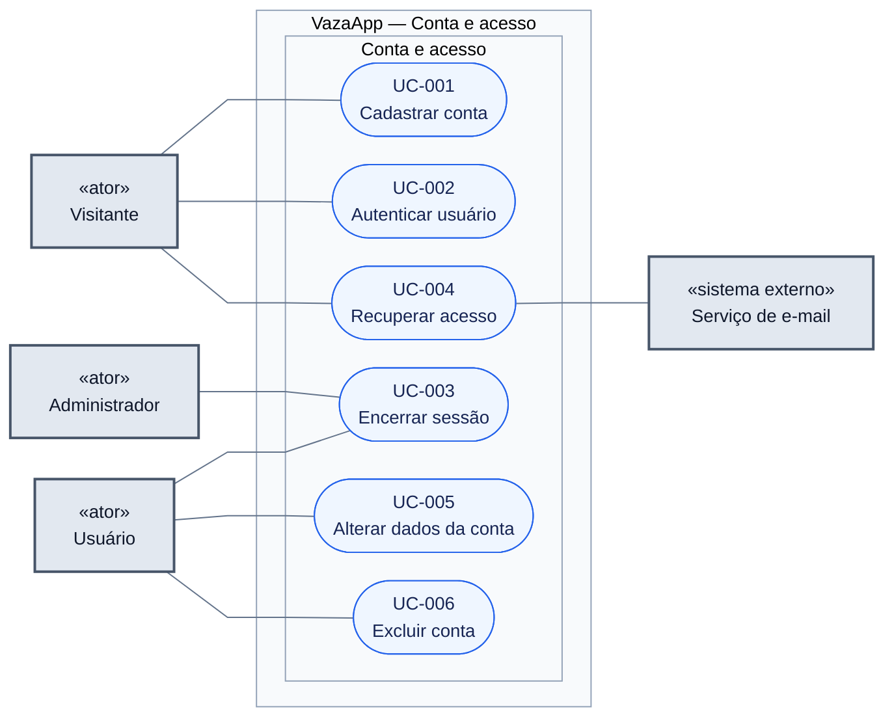
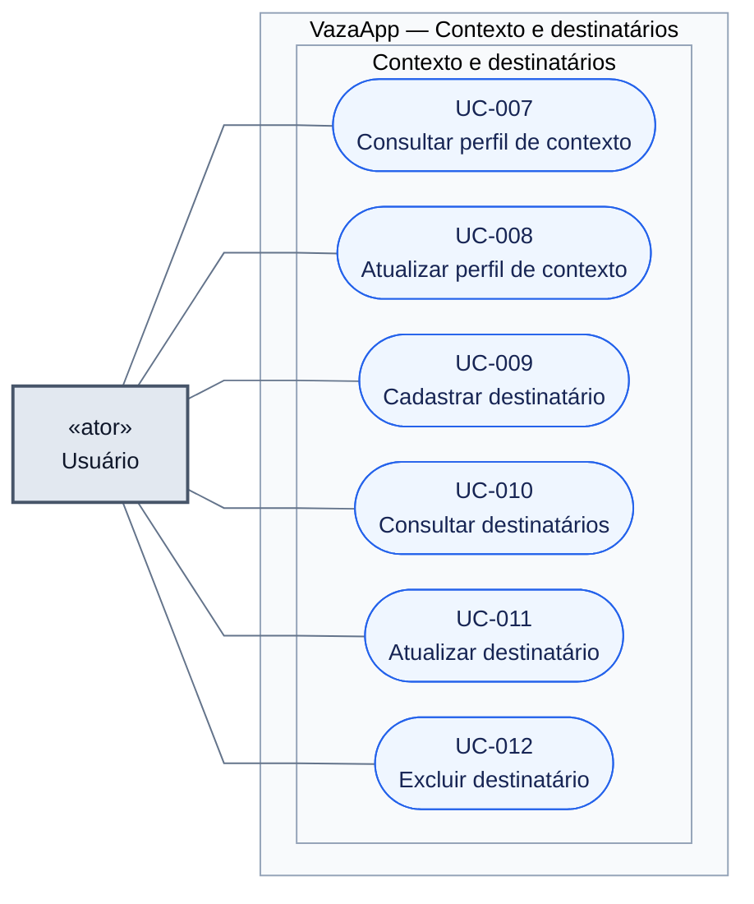
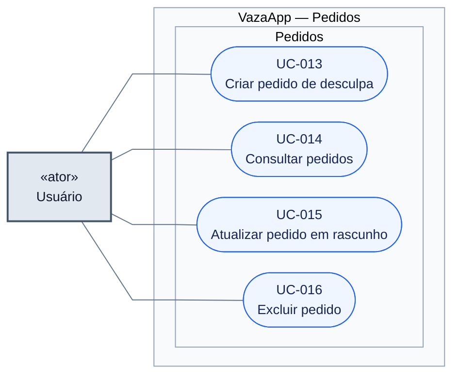
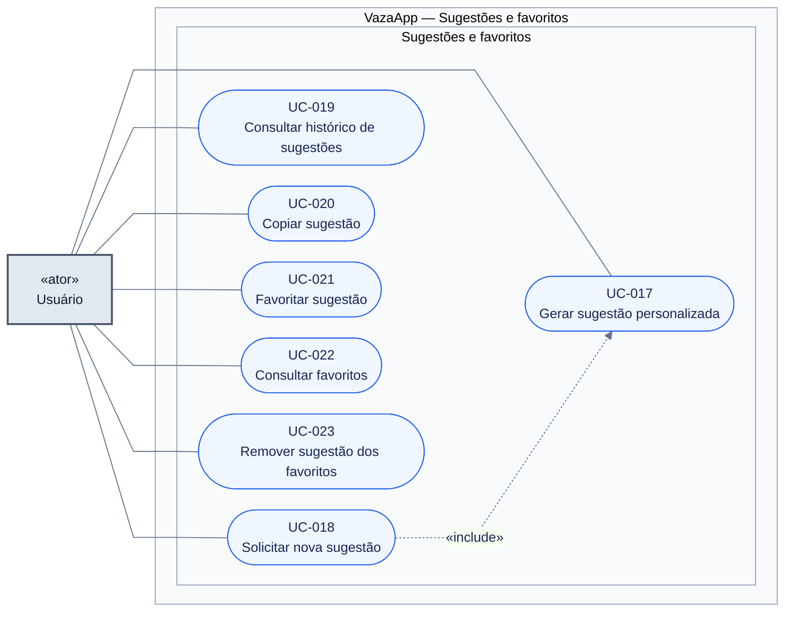
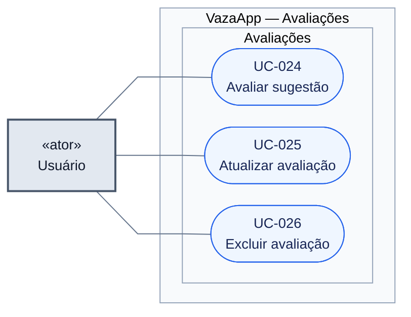
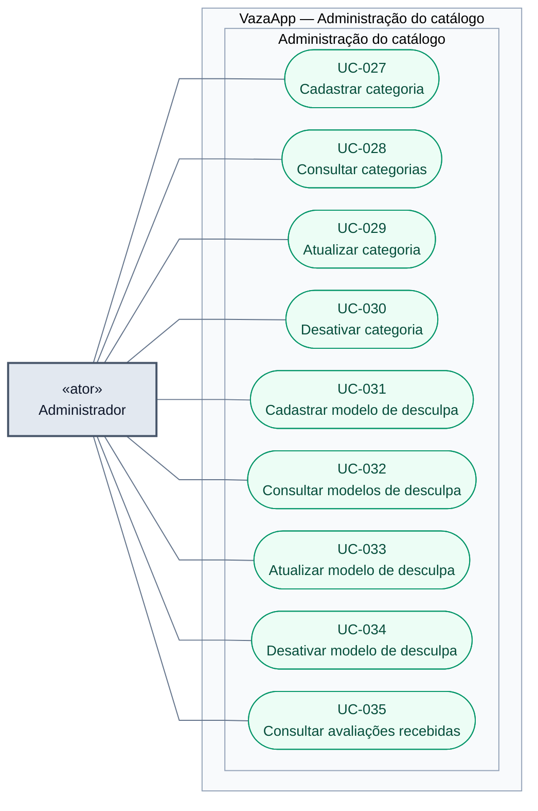
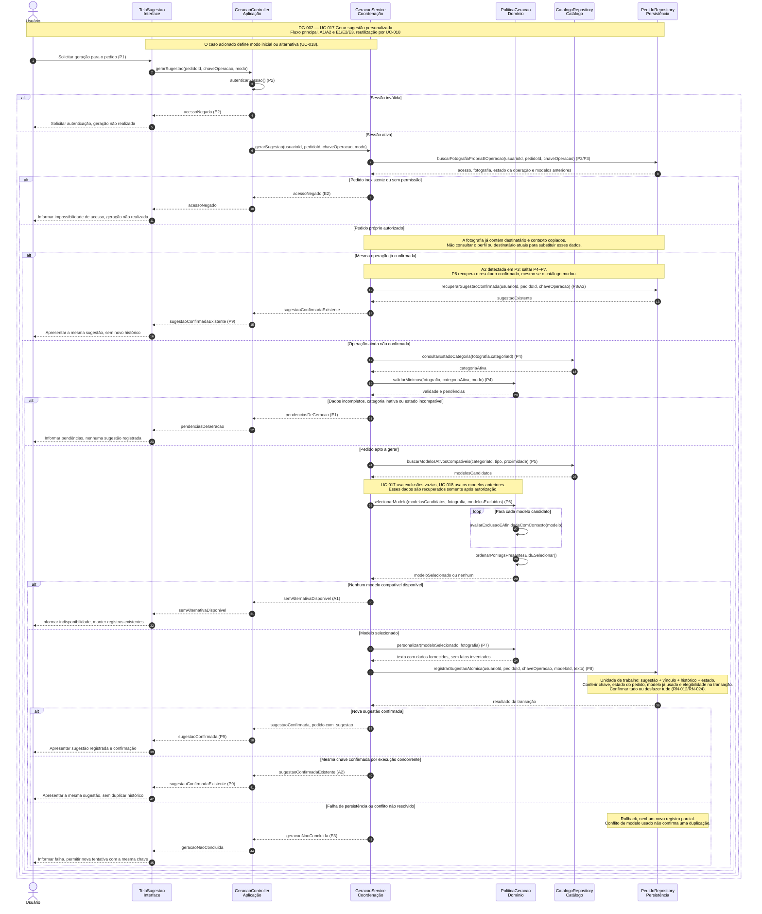

# Diagramas Mermaid — VazaApp

## DG-001 — Casos de uso

[Visualizar o diagrama completo](https://mermaid.live/view#pako:eNqVV91u2zYUfhVBQYYNsDuTkvzXoYDz093sYqibAMO8C1qiHCISqZGUm7QIsIfYCxS7KLBdFrvqXf0me5IdkQxjK3J-DERkdM73HZ4_ivwQpiKj4TQ8PPzAONPT4MMi1Be0pItwugiXRMGktwjzQrxLL4jU8Bo00lqurUbBOCXS6HBgmlckZXwFIozhlST88u5VnNz0HPs5kYwsC6osXy64fk1KVlwb0hkIC2sXBHP23tpCcXVl3laSlUReH4tCSCM5oHk-zPNt4Vt6pbcU0AgnSbytcCRkRuWWCk6GEV0alcarLckwHsVjK0mLWmkqjy5XVpSPc5KnOyLDa6WTmETL8SK8ubk5PFxwH8XgpzcLHsDv8DCYKSVSRjafNv9SFajN54JlBCa0hD9NAkkrSRXlmpRBBViWsqrR_ku8DDg8dxQU_b3e_M2B74U1cP7rIvz6D9FCfv3yw1J-_-qcKaYJ1xDS36zKWVvlTNWbj5IJrzFra8yyEqpFaUmyJkZO7dSoKXhPSxJA_KnkwiHmVK7Z5pMIMhrQfklY4WGqXq4kqS6C-S9zYDgn78msqoL__vgziJIgJUqoBlWruwXtwFKoEQLA42YMaEBSqlq6zS9jkqaaCR68PdqVnB0PBuhbYDg77sPMrPeYQBLAP2npge27-yDsQdiGpdaQBpYCqr6LYQcw8sDIAE95SmVjTMHSIafdqNijYoN6Q9O6og3Mu9yBSjwqsYsstMFkkDsILHnIwaHHDu06r6DIWWdMKM_25AYKQbj0NFPIUEaVZpxoEyH1zEyN_JpGNlOCq7rQ4BHEImdFUyu3Zru9GnuGsY2IrknB3j-DYeIZJq1q2XGtE4wGt2A0aDlwLy4daF-oCLUW_wTTvmAR3snnA9DuvFY0Y1A-wPaznT0vicg3ALINcAw7vnSsTfhhQWldVN1liXwjoPheCdyupgPmOwEl9_JuDMOWKwkY5hd74uf7Ae32g8U_JXCqXkGsBW1CNzdzs-3TICdrIZl-diR9OyDbDj-a5rZmmq8DlLQS3PiZ7Qmn7wdk-2EuCvjINOHkYk3uuLrRvhfQpJWMC_gSbD5LlpqUKu9tJw_2bYFv26Ji2550o3w7YNsOr20YHwf6VsC4teztTHQAfeniyO3CpVjT7ZA3--oeku6iIGvID0ltVczMP_Y48LxawL4vsO0LS_VoKHxf4HZfkNu17IP6hsC7DbEXuOczQTQpxKr5TNwdLQwagtlINx8b8TPD4VsDj9rfdKLpCvLT3RDYNwQet2rDA_cUh28GPGmF8mGTka_-yFb_CVVEs_XjQN8AUfvgUsJ5vHh8N418J0TtTrAM6nEK3xNR1HL7qYvwpRvFLf-fyuCrOEpabpCtjoLTckqXzQl7T136yXnQ7_ft2TD4xh733Bi7c7NXiJwgcePQjSM3jt04sSMauNERI0eMHA-K3ej4kONDjg85PuT4sOPDjg87Puz4sOPDjg8P3bG-7QB2BrAzgJ2ByBmInIHIGYgcLnIGosRFpgmSIT_1L2DR_RdBc0FgHPaIjH79sgiDF_1X1jOrlxZEqROaw4EWLhsBnMWK6QHFdJwPelDU4pJOD-JRkgwnvbS5nk0PBjnc7IgT9t-xTF9McXX1ssVXEk5WcO_k-pY0zbM88aSDZDLcIh3GNFpucwTnvbPerHdqF7YjMXHrmaiZ56RnImaeyDyxeUbmGZtnsrUgIAt7YUklXIoyuA3bCzJcyTOaEyjg8KYXklqL-TVPw6mWNe2FdZXBrnDCCGyfpX158z8ux7Cp) · [Editar no Mermaid Live](https://mermaid.live/edit#pako:eNqVV91u2zYUfhVBQYYNsDuTkvzXoYDz093sYqibAMO8C1qiHCISqZGUm7QIsIfYCxS7KLBdFrvqXf0me5IdkQxjK3J-DERkdM73HZ4_ivwQpiKj4TQ8PPzAONPT4MMi1Be0pItwugiXRMGktwjzQrxLL4jU8Bo00lqurUbBOCXS6HBgmlckZXwFIozhlST88u5VnNz0HPs5kYwsC6osXy64fk1KVlwb0hkIC2sXBHP23tpCcXVl3laSlUReH4tCSCM5oHk-zPNt4Vt6pbcU0AgnSbytcCRkRuWWCk6GEV0alcarLckwHsVjK0mLWmkqjy5XVpSPc5KnOyLDa6WTmETL8SK8ubk5PFxwH8XgpzcLHsDv8DCYKSVSRjafNv9SFajN54JlBCa0hD9NAkkrSRXlmpRBBViWsqrR_ku8DDg8dxQU_b3e_M2B74U1cP7rIvz6D9FCfv3yw1J-_-qcKaYJ1xDS36zKWVvlTNWbj5IJrzFra8yyEqpFaUmyJkZO7dSoKXhPSxJA_KnkwiHmVK7Z5pMIMhrQfklY4WGqXq4kqS6C-S9zYDgn78msqoL__vgziJIgJUqoBlWruwXtwFKoEQLA42YMaEBSqlq6zS9jkqaaCR68PdqVnB0PBuhbYDg77sPMrPeYQBLAP2npge27-yDsQdiGpdaQBpYCqr6LYQcw8sDIAE95SmVjTMHSIafdqNijYoN6Q9O6og3Mu9yBSjwqsYsstMFkkDsILHnIwaHHDu06r6DIWWdMKM_25AYKQbj0NFPIUEaVZpxoEyH1zEyN_JpGNlOCq7rQ4BHEImdFUyu3Zru9GnuGsY2IrknB3j-DYeIZJq1q2XGtE4wGt2A0aDlwLy4daF-oCLUW_wTTvmAR3snnA9DuvFY0Y1A-wPaznT0vicg3ALINcAw7vnSsTfhhQWldVN1liXwjoPheCdyupgPmOwEl9_JuDMOWKwkY5hd74uf7Ae32g8U_JXCqXkGsBW1CNzdzs-3TICdrIZl-diR9OyDbDj-a5rZmmq8DlLQS3PiZ7Qmn7wdk-2EuCvjINOHkYk3uuLrRvhfQpJWMC_gSbD5LlpqUKu9tJw_2bYFv26Ji2550o3w7YNsOr20YHwf6VsC4teztTHQAfeniyO3CpVjT7ZA3--oeku6iIGvID0ltVczMP_Y48LxawL4vsO0LS_VoKHxf4HZfkNu17IP6hsC7DbEXuOczQTQpxKr5TNwdLQwagtlINx8b8TPD4VsDj9rfdKLpCvLT3RDYNwQet2rDA_cUh28GPGmF8mGTka_-yFb_CVVEs_XjQN8AUfvgUsJ5vHh8N418J0TtTrAM6nEK3xNR1HL7qYvwpRvFLf-fyuCrOEpabpCtjoLTckqXzQl7T136yXnQ7_ft2TD4xh733Bi7c7NXiJwgcePQjSM3jt04sSMauNERI0eMHA-K3ej4kONDjg85PuT4sOPDjg87Puz4sOPDjg8P3bG-7QB2BrAzgJ2ByBmInIHIGYgcLnIGosRFpgmSIT_1L2DR_RdBc0FgHPaIjH79sgiDF_1X1jOrlxZEqROaw4EWLhsBnMWK6QHFdJwPelDU4pJOD-JRkgwnvbS5nk0PBjnc7IgT9t-xTF9McXX1ssVXEk5WcO_k-pY0zbM88aSDZDLcIh3GNFpucwTnvbPerHdqF7YjMXHrmaiZ56RnImaeyDyxeUbmGZtnsrUgIAt7YUklXIoyuA3bCzJcyTOaEyjg8KYXklqL-TVPw6mWNe2FdZXBrnDCCGyfpX158z8ux7Cp) · [Código-fonte](../diagramas/DG-001-casos-de-uso.mmd)

São 35 objetivos identificados no catálogo, com os mesmos IDs das especificações. O diagrama completo oferece a visão geral; as vistas por área abaixo facilitam a leitura em telas menores. Cada vista conserva a fronteira do VazaApp e os atores pertinentes.

### Notação

- Atores ficam fora da fronteira do sistema. Visitante inicia cadastro/autenticação/recuperação; Usuário opera seus dados; Administrador mantém o catálogo e consulta avaliações; Serviço de e-mail participa da recuperação.
- Associações sólidas **sem seta** indicam participação, não ordem de execução.
- Casos em formato arredondado representam objetivos. Agrupamentos internos são áreas funcionais, não atores ou casos adicionais.
- `UC-018 → UC-017` tem `«include»`: toda solicitação de alternativa executa o comportamento de geração com os modelos anteriores excluídos.
- Avaliar, copiar e favoritar são objetivos independentes disponíveis depois de uma geração; não são etapas obrigatórias da geração.
- Autenticação é precondição das operações protegidas; não se realiza um novo login dentro de cada caso.

Usamos `flowchart LR`, conforme o exemplo didático em [SEMANA05.pdf, p. 43](https://github.com/JoaoChoma/analise_projeto_esoft_2026/blob/main/aulas/SEMANA05/SEMANA05.pdf). Essa representação utiliza convenções de casos de uso com formas e relações do flowchart. A sintaxe nativa de casos de uso foi introduzida no Mermaid 12; a representação adotada favorece compatibilidade com renderizadores GitHub e mantém o padrão do material da disciplina. [Documentação Mermaid](https://mermaid.js.org/syntax/usecase.html).

### Visão completa

```mermaid
%%{init: {"theme":"base","flowchart":{"curve":"linear","nodeSpacing":22,"rankSpacing":45},"themeVariables":{"fontFamily":"Arial","fontSize":"14px","primaryColor":"#eff6ff","primaryTextColor":"#172554","primaryBorderColor":"#2563eb","lineColor":"#64748b","clusterBkg":"#f8fafc","clusterBorder":"#94a3b8"}}}%%
flowchart LR
    %% Associações sólidas sem seta representam participação; não representam sequência.
    V["«ator»<br/>Visitante"]
    U["«ator»<br/>Usuário"]
    A["«ator»<br/>Administrador"]
    E["«sistema externo»<br/>Serviço de e-mail"]
    subgraph SYS["VazaApp — 35 casos de uso"]
        subgraph conta["Conta e acesso"]
            direction TB
            UC001(["UC-001<br/>Cadastrar conta"])
            UC002(["UC-002<br/>Autenticar usuário"])
            UC003(["UC-003<br/>Encerrar sessão"])
            UC004(["UC-004<br/>Recuperar acesso"])
            UC005(["UC-005<br/>Alterar dados da conta"])
            UC006(["UC-006<br/>Excluir conta"])
        end
        subgraph contexto["Contexto e destinatários"]
            direction TB
            UC007(["UC-007<br/>Consultar perfil de contexto"])
            UC008(["UC-008<br/>Atualizar perfil de contexto"])
            UC009(["UC-009<br/>Cadastrar destinatário"])
            UC010(["UC-010<br/>Consultar destinatários"])
            UC011(["UC-011<br/>Atualizar destinatário"])
            UC012(["UC-012<br/>Excluir destinatário"])
        end
        subgraph pedidos["Pedidos"]
            direction TB
            UC013(["UC-013<br/>Criar pedido de desculpa"])
            UC014(["UC-014<br/>Consultar pedidos"])
            UC015(["UC-015<br/>Atualizar pedido em rascunho"])
            UC016(["UC-016<br/>Excluir pedido"])
        end
        subgraph sugestoes["Sugestões e favoritos"]
            direction TB
            UC017(["UC-017<br/>Gerar sugestão personalizada"])
            UC018(["UC-018<br/>Solicitar nova sugestão"])
            UC019(["UC-019<br/>Consultar histórico de sugestões"])
            UC020(["UC-020<br/>Copiar sugestão"])
            UC021(["UC-021<br/>Favoritar sugestão"])
            UC022(["UC-022<br/>Consultar favoritos"])
            UC023(["UC-023<br/>Remover sugestão dos favoritos"])
        end
        subgraph avaliacoes["Avaliações"]
            direction TB
            UC024(["UC-024<br/>Avaliar sugestão"])
            UC025(["UC-025<br/>Atualizar avaliação"])
            UC026(["UC-026<br/>Excluir avaliação"])
        end
        subgraph catalogo["Administração do catálogo"]
            direction TB
            UC027(["UC-027<br/>Cadastrar categoria"])
            UC028(["UC-028<br/>Consultar categorias"])
            UC029(["UC-029<br/>Atualizar categoria"])
            UC030(["UC-030<br/>Desativar categoria"])
            UC031(["UC-031<br/>Cadastrar modelo de desculpa"])
            UC032(["UC-032<br/>Consultar modelos de desculpa"])
            UC033(["UC-033<br/>Atualizar modelo de desculpa"])
            UC034(["UC-034<br/>Desativar modelo de desculpa"])
            UC035(["UC-035<br/>Consultar avaliações recebidas"])
        end
    end
    V --- UC001 & UC002 & UC004
    U --- UC003 & UC005 & UC006 & UC007 & UC008 & UC009 & UC010 & UC011 & UC012 & UC013 & UC014 & UC015 & UC016 & UC017 & UC018 & UC019 & UC020 & UC021 & UC022 & UC023 & UC024 & UC025 & UC026
    A --- UC003 & UC027 & UC028 & UC029 & UC030 & UC031 & UC032 & UC033 & UC034 & UC035
    UC004 --- E
    UC018 -. "«include»" .-> UC017
    classDef actor fill:#e2e8f0,stroke:#475569,color:#0f172a,stroke-width:2px;
    classDef management fill:#ecfdf5,stroke:#059669,color:#064e3b;
    class V,U,A,E actor;
    class UC027,UC028,UC029,UC030,UC031,UC032,UC033,UC034,UC035 management;
```

### Vistas por área

| Área | Fonte | Visualização | Edição |
|---|---|---|---|
| Conta e acesso | [`.mmd`](../diagramas/DG-001-conta.mmd) | [Visualizar](https://mermaid.live/view#pako:eNp9VM1u00AQfpWVoyCQHEgT201ThJSm4cSpaSIhwmGyHier2muzu27TVpF4CF4AcagER8SJW_MmPAljr3GTEtWS7fV8P7s7M95bh6chOn2n2bwVUpg-u505ZokJzpz-zJmDpoE7c6I4veJLUIbCxOC5urSMWEgEVXIkOY0z4EIuCOp0KKRAXjyEPH_tVu5TUALmMWrrF6XSvIVExNel6YDA2M5LwFjc2LkOvGxVRjMlElDXwzROVYk0MIqCKNoGz3FltggHhx3f97YJJ6kKUW1ROn7QxXlJKXa1hQTeodezCI9zbVCdXCwsFPUiiPgOVPpa9MiD7rw3c9brdbM5k3UW2buzmWR0NZtsoHXKBWzuNr9QM735GYsQaIAJ3QaYwkyhRmkgYRlpBRdZwf6WHjNJzx2Cxk_55rskv5d2gumHmXP_A0yq7n-_nqtXb6ZCCwPSUEo_WsrkMWWi881XJdKaMXjMGIQJdYs2CsIiRxVtVNI0xTEBRvlHJdNKMUZ1KTZ3KQuRYSsBEdcync8XCrIlG78fk8MUbmCQZezP5y9sSOUnJwYcKUu1YkfFCw7pnuAWVygUciNSyc5PdpHJsN0-eE4Ok2GLRuVyh0A1oO0pa09uL_4XdWpRx2YlN1QFwUmVP6Rwj7BbC7ulcCQ5qmIyTUunku5XebXKK1VnyPMMC1m95T0qv1b5dpGxKTUhlU7T86kNBrU2sOtcUY-LvTlBGdqPejBlrVbLJpc9s_mq3l7VdzWhWwF-9Q6qtnsgVIpCXAZHNsBj0PoUI8oANSeLRBz3G9jBXtR2qXzpBfYb3qHvB0cuL37nfqMd0UkAFdi6EqFZ9jvZ6viRXwISFnROSfPPlEdh5Nembf8o2DINPOzOtz3Y1J24A3dkF0aI4zoJKur7kA48ewbSqRtiBHlsnLXrQG7S8bXkTt-oHF0nz0IweCqAujyxwfVfCn7NTw) | [Editar](https://mermaid.live/edit#pako:eNp9VM1u00AQfpWVoyCQHEgT201ThJSm4cSpaSIhwmGyHier2muzu27TVpF4CF4AcagER8SJW_MmPAljr3GTEtWS7fV8P7s7M95bh6chOn2n2bwVUpg-u505ZokJzpz-zJmDpoE7c6I4veJLUIbCxOC5urSMWEgEVXIkOY0z4EIuCOp0KKRAXjyEPH_tVu5TUALmMWrrF6XSvIVExNel6YDA2M5LwFjc2LkOvGxVRjMlElDXwzROVYk0MIqCKNoGz3FltggHhx3f97YJJ6kKUW1ROn7QxXlJKXa1hQTeodezCI9zbVCdXCwsFPUiiPgOVPpa9MiD7rw3c9brdbM5k3UW2buzmWR0NZtsoHXKBWzuNr9QM735GYsQaIAJ3QaYwkyhRmkgYRlpBRdZwf6WHjNJzx2Cxk_55rskv5d2gumHmXP_A0yq7n-_nqtXb6ZCCwPSUEo_WsrkMWWi881XJdKaMXjMGIQJdYs2CsIiRxVtVNI0xTEBRvlHJdNKMUZ1KTZ3KQuRYSsBEdcync8XCrIlG78fk8MUbmCQZezP5y9sSOUnJwYcKUu1YkfFCw7pnuAWVygUciNSyc5PdpHJsN0-eE4Ok2GLRuVyh0A1oO0pa09uL_4XdWpRx2YlN1QFwUmVP6Rwj7BbC7ulcCQ5qmIyTUunku5XebXKK1VnyPMMC1m95T0qv1b5dpGxKTUhlU7T86kNBrU2sOtcUY-LvTlBGdqPejBlrVbLJpc9s_mq3l7VdzWhWwF-9Q6qtnsgVIpCXAZHNsBj0PoUI8oANSeLRBz3G9jBXtR2qXzpBfYb3qHvB0cuL37nfqMd0UkAFdi6EqFZ9jvZ6viRXwISFnROSfPPlEdh5Nembf8o2DINPOzOtz3Y1J24A3dkF0aI4zoJKur7kA48ewbSqRtiBHlsnLXrQG7S8bXkTt-oHF0nz0IweCqAujyxwfVfCn7NTw) |
| Contexto e destinatários | [`.mmd`](../diagramas/DG-001-contexto.mmd) | [Visualizar](https://mermaid.live/view#pako:eNqVlN9u0zAUxl_FclUEUgtJlvRPhpC6Dq64ouskRLg4dezWWuIE22Hdpko8BC-AuECCS8QVd-ub8CScxl1ox4RGpNTu-c73s33s-IqyIuU0pu32lVTSxuQqoXbBc57QOKEzMNjpJFRkxTlbgLYYxgxW6fcuI5OKg65zFJImJTCp5igFAYY0qLM_oTBadbb0U9ASZhk3jicKZV9ALrOLGjpCMXPjojCRl24sPyyXdbTUMgd9MS6yQtdKiwvRE2JXPOFLu5Pg94MoCncTjgqdcr2TEkS9Az6rUzar2lF6YT8cOIVllbFcH53NnSQGAgTbk2quU4chHMwGCV2tVu12opoqkpevEkXwabfJyJiCSVh_Wf_ghpj190ymgB2e42uBaF5qbriykJMSvZLJcpP9uTgkCn_3Egx_V62_KuQ9dgNM3yT0-hvYQl__fDrTT55NTbX-pGWR0Lcuw1SzuYZyQSavJ5h8CpcwKkvy68NHMsbqYxkLwknKjZUKbO01jXkPwLbpSLmfc_OkUnNmZaHIydG-Mh17Xv8hwqbjLvbq2SPXVJkFTUquhcyQ3gyL6Ed_EwYNYVATRraCTF7-B2HYEIZuDoD7YzUS9pZ2p9n3bsy-d2sBf9XlDrffuP1bk7_H0EFjDmrz8yWeUPlPK1ep-9N0pqTb7bqtIA9cQbft0LW-t239bRs4I8vAmGMuCDA8fAQrncUtHvCB8DpYveKMx62wH0W9YYdtvrS45Qn8SGErds9lahdxUC4Pb_FyUDDHK0TZGygTqYgaqBcNezvQXsgPZrsMXFI9JYzRDs25zkGmeAu5iwmvwpQLwC2iqw6FyhaTC8VobHXFO7QqU7D8WAIe-NwFV78BQQSysw) | [Editar](https://mermaid.live/edit#pako:eNqVlN9u0zAUxl_FclUEUgtJlvRPhpC6Dq64ouskRLg4dezWWuIE22Hdpko8BC-AuECCS8QVd-ub8CScxl1ox4RGpNTu-c73s33s-IqyIuU0pu32lVTSxuQqoXbBc57QOKEzMNjpJFRkxTlbgLYYxgxW6fcuI5OKg65zFJImJTCp5igFAYY0qLM_oTBadbb0U9ASZhk3jicKZV9ALrOLGjpCMXPjojCRl24sPyyXdbTUMgd9MS6yQtdKiwvRE2JXPOFLu5Pg94MoCncTjgqdcr2TEkS9Az6rUzar2lF6YT8cOIVllbFcH53NnSQGAgTbk2quU4chHMwGCV2tVu12opoqkpevEkXwabfJyJiCSVh_Wf_ghpj190ymgB2e42uBaF5qbriykJMSvZLJcpP9uTgkCn_3Egx_V62_KuQ9dgNM3yT0-hvYQl__fDrTT55NTbX-pGWR0Lcuw1SzuYZyQSavJ5h8CpcwKkvy68NHMsbqYxkLwknKjZUKbO01jXkPwLbpSLmfc_OkUnNmZaHIydG-Mh17Xv8hwqbjLvbq2SPXVJkFTUquhcyQ3gyL6Ed_EwYNYVATRraCTF7-B2HYEIZuDoD7YzUS9pZ2p9n3bsy-d2sBf9XlDrffuP1bk7_H0EFjDmrz8yWeUPlPK1ep-9N0pqTb7bqtIA9cQbft0LW-t239bRs4I8vAmGMuCDA8fAQrncUtHvCB8DpYveKMx62wH0W9YYdtvrS45Qn8SGErds9lahdxUC4Pb_FyUDDHK0TZGygTqYgaqBcNezvQXsgPZrsMXFI9JYzRDs25zkGmeAu5iwmvwpQLwC2iqw6FyhaTC8VobHXFO7QqU7D8WAIe-NwFV78BQQSysw) |
| Pedidos | [`.mmd`](../diagramas/DG-001-pedidos.mmd) | [Visualizar](https://mermaid.live/view#pako:eNptVN1u0zAUfhXLVRFILXRtknUZQuoKXHGB6DoJES5OHLu1ltjBdli3qRIPwQsgLpDgEnHF3fomPAmncZelsCiJnfP9HNvHzjVlOuM0pt3utVTSxeQ6oW7JC57QOKEpWOz0EipyfcGWYByGkcEq89Ezcqk4mJqj0GlWApNqgdBwiCED6vwuFITr3s79DIyENOfW-wmt3EsoZH5Zm04QzH1eBGbyyuc6CMpVHS2NLMBcTnWuTY10uBCREG3wlK9ci3BwOAzDoE040SbjpkUZhtGIpzVlO6sWEgWHwdgjLK-s4-bkfOEhMRYg2B5U-3r0KIBROk7oer3udhPVrCJ59SZRBK9ul0ys1UzC5tvmF7fEbn7mMgPs8AIfB8Tw0nDLlYOClKiVTJZb9ld9TBS-9wiWf6g23xX6PfYJ5u8SevMDnDY3v5-m5smzua02X4zUCX3vGbZKFwbKJZm9nSH5DK5gUpbkz6fP5DXPZKZtQ92jlx5EyX207ZVJw5mTWpHTk31kPh0cjB6idD7tY68e2BSLbnauJON4W1blJaDto__VQaMOvForW-WucbD3y8JGFtayiasgl1d3iXHVDWBitdT3O0SNQ1Q7vFhh3eWtfl_DVeY_ms6c9Pt9P33ywE9k14a7NvJEloO1z7kgwLB2RMg8jzt8yMdi0LPO6HMed4LDMIyOemy7UePOQOAehx3Yv5CZW8bDcnX8j18BChZ4ApW7NWUiE2FjOgiPopZpFPBR2vbAKdRDwhjt0YKbAmSGh9ifa_yTZFwAVoKuexQqp2eXitHYmYr3aFVm4PhzCbiDCh9c_wXswnI2) | [Editar](https://mermaid.live/edit#pako:eNptVN1u0zAUfhXLVRFILXRtknUZQuoKXHGB6DoJES5OHLu1ltjBdli3qRIPwQsgLpDgEnHF3fomPAmncZelsCiJnfP9HNvHzjVlOuM0pt3utVTSxeQ6oW7JC57QOKEpWOz0EipyfcGWYByGkcEq89Ezcqk4mJqj0GlWApNqgdBwiCED6vwuFITr3s79DIyENOfW-wmt3EsoZH5Zm04QzH1eBGbyyuc6CMpVHS2NLMBcTnWuTY10uBCREG3wlK9ci3BwOAzDoE040SbjpkUZhtGIpzVlO6sWEgWHwdgjLK-s4-bkfOEhMRYg2B5U-3r0KIBROk7oer3udhPVrCJ59SZRBK9ul0ys1UzC5tvmF7fEbn7mMgPs8AIfB8Tw0nDLlYOClKiVTJZb9ld9TBS-9wiWf6g23xX6PfYJ5u8SevMDnDY3v5-m5smzua02X4zUCX3vGbZKFwbKJZm9nSH5DK5gUpbkz6fP5DXPZKZtQ92jlx5EyX207ZVJw5mTWpHTk31kPh0cjB6idD7tY68e2BSLbnauJON4W1blJaDto__VQaMOvForW-WucbD3y8JGFtayiasgl1d3iXHVDWBitdT3O0SNQ1Q7vFhh3eWtfl_DVeY_ms6c9Pt9P33ywE9k14a7NvJEloO1z7kgwLB2RMg8jzt8yMdi0LPO6HMed4LDMIyOemy7UePOQOAehx3Yv5CZW8bDcnX8j18BChZ4ApW7NWUiE2FjOgiPopZpFPBR2vbAKdRDwhjt0YKbAmSGh9ifa_yTZFwAVoKuexQqp2eXitHYmYr3aFVm4PhzCbiDCh9c_wXswnI2) |
| Sugestões e favoritos | [`.mmd`](../diagramas/DG-001-sugestoes.mmd) | [Visualizar](https://mermaid.live/view#pako:eNqNlN1u0zAYhm_F8lQEUjvatOnf0KSt0zjhaF0nIcLB1-Rzay2xg-10f6rERXADiAMkOJx2tLP1TrgS3DjL0lEEkVK7ft_3seO_GxrKCOmQ1mo3XHAzJDcBNXNMMKDDgE5B20o9oCyWF-EclLHN1hFmauEcMRcIKvcISxqnEHIxs5Ln2SYF4vypqeMv6wX9DBSHaYza8ZgU5hgSHl_l0AMrxq5fK4z5teur1Ukv89ZU8QTU1UjGUuXKDjLWZawqnuKlqRhaPc_3O1XDoVQRqorF87ttnOaW9VdVlG6n1-k7JYwzbVAdns-cxPoMWLgh5VynDjrQnvYDulwua7VAlLNI3p0EgtinViMHWsuQw-r76g410avbmEdgK5jY1wBRmCrUKAwkJLVZHvJ07f4m94iwvxsGjZ-y1Q9hebuug8mHgD78BCPVw_2bqXq9P9HZ6qviMqAfnUNn05mCdE7G78fWfAbXcJCm5NfnL2SczVCbfFxIGCyk4kbqMrmR1rlXoraM_8itn4grDA2XgpwebiqTUbPVe2lJk1HD1vKBv0UFquhm_dkpKi0FxPwaIrDsV38i-iWinyPGMrazZyxGyAU8sbanB2V6kKdHUugsXqfn3MZuFQ8lifARc7fezFs4XvOR4zULTsqrX7I91SpTrTx17Kbx30GvDHrPhl1diS3Bdhls58ETTOQCq1MeSf03CIrI_SkrE9JoNNxKkhduOYpy4EqvWZStovSKsl0A8khjl6x3MBf2eEX4cB9QstvYd1znC2PQ-ggZgdBuc8J4HA930MM-a9a1UfIchzudnu93B_VwfaaHO01mrwMoxMYFj8x86KWXe894CQiY2ctKmEdoyCLml9CmP-hWoN0OtqdVhp2CfEi2jdZpgioBHtn7zl2B9tKNkIFdGrqsU8iMHF-JkA6NyrBOszQCg0cc7OlKXOPyNyqT0pM) | [Editar](https://mermaid.live/edit#pako:eNqNlN1u0zAYhm_F8lQEUjvatOnf0KSt0zjhaF0nIcLB1-Rzay2xg-10f6rERXADiAMkOJx2tLP1TrgS3DjL0lEEkVK7ft_3seO_GxrKCOmQ1mo3XHAzJDcBNXNMMKDDgE5B20o9oCyWF-EclLHN1hFmauEcMRcIKvcISxqnEHIxs5Ln2SYF4vypqeMv6wX9DBSHaYza8ZgU5hgSHl_l0AMrxq5fK4z5teur1Ukv89ZU8QTU1UjGUuXKDjLWZawqnuKlqRhaPc_3O1XDoVQRqorF87ttnOaW9VdVlG6n1-k7JYwzbVAdns-cxPoMWLgh5VynDjrQnvYDulwua7VAlLNI3p0EgtinViMHWsuQw-r76g410avbmEdgK5jY1wBRmCrUKAwkJLVZHvJ07f4m94iwvxsGjZ-y1Q9hebuug8mHgD78BCPVw_2bqXq9P9HZ6qviMqAfnUNn05mCdE7G78fWfAbXcJCm5NfnL2SczVCbfFxIGCyk4kbqMrmR1rlXoraM_8itn4grDA2XgpwebiqTUbPVe2lJk1HD1vKBv0UFquhm_dkpKi0FxPwaIrDsV38i-iWinyPGMrazZyxGyAU8sbanB2V6kKdHUugsXqfn3MZuFQ8lifARc7fezFs4XvOR4zULTsqrX7I91SpTrTx17Kbx30GvDHrPhl1diS3Bdhls58ETTOQCq1MeSf03CIrI_SkrE9JoNNxKkhduOYpy4EqvWZStovSKsl0A8khjl6x3MBf2eEX4cB9QstvYd1znC2PQ-ggZgdBuc8J4HA930MM-a9a1UfIchzudnu93B_VwfaaHO01mrwMoxMYFj8x86KWXe894CQiY2ctKmEdoyCLml9CmP-hWoN0OtqdVhp2CfEi2jdZpgioBHtn7zl2B9tKNkIFdGrqsU8iMHF-JkA6NyrBOszQCg0cc7OlKXOPyNyqT0pM) |
| Avaliações | [`.mmd`](../diagramas/DG-001-avaliacoes.mmd) | [Visualizar](https://mermaid.live/view#pako:eNp9VN1u0zAUfhXLVRFILXRZknUZQuo2uNoVXSchwsWpc9xaS5xgO1u3qRIPwQsgLpDgEnHF3fomPAmn8VZS0LCU5OR8P-c4tnPDRZkhT3i3e6O0cgm7SbmbY4EpT1I-BUtBL-UyLy_FHIyjNDFEbS48I1cawTQcTU7jCoTSM4KCgFIG9PmfVBgte3fuZ2AUTHO03k-W2r2CQuVXjemIwNzXJWCsrn2tnbBaNNnKqALM1VGZl6ZBOihlLGUbPMWFaxF29oIoCtuEw9JkaFqUIIp3cdpQ1rNqIXG4Fw49IvLaOjSH5zMPyaEEKbagxtej-yHsTocpXy6X3W6qN1-RnbxONaPR7bKRtaVQsPqy-oGW2dX3XGVAARZ0OWAGK4MWtYOCVaRVQlVr9ufygGm6bxEsvq9XXzX5PfUFJm9TfvsNXGlufz6fmmcvJrZefTKqTPk7z7D1dGagmrPxmzGRz-AaRlXFfn34yEYXkN93tuFvaaBhiBItSR-kr0emDAqnSs1OD7eRydEgCB-TfnLUp6jp0lsZKjRD62iW5PfkX1m0kUVe5mrSXZMQ7nt5SBpvpHEjfbmg9VP_EaLO_MsmmLB-v-_bZ498P3fP2BNEDtYeo2QgaAGYVHmedDDAoRz0rDPlOSadcC-K4v2eWO-2pDOQtFHhDuxfqszNk6BaHPzlV4CGGR0j7e5NhcxktDEdRPtxyzQOcXfa9qDWm5Yox3u8QFOAyugk-sNJv4MMJdS548seh9qV4ysteOJMjT1eVxk4PFZAO6DwyeVv4xhptA) | [Editar](https://mermaid.live/edit#pako:eNp9VN1u0zAUfhXLVRFILXRZknUZQuo2uNoVXSchwsWpc9xaS5xgO1u3qRIPwQsgLpDgEnHF3fomPAmn8VZS0LCU5OR8P-c4tnPDRZkhT3i3e6O0cgm7SbmbY4EpT1I-BUtBL-UyLy_FHIyjNDFEbS48I1cawTQcTU7jCoTSM4KCgFIG9PmfVBgte3fuZ2AUTHO03k-W2r2CQuVXjemIwNzXJWCsrn2tnbBaNNnKqALM1VGZl6ZBOihlLGUbPMWFaxF29oIoCtuEw9JkaFqUIIp3cdpQ1rNqIXG4Fw49IvLaOjSH5zMPyaEEKbagxtej-yHsTocpXy6X3W6qN1-RnbxONaPR7bKRtaVQsPqy-oGW2dX3XGVAARZ0OWAGK4MWtYOCVaRVQlVr9ufygGm6bxEsvq9XXzX5PfUFJm9TfvsNXGlufz6fmmcvJrZefTKqTPk7z7D1dGagmrPxmzGRz-AaRlXFfn34yEYXkN93tuFvaaBhiBItSR-kr0emDAqnSs1OD7eRydEgCB-TfnLUp6jp0lsZKjRD62iW5PfkX1m0kUVe5mrSXZMQ7nt5SBpvpHEjfbmg9VP_EaLO_MsmmLB-v-_bZ498P3fP2BNEDtYeo2QgaAGYVHmedDDAoRz0rDPlOSadcC-K4v2eWO-2pDOQtFHhDuxfqszNk6BaHPzlV4CGGR0j7e5NhcxktDEdRPtxyzQOcXfa9qDWm5Yox3u8QFOAyugk-sNJv4MMJdS548seh9qV4ysteOJMjT1eVxk4PFZAO6DwyeVv4xhptA) |
| Administração do catálogo | [`.mmd`](../diagramas/DG-001-catalogo.mmd) | [Visualizar](https://mermaid.live/view#pako:eNqNlc2O0zAQx1_FSlUEUgptPvq1CKnbFSdOdHclRDlMEqe1NrGD7Sz7oUo8BC-AOCDBEXHitn0TnoSJnc2mBbQbtTOuZ_4_exzbvXZikVBn6nS714wzPSXXS0evaU6XznTpRKCw4S6dNBMf4jVIjd2YEZfy3GZkjFOQJocjaVFAzPgKQ56HXRL42V1XEG7cmn4KkkGUUWV5qeD6JeQsuzTQGQYzOy4GFuzKjjUIigvTW0iWg7yci0xIE-nQNB2maTt4TC90K2Ew8sIwaCccCplQ2UrxwqFPI5NSVdWKDINRMLaROCuVpvLwbGVD6TiFNN4JGa6NTgLwo_HS2Ww23e6SN6tIXr1ecoJPt0tmSomYwfbr9idVRG1_ZCwBbNAcvxqIpIWkinINOSlQy2JWVNlfxAHhaHcSFH1fbr9x5D21A8zeLp2b76CFvPn1PJLPXsySHF-00hKSqrx3Nk2V0UpCsSaLNwtUnMIVzIqC_P74idwJzKAkESQGvf2ciZVo9DsMDEMVRdCDxdWTMEljzQQnx4e7kZN53xs9Rt7JvIctU8gccJkQLCsiXQncM0h88rdw3AjHVii4KjPdFqp_KyeNcmLXTpeQsat7h_T7t0K_b4RHVIFm5_cLB41wsFdkjqcrwwWk-FFxmRX_IXgNwdur1hLU_Qi_Qfh7ZT90EkFDCPbqfyghbAjhXhlwjpO5PS64YWhUnZddCuWJ_dE0ZqTX69l9RB7ZbVH7ifV-v_aD2nu192sf1D60wDgDpY5oSiDGw0VSlmXTDvXoOO27-MbEGZ12glEYDiduXN0k004_xUsI6mDvA0v0euoVFwd7vBw4rPCK5PoWGqdJGjbQfjgZtqDDgPpRm4Glmint9JnCXVO2sRPXlGzswFjPWN_YwNiwNRWEOa6TU5kDS_DKtrc4_m8kNAV8L87GdaDUYnHJY2eqZUldpywS3OxHDPBWyG3n5g_2BgSI) | [Editar](https://mermaid.live/edit#pako:eNqNlc2O0zAQx1_FSlUEUgptPvq1CKnbFSdOdHclRDlMEqe1NrGD7Sz7oUo8BC-AOCDBEXHitn0TnoSJnc2mBbQbtTOuZ_4_exzbvXZikVBn6nS714wzPSXXS0evaU6XznTpRKCw4S6dNBMf4jVIjd2YEZfy3GZkjFOQJocjaVFAzPgKQ56HXRL42V1XEG7cmn4KkkGUUWV5qeD6JeQsuzTQGQYzOy4GFuzKjjUIigvTW0iWg7yci0xIE-nQNB2maTt4TC90K2Ew8sIwaCccCplQ2UrxwqFPI5NSVdWKDINRMLaROCuVpvLwbGVD6TiFNN4JGa6NTgLwo_HS2Ww23e6SN6tIXr1ecoJPt0tmSomYwfbr9idVRG1_ZCwBbNAcvxqIpIWkinINOSlQy2JWVNlfxAHhaHcSFH1fbr9x5D21A8zeLp2b76CFvPn1PJLPXsySHF-00hKSqrx3Nk2V0UpCsSaLNwtUnMIVzIqC_P74idwJzKAkESQGvf2ciZVo9DsMDEMVRdCDxdWTMEljzQQnx4e7kZN53xs9Rt7JvIctU8gccJkQLCsiXQncM0h88rdw3AjHVii4KjPdFqp_KyeNcmLXTpeQsat7h_T7t0K_b4RHVIFm5_cLB41wsFdkjqcrwwWk-FFxmRX_IXgNwdur1hLU_Qi_Qfh7ZT90EkFDCPbqfyghbAjhXhlwjpO5PS64YWhUnZddCuWJ_dE0ZqTX69l9RB7ZbVH7ifV-v_aD2nu192sf1D60wDgDpY5oSiDGw0VSlmXTDvXoOO27-MbEGZ12glEYDiduXN0k004_xUsI6mDvA0v0euoVFwd7vBw4rPCK5PoWGqdJGjbQfjgZtqDDgPpRm4Glmint9JnCXVO2sRPXlGzswFjPWN_YwNiwNRWEOa6TU5kDS_DKtrc4_m8kNAV8L87GdaDUYnHJY2eqZUldpywS3OxHDPBWyG3n5g_2BgSI) |

#### Conta e acesso

#### Contexto e destinatários

#### Pedidos

#### Sugestões e favoritos

#### Avaliações

#### Administração do catálogo

## DG-002 — Sequência central

[Visualizar](https://mermaid.live/view#pako:eNqdWN1u2zYUfhXCVzamOI3TrZ0xBDActwiKpkKc3BUYaIl2uEmkRkpGmqJA32F7gWIXwwb0qtgT-E36JDvnkPpxLDlec9HaIs_h-fm-w09-34t0LHrjnhW_FUJF4lzyleHpW8Xgjxe5VkW6EMZ_j3Jt2A3jlt3YYvPJSO0WMm5yGcmMq5xd4_K1SPi8WAmbc_3TwhyfXahcmCWPxK7BFA1eCsMjrqda5UYniTBkNckSGfHNX5s_Ww6aN-zmwqxlJMhoqrWJheoyC9Es1ImEJ9ybk925TjefVVtKr9BkynOe6JW-Epm2Egrxzp3G880nfL5rdkUniVjGD41CYay0-eYfFUn-VjnTS50LptcCKhxcjdn5y6MnT0bs68c_2M306MnJM8rVMEtlhdRYBl604om85zEnvy-S4g6eG6kwhCRgk5PjyYgJNjs5no2OZ6cBM6LIJZpQeViGDUX3zx8GcR3Mx-wNi7jV0HgJB8WaxWIplWCphs9SQaI8YbpgPIHuKp7LNWd9524wdA5vjs7OrsdsDgWPZA7xryALfzY3nGEaWCHWD08GzuQaTKZj2mhKEPXdros4YNEtX4s3metcQLF4w6kzBNgKhd01c2Et2A7A-cjvgVAZPsYApFpD72TM3ZJz4eIFpFqrL8UKs-7PSmsXHmy5aaZUHUh5BY0UFf5jhO-R8yESK6oQqGbN48_O5g9TL2zBgWqY-yFVwL85-AEMLQoLVXihcw2kXkoeGg3g4LPS7gDXVLvj8LTh_OrIRelqFLBl5T9gGDHiBBqbVVUgwIhEW8ZxDEhthK3dYUccS6Ah4g54AcUUCCsrUgR5KqlWtYXL0De7u1Fd_dzeUbbzQi21SaGbMgWuWrmQiIxYAOarTPc3tmquzyYzmy9Qbk1z1ODGB0fXZJsj4yeNSrJfNp9YBNNw83cKEdhcKhw06E3Qc3GXa_iQSfBqh8T-S4wJ1myRICppQCwlEXTbA88LLq3jny0WsJQX0kDvrLDQOnS4HSi26LWw6VZXfYRLCVVrlqAruxFEkYsI8MEZNDY8HTPLKdLw6dePv4fPXBbhc6hrVOA5DEtM2cS6PgrRDrFogAdsiMr5y9Ii1sVwNw7PhdJpxatpFfuBNHgOs3Sw67-kg_V-ZyWE20JxoLU7IewxKiG8xwiC-7ElshLakwzKCPtwVFHteH2LBMQypdea3eKV9MXI6AFMCdNv6sZzqaCFyqOts_9Y91fjGpAzGg1wX4oVsIH3a7APo_LhRYyFftqSyytf5WrrZHtyNk8Nx2zNkb3mNVxSqbb95oja9uBHZ8epoT_VuYNJIAAgKnYXt93dj0Q5RwLBKIt0miUi17ZxJJP-lgRO-lHpNgKKP69FsuuxCRs8WtDJ58IrFxh5J4N2qxI3LVbtBjuTsJFqwJRQt0UTOcCoFSDGtDa_OQd5BqOKu0utK0GCiruuXru7Aruj7ZRqI9dC2n4DJQHLZQbYzYy-kym1Blv4fUcpSvD4a2jKFQTGoTXt25uTC7Dk5VdhYW7dRUlhN__CnFzze6qLkzu0Cm3fvejcVJvVs5VZVzw3juiBTonFPNt8sdVtQWQbdhcMIrMiESTNfNH6Owlu385-eYZZQGcs1uyHjpolWmcsxCsiwontTOGz99xu5DhDsXHkDLCeKgZTcQLKkRoFLZ36C8zH2xEBoK99wZ_gZL4JtbnmKxu6GSfs7CKezavC9AddPpqQqPYDXIGaDuvthkjxS1qvalLzl8XSZlrt4fLWNSDSSa2cz8lUopf-pIvUWxdCh3m35a7WUS7gSu0ARgi6JbkBnZUk62ALUd3hrwZkrPelT-1rvL6Y_k4bmsBFmD4b7EOc62UpilJPNEhSgb8YaYC33BIZgaof78K4i_1bmsFNuEozTHKdgs4_VJJDSjSrMC5SEHuSqIcOHHyjKu0Jxy94cqvHjcn7HVvDq2pUJPixvrbhi7tUhv5FWC1hCBkXWK3Ny1euMkRScsDRGLUldGBVa1_F8Xxl_TCq3EpCT144uoC6XPJ74R_0ry5hIo6O8b_R08GwO-VSOdUiL946r9uSSKjXzdtonxQ5TIOVvUQE_Vwu73fWrc06JNkj8qztcnWCn9w-UhXHRNJ31PJGTehFX9zBpeM0HKxE2ph2xfk_JSuMq9HgW-v0mIb9Nj0bF_TLkenUtDtlewEc48i3rPnbDKIbi5jIvHrnszpZy_gRYGyx-UonyYJHv5YiysntcsLiexj-kFKzi06Ly7dmT80tvc1Qifkk9-mEh11cueF0SR0gEQBAnZ0e2L0W68MaVt03S6xy4F7qc5hMCjmM7XeqGEd32VFC8J6mdYmD1oWdh1sPqi_0oRf0UoiPy7g3ft_Lb0WKP5DGYslhSPU-BD0UaPN3KuqNc1OIoFdkIIjKX07dww__AcUJppg) · [Editar no Mermaid Live](https://mermaid.live/edit#pako:eNqdWN1u2zYUfhXCVzamOI3TrZ0xBDActwiKpkKc3BUYaIl2uEmkRkpGmqJA32F7gWIXwwb0qtgT-E36JDvnkPpxLDlec9HaIs_h-fm-w09-34t0LHrjnhW_FUJF4lzyleHpW8Xgjxe5VkW6EMZ_j3Jt2A3jlt3YYvPJSO0WMm5yGcmMq5xd4_K1SPi8WAmbc_3TwhyfXahcmCWPxK7BFA1eCsMjrqda5UYniTBkNckSGfHNX5s_Ww6aN-zmwqxlJMhoqrWJheoyC9Es1ImEJ9ybk925TjefVVtKr9BkynOe6JW-Epm2Egrxzp3G880nfL5rdkUniVjGD41CYay0-eYfFUn-VjnTS50LptcCKhxcjdn5y6MnT0bs68c_2M306MnJM8rVMEtlhdRYBl604om85zEnvy-S4g6eG6kwhCRgk5PjyYgJNjs5no2OZ6cBM6LIJZpQeViGDUX3zx8GcR3Mx-wNi7jV0HgJB8WaxWIplWCphs9SQaI8YbpgPIHuKp7LNWd9524wdA5vjs7OrsdsDgWPZA7xryALfzY3nGEaWCHWD08GzuQaTKZj2mhKEPXdros4YNEtX4s3metcQLF4w6kzBNgKhd01c2Et2A7A-cjvgVAZPsYApFpD72TM3ZJz4eIFpFqrL8UKs-7PSmsXHmy5aaZUHUh5BY0UFf5jhO-R8yESK6oQqGbN48_O5g9TL2zBgWqY-yFVwL85-AEMLQoLVXihcw2kXkoeGg3g4LPS7gDXVLvj8LTh_OrIRelqFLBl5T9gGDHiBBqbVVUgwIhEW8ZxDEhthK3dYUccS6Ah4g54AcUUCCsrUgR5KqlWtYXL0De7u1Fd_dzeUbbzQi21SaGbMgWuWrmQiIxYAOarTPc3tmquzyYzmy9Qbk1z1ODGB0fXZJsj4yeNSrJfNp9YBNNw83cKEdhcKhw06E3Qc3GXa_iQSfBqh8T-S4wJ1myRICppQCwlEXTbA88LLq3jny0WsJQX0kDvrLDQOnS4HSi26LWw6VZXfYRLCVVrlqAruxFEkYsI8MEZNDY8HTPLKdLw6dePv4fPXBbhc6hrVOA5DEtM2cS6PgrRDrFogAdsiMr5y9Ii1sVwNw7PhdJpxatpFfuBNHgOs3Sw67-kg_V-ZyWE20JxoLU7IewxKiG8xwiC-7ElshLakwzKCPtwVFHteH2LBMQypdea3eKV9MXI6AFMCdNv6sZzqaCFyqOts_9Y91fjGpAzGg1wX4oVsIH3a7APo_LhRYyFftqSyytf5WrrZHtyNk8Nx2zNkb3mNVxSqbb95oja9uBHZ8epoT_VuYNJIAAgKnYXt93dj0Q5RwLBKIt0miUi17ZxJJP-lgRO-lHpNgKKP69FsuuxCRs8WtDJ58IrFxh5J4N2qxI3LVbtBjuTsJFqwJRQt0UTOcCoFSDGtDa_OQd5BqOKu0utK0GCiruuXru7Aruj7ZRqI9dC2n4DJQHLZQbYzYy-kym1Blv4fUcpSvD4a2jKFQTGoTXt25uTC7Dk5VdhYW7dRUlhN__CnFzze6qLkzu0Cm3fvejcVJvVs5VZVzw3juiBTonFPNt8sdVtQWQbdhcMIrMiESTNfNH6Owlu385-eYZZQGcs1uyHjpolWmcsxCsiwontTOGz99xu5DhDsXHkDLCeKgZTcQLKkRoFLZ36C8zH2xEBoK99wZ_gZL4JtbnmKxu6GSfs7CKezavC9AddPpqQqPYDXIGaDuvthkjxS1qvalLzl8XSZlrt4fLWNSDSSa2cz8lUopf-pIvUWxdCh3m35a7WUS7gSu0ARgi6JbkBnZUk62ALUd3hrwZkrPelT-1rvL6Y_k4bmsBFmD4b7EOc62UpilJPNEhSgb8YaYC33BIZgaof78K4i_1bmsFNuEozTHKdgs4_VJJDSjSrMC5SEHuSqIcOHHyjKu0Jxy94cqvHjcn7HVvDq2pUJPixvrbhi7tUhv5FWC1hCBkXWK3Ny1euMkRScsDRGLUldGBVa1_F8Xxl_TCq3EpCT144uoC6XPJ74R_0ry5hIo6O8b_R08GwO-VSOdUiL946r9uSSKjXzdtonxQ5TIOVvUQE_Vwu73fWrc06JNkj8qztcnWCn9w-UhXHRNJ31PJGTehFX9zBpeM0HKxE2ph2xfk_JSuMq9HgW-v0mIb9Nj0bF_TLkenUtDtlewEc48i3rPnbDKIbi5jIvHrnszpZy_gRYGyx-UonyYJHv5YiysntcsLiexj-kFKzi06Ly7dmT80tvc1Qifkk9-mEh11cueF0SR0gEQBAnZ0e2L0W68MaVt03S6xy4F7qc5hMCjmM7XeqGEd32VFC8J6mdYmD1oWdh1sPqi_0oRf0UoiPy7g3ft_Lb0WKP5DGYslhSPU-BD0UaPN3KuqNc1OIoFdkIIjKX07dww__AcUJppg) · [Código-fonte](../diagramas/DG-002-sequencia-gerar-sugestao.mmd)

O diagrama realiza o UC-017, com caminhos de validação, ausência de modelos, repetição idempotente e falha na transação. [Responsabilidades, rastreabilidade e checklist](sequencia.md).

## Como editar

1. Use um dos links **Editar** para abrir o código e a visualização no Mermaid Live.
2. Altere o código e confira o resultado.
3. Copie o código atualizado para o arquivo `.mmd` correspondente no repositório e atualize o bloco Mermaid desta documentação.
4. Gere um novo link de compartilhamento no editor se quiser compartilhar a versão modificada.

Os links incluem uma cópia do código no fragmento da URL. Não há sincronização automática entre o Mermaid Live e o GitHub; o `.mmd` versionado é a referência da entrega. Não inserir credenciais ou dados pessoais reais nos diagramas.
